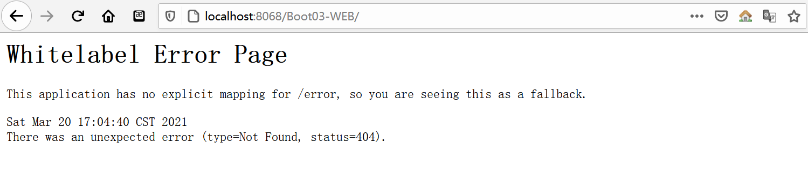
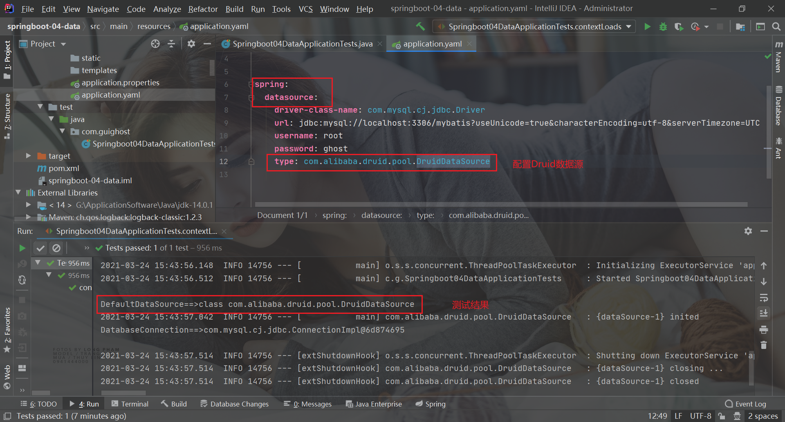
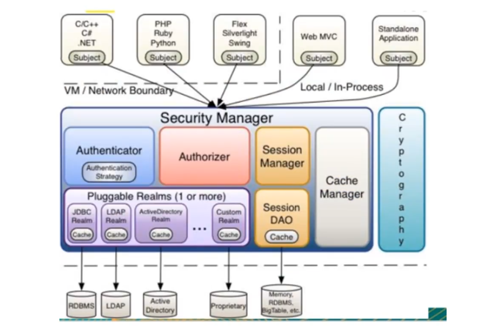
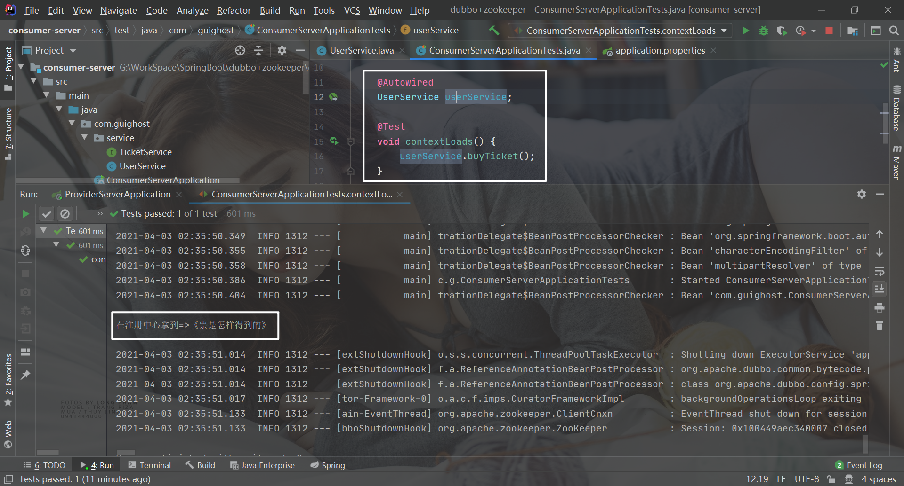

# 微服务阶段

JavaSE：OOP思想

MySQL： 持久化

html+css+js+jQuery+框架：视图，框架不熟练

JavaWeb：独立开发MVC三层架构的网站了：原始

SSM：框架：简化了开发的流程，配置较为复杂

**war：tomcat运行**

Spring再简化——>SpringBoot - jar ：内嵌tomcat；微服务架构

随着服务的增多，SpringCloud;


**阶段六学习：**


# 微服务

### 什么是微服务？

微服务是一种架构风格，它要求我们在开发一个应用的时候，这个应用必须构建成一系列小服务的组合，可用通过http的方式进行互通。

### 单体应用架构

单体应用架构（all in one），将应用的所有服务都封装到一个应用中。

无论ERP、CRM或其他系统，都是把数据库、web访问等等各个功能放到一个war包中

优点：

* 易于开发和测试，方便部署，扩展时，将war复制后放到多个服务器，做个负载均衡即可

缺点：

* 维护不便，牵一发而动全身，修改非常小的地方也要停掉整个服务，重新打包、部署

### 微服务架构

微服务架构，就是把每个功能元素独立出来。把独立出来的功能元素动态组合，把我们所需要的功能元素组合，需要多一些可以整合多个功能元素。微服务架构是对功能元素进行复制，从而没有对整个应用进行复制

优点：

* 节省了资源调用
* 每个功能元素的服务都是可替换、可独立升级的软件代码


# 第一个SpringBoot程序

环境：

* jdk14
* maven3.6.3
* SpringBoot：最新版
* IDEA

创建：官网提供了快速生成的网站，IDEA集成了该网站

* 直接在官网创建，然后导入idea中进行开发
* 使用IDEA开发工具创建（推荐）


### SpringBoot程序目录结构


1. 程序的主启动类（@SpringBootApplication注解的HelloworldApplication）
2. 一个配置文件：application.properties
3. 一个测试类：@SpringBootTest注解的HelloworldApplicationTests
4. 一个pom.xml文件：

#### pom.xml分析

```xml
<?xml version="1.0" encoding="UTF-8"?>
<project xmlns="http://maven.apache.org/POM/4.0.0" xmlns:xsi="http://www.w3.org/2001/XMLSchema-instance"
         xsi:schemaLocation="http://maven.apache.org/POM/4.0.0 https://maven.apache.org/xsd/maven-4.0.0.xsd">
     <modelVersion>4.0.0</modelVersion>
     <!--本项目有一个父项目：spring-boot-starter-parent-->
     <parent>
          <groupId>org.springframework.boot</groupId>
          <artifactId>spring-boot-starter-parent</artifactId>
          <version>2.4.3</version>
          <relativePath/> <!-- lookup parent from repository -->
     </parent>
     <groupId>com.guighost</groupId>
     <artifactId>helloworld</artifactId>
     <version>0.0.1-SNAPSHOT</version>
     <name>helloworld</name>
     <description>Demo project for Spring Boot</description>
     <properties>
          <java.version>14</java.version>
     </properties>
     <dependencies>
          <!--web依赖：配置了tomcat，DispatcherServlet，xml-->
          <dependency>
               <groupId>org.springframework.boot</groupId>
               <artifactId>spring-boot-starter-web</artifactId>
          </dependency>

          <!--所有的SpringBoot依赖都是使用spring-boot-starter开头-->

          <!--单元测试-->
          <dependency>
               <groupId>org.springframework.boot</groupId>
               <artifactId>spring-boot-starter-test</artifactId>
               <scope>test</scope>
          </dependency>
     </dependencies>

     <build>
          <!--打jar包插件-->
          <plugins>
               <plugin>
                    <groupId>org.springframework.boot</groupId>
                    <artifactId>spring-boot-maven-plugin</artifactId>
               </plugin>
          </plugins>
     </build>

</project>
```

#### 写一个http接口

1. 新建一个controller包（该包一定要在主程序的同级目录下，否则会找不到这个接口）

2. 在controller包中新建HelloController类

   ```java
   package com.guighost.helloworld.controller;
   
   import org.springframework.web.bind.annotation.RequestMapping;
   import org.springframework.web.bind.annotation.RestController;
   
   /**
    * @author GuiGhost
    * @date 2021/03/15
    * @className HelloController()
    * 描述：
    */
   @RestController
   public class HelloController {
   
        // 接口：http://localhost:8080/hello
        @RequestMapping("/hello")
        public String hello(){
             //调用业务，接收前端参数
             return "hello,world!——hello SpringBoot!";
        }
   }
   ```

3. 启动主程序，从浏览器发起请求，查看结果

   

4. 更改项目端口号

   在SpringBoot核心配置文件中配置：`server.port=8056`

   ```properties
   # 更改项目的端口号
   server.port=8056
   ```

   


### 将项目打成jar包，点击maven的package命令


通过maven打jar包时，可能会遇到using 'utf-8' encoding to copy filtered resources的问题

解决：

修改 maven-plugins 版本

```xml
<build>
     <plugins>
          <plugin>
               <groupId>org.springframework.boot</groupId>
               <artifactId>spring-boot-maven-plugin</artifactId>
          </plugin>
          <!--在这里修改版本-->
          <plugin>
               <groupId>org.apache.maven.plugins</groupId>
               <artifactId>maven-resources-plugin</artifactId>
               <version>2.4.3</version>
          </plugin>
          <!---->
     </plugins>
</build>
```

参考博客：https://blog.csdn.net/qq_35526165/article/details/112203197

**打好的jar包在项目的target目录下**

使用Powershell窗口，使用命令：`java -jar 打包好的jar包`就可以运行了

### 彩蛋

参考文献：https://mp.weixin.qq.com/s?__biz=Mzg2NTAzMTExNg%3D%3D&chksm=ce6107eff9168ef93424fc2422c74ec5ad5755e4944bbc8a07609f185ec1ad6037eb5ae0f8da&idx=1&mid=2247483724&scene=21&sn=77ce80187dbfdbaaafa0366f6a0c9151#wechat_redirect

如何更改启动时显示的字符拼成的字母，SpringBoot呢？也就是 banner 图案；

只需一步：到项目下的 resources 目录下新建一个banner.txt 即可。

图案可以到：https://www.bootschool.net/ascii 这个网站生成，然后拷贝到文件中即可！


# 原理初探

### 自动配置

pom.xml

* spring-boot-dependencies：核心依赖，在父工程中
* 在我们新增SpringBoot依赖时，不需要指定版本，原因就是父工程中有这些依赖的版本仓库


启动器

* ```xml
  <!--启动器-->
  <dependency>
       <groupId>org.springframework.boot</groupId>
       <artifactId>spring-boot-starter</artifactId>
  </dependency>
  ```

* 启动器：SpringBoot的启动场景

  * 比如spring-boot-starter-web，它会自动导入web环境的所有依赖
  * SpringBoot会将所有的功能场景，都变成一个个的启动器
  * 如果我们需要什么功能，只需要找到对应的启动器就行了`starter`

### 主程序

`@SpringBootApplication`注解：标注这个类是一个springboot的应用

```java
package com.guighost;

import org.springframework.boot.SpringApplication;
import org.springframework.boot.autoconfigure.SpringBootApplication;
//@SpringBootApplication：标注这个类是一个springboot的应用
@SpringBootApplication
public class Springboot01HelloworldApplication {

     public static void main(String[] args) {
          //将SpringBoot应用启动
          SpringApplication.run(Springboot01HelloworldApplication.class, args);
     }

}
```

* 注解

  * ```java
    @SpringBootConfiguration：springboot的配置
    	@Configuration：spring配置类
    		@Component：说明这是一个Spring组件
    		
    
    @EnableAutoConfiguration：自动配置
    	@AutoConfigurationPackage：自动配置包
    		@Import({Registrar.class})：自动配置’包注册‘
    	@Import({AutoConfigurationImportSelector.class})：自动配置导入选择
         
    
    //获取所有的配置
    List<String> configurations = this.getCandidateConfigurations(annotationMetadata, attributes);
    ```

    获取候选的配置

    ```java
    protected List<String> getCandidateConfigurations(AnnotationMetadata metadata, AnnotationAttributes attributes) {
         List<String> configurations = SpringFactoriesLoader.loadFactoryNames(this.getSpringFactoriesLoaderFactoryClass(), this.getBeanClassLoader());
         Assert.notEmpty(configurations, "No auto configuration classes found in META-INF/spring.factories. If you are using a custom packaging, make sure that file is correct.");
         return configurations;
    }
    ```

    META-INF/spring.factories：自动配置的核心文件 

    

    ```java
    Properties properties = PropertiesLoaderUtils.loadProperties(resource);
    //所有的资源加载到配置中
    ```

    


### 学习方法：由简入深，依次展开——借助流程图

例如：SpringBoot的自动配置

首先从单一的一个`@SpringBootApplication`注解入手（该注解是一个集大成者），然后慢慢的、依次向下的去挖出该注解中的内容@SpringBootConfiguration、@EnableAutoConfiguration（自动导入包）、@ComponentScan（扫描当前主程序同级目录下的包），再从`@SpringBootApplication`注解中挖出的另外三个注解入手，逐一疏通，直到找到我们所需要的东西为止。

### 结论


* SpringBoot中的自动配置都是程序启动的时候通过`@SpringBootApplication`注解下的`@EnableAutoConfiguration`注解中的AutoConfigurationImportSelector（自动配置选择器类）
* AutoConfigurationImportSelector类中有一个获得自动配置实体的方法getAutoConfigurationEntry()
* 而这个自动获取配置实体方法中又调用了获取候选配置的方法getCandidateConfigurations()
* 获取候选配置的方法中则通过调用SpringFactoriesLoader类中的loadFactoryNames()方法，loadFactoryNames()方法是获取所有的加载配置，这个方法是怎么获取的呢？
* loadFactoryNames()方法通过调用loadSpringFactories()方法，loadSpringFactories()方法会根据@EnableAutoConfiguration注解所在项目的spring-boot-autoconfigure-2.4.3.jar报下的META-INF下的spring.factories项目资源中遍历所有自动配置元素并封装为Properties供我们使用；@EnableAutoConfiguration注解是什么呢？
* @EnableAutoConfiguration注解是loadFactoryNames()方法的一个参数，该参数是通过getSpringFactoriesLoaderFactoryClass()方法得到的，这个参数是一个标记了@EnableAutoConfiguration注解的类（这个类就是项目的入口，也就是主程序类【主程序类的@SpringBootApplication注解集成了@EnableAutoConfiguration注解】）；

思考：在spring.factories项目资源中有很多自动配置类，但是为什么有些自动配置类需要导入对应starter才能生效

* 根据上面的问题，引出一个核心注解@ConditionalOnXXX（@ConditionalOnClass），但并不一定是Class结尾，
* 只有@ConditionalOnClass注解里面的条件全都满足时，才能生效,怎么才能满足全部条件呢?只有导入了对应的starter，就有了对应的启动器，有了启动器，我们的自动装配才能生效
* 以上就是为什么在spring.factories项目资源中有很多自动配置类，而有些这需要导入对应starter才能生效的原因

注意：

1. 整个JavaEE的解决方案和自动配置的东西都在spring-boot-autoconfigure-2.4.3.jar包下 

2. springboot会把所有需要的组件，以类名的方式返回，这样这些组件就会自动装配到容器中

3. 容器中也会存在非常多的xxxAutoConfiguration的文件，就是这写类给容器中导入了这个场景需要的所有组件并自动配置，而这些类就是通过javaCoinfig形式（**@Configuration**）配置的

   

   


### 主启动类的运行

#### SpringApplication

我最初以为就是一个main方法，但是他却开启了一个服务；

```java
//@SpringBootApplication：标注这个类是一个springboot的应用；启动类下的所有资源被导入
@SpringBootApplication
public class Springboot01HelloworldApplication {

     public static void main(String[] args) {
          //将SpringBoot应用启动
          //SpringApplication类
          //run方法
          SpringApplication.run(Springboot01HelloworldApplication.class, args);
     }
}
```

**SpringApplication.run分析**

分析该方法主要分两部分，一部分是SpringApplication的实例化，二是run方法的执行；

SpringApplication类主要做了一下四件事情：

1. 推断应用的类型是普通的项目还是Web项目
2. 查找并加载所有的可用初始化器，并设置到initializers属性中
3. 找出所有的应用程序监听器，设置到listeners属性中
4. 推断并设置main方法的定义类，找到运行的主类

查看构造器

```java
public SpringApplication(ResourceLoader resourceLoader, Class<?>... primarySources) {
     this.sources = new LinkedHashSet();
     this.bannerMode = Mode.CONSOLE;
     this.logStartupInfo = true;
     this.addCommandLineProperties = true;
     this.addConversionService = true;
     this.headless = true;
     this.registerShutdownHook = true;
     this.additionalProfiles = Collections.emptySet();
     this.isCustomEnvironment = false;
     this.lazyInitialization = false;
     this.applicationContextFactory = ApplicationContextFactory.DEFAULT;
     this.applicationStartup = ApplicationStartup.DEFAULT;
     this.resourceLoader = resourceLoader;
     Assert.notNull(primarySources, "PrimarySources must not be null");
     this.primarySources = new LinkedHashSet(Arrays.asList(primarySources));
     this.webApplicationType = WebApplicationType.deduceFromClasspath();
     this.bootstrappers = new ArrayList(this.getSpringFactoriesInstances(Bootstrapper.class));
     this.setInitializers(this.getSpringFactoriesInstances(ApplicationContextInitializer.class));
     this.setListeners(this.getSpringFactoriesInstances(ApplicationListener.class));
     this.mainApplicationClass = this.deduceMainApplicationClass();
}
```

#### run方法流程分析


# SpringBoot配置：yaml语法学习

### 配置文件

SpringBoot使用一个全局的配置文件 ， 配置文件名称是固定的

* application.properties
  * 语法结构：key=value
* application.yaml
  * 语法结构：key:空格 value


**配置文件可以修改SpringBoot自动配置的默认值，（Why：因为SpringBoot在底层都配置好了的）**

### yaml概述

YAML是 "YAML Ain't a Markup Language" （YAML不是一种标记语言）的递归缩写。在开发的这种语言时，YAML 的意思其实是："Yet Another Markup Language"（仍是一种标记语言）

**注意：该语言是以数据作为中心，而不是标记语言**

对比xml配置文件：如配置端口

* xml配置：

  ```xml
  <server>
  	<port>8058</port>
  </server>
  ```

* yaml配置：

  ```yaml
  server:
  	port: 8058
  ```

### yaml基础语法

**说明：yaml的语法要求极其严格！**

1. 空格不能省略
2. 以缩进来控制层级关系，只要左边对齐的一列数据都是同级的
3. 属性和值的大小写都是十分敏感的

**字面量: 普通的值【数字、布尔值、字符串】**

字面量直接写在后面就可以 ， 字符串默认不用加上双引号或者单引号；

```yaml
k: guigui
```

注意：

* “ ” 双引号，不会转义字符串里面的特殊字符 ， 特殊字符会作为本身想表示的意思；

  比如 ：name: "kuang \n shen"  输出 ：kuang  换行  shen

* '' 单引号，会转义特殊字符 ， 特殊字符最终会变成和普通字符一样输出

  比如 ：name: ‘kuang \n shen’  输出 ：kuang  \n  shen


**对象、Map（键值对）**

```yaml
# 对象、Map格式
k:
	v1: value1
	v2: value2
	
# 在下一行来写对象的属性和值得关系，注意缩进；比如:
student:
	name: guigui
	age:8
```

行内写法

```yaml
student: {name: guigui,age: 3}
```


**数组（List、Set）**

用	-	值表示数组中的一个元素，比如：

```yaml
pets:
	- cat
	- dog
	- pig
```

行内写法

```yaml
pets: [cat,dog,pig]
```


**修改SpringBoot的默认端口号：**

```yaml
server:
	port: 8058
```


### 注入配置文件

1. 在SpringBoot项目中的resources目录下新建一个application.yaml文件

   

2. 编写一个实体类

   ```java
   @Component
   public class Person {
       private String name;
       private Integer age;
       private Boolean happy;
       private Date birth;
       private Map<String,Object> map;
       private List<Object> list;
       private Dog dog;
   }
   ```

   

3. 我们来使用yaml配置的方式进行注入，大家写的时候注意区别和优势，我们编写一个yaml配置

   ```yaml
   # 对空格的要求十分高
   # 可以注入到我们的配置类中
   
   server:
     port: 8058
   
   person:
     name: guigui
     age: 8
     happy: false
     birth: 2021/3/18
     map: {k1: v1,k2: v2}
     list: [l1,l2,l3]
     dog:
       name: wangcai
       age: 3
   ```

4. 我们刚才已经把person这个对象的所有值都写好了，我们现在来注入到我们的类中

   ```java
   @Component
   @ConfigurationProperties(prefix = "person")
   public class Person {
        private String name;
        private Integer age;
        private Boolean happy;
        private Date birth;
        private Map<String,Object> map;
        private List<Object> list;
        private Dog dog;
   }
   ```

5. IDEA 提示，springboot配置注解处理器没有找到，让我们看文档，我们可以查看文档，找到一个依赖

   

   ```xml
   <dependency>
     <groupId>org.springframework.boot</groupId>
        <artifactId>spring-boot-configuration-processor</artifactId>
        <optional>true</optional>
   </dependency>
   ```

6. 确认以上配置都OK之后，我们去测试类中测试一下

   

7. **注意：将配置文件的key 值 和 属性的值设置为不一样，则结果输出为null，注入失败**


### 加载指定的配置文件

* **@PropertySource ：**加载指定的配置文件
* **@configurationProperties**：默认从全局配置文件中获取值

1. 在resources目录下新建一个person.properties文件

   ```properties
   name=guighost
   ```

2. 然后在我们的代码中指定加载person.properties文件

   ```java
   @Component
   @PropertySource("classpath:person.properties")
   public class Person {
        @Value("${name}")
        private String name;
   }
   ```

3. 测试

   


### 配置文件占位符

配置文件还可以编写占位符生成随机数

```yaml
# 对空格的要求十分高
# 可以注入到我们的配置类中

server:
  port: 8058

person:
  name: guigui${random.uuid} # 随机uuid
  age: ${random.int}
  happy: false
  birth: 2021/3/18
#  hello: KiKi
  map: {k1: v1,k2: v2}
  list: [l1,l2,l3]
  dog:
    name: ${person.hello:旺财} # 有hello属性就用hello属性的值，没有就是: 后面的默认值
    age: 3
```


### 对比小结

@Value这个使用起来并不友好！我们需要为每个属性单独注解赋值，比较麻烦；我们来看个功能对比图


1. @ConfigurationProperties只需要写一次即可 ， @Value则需要每个字段都添加
2. 松散绑定：这个什么意思呢? 比如我的yml中写的last-name，这个和lastName是一样的， - 后面跟着的字母默认是大写的。这就是松散绑定。可以测试一下
3. JSR303数据校验 ， 这个就是我们可以在字段是增加一层过滤器验证 ， 可以保证数据的合法性
4. 复杂类型封装，yml中可以封装对象 ， 使用value就不支持

**结论：**

properties适用于只要获取配置文件的某个值，但是如果专门编写了JavaBean来和配置文件一一映射，就是使用@configurationProperties注入yaml配置文件


# JSR303数据校验

### @Validated（数据校验）

说明：使用@Validated数据校验，首先得导入相关的启动器

```xml
<dependency>
     <groupId>org.springframework.boot</groupId>
     <artifactId>spring-boot-starter-validation</artifactId>
</dependency>
```

1. 首先再需要校验的类上加上@Validated注解

   ```java
   @Component
   //@PropertySource("classpath:person.properties")
   @ConfigurationProperties(prefix = "person")
   @Validated//数据校验
   public class Person {
        //    @Value("${name}")
        @Email(message = "邮箱格式错误")
        private String name;
   }
   ```

2. 然后再需要校验的属性上添加对应的注解进行校验

   ```java
   @Email(message = "邮箱格式错误")
       private String name;
   ```

3. 测试结果

   

### 数据校验注解

```properties
空检查
@Null       验证对象是否为null
@NotNull    验证对象是否不为null, 无法查检长度为0的字符串
@NotBlank   检查约束字符串是不是Null还有被Trim的长度是否大于0,只对字符串,且会去掉前后空格.
@NotEmpty   检查约束元素是否为NULL或者是EMPTY.

Booelan检查
@AssertTrue     验证 Boolean 对象是否为 true  
@AssertFalse    验证 Boolean 对象是否为 false  

长度检查
@Size(min=, max=) 验证对象（Array,Collection,Map,String）长度是否在给定的范围之内  
@Length(min=, max=) string is between min and max included.

日期检查
@Past       验证 Date 和 Calendar 对象是否在当前时间之前  
@Future     验证 Date 和 Calendar 对象是否在当前时间之后  
@Pattern    验证 String 对象是否符合正则表达式的规则

.......等等
除此以外，我们还可以自定义一些数据校验规则
```


# 多环境切换

profile是Spring对不同环境提供不同配置功能的支持，可以通过激活不同的环境版本，实现快速切换环境

### 多配置文件

我们在主配置文件编写的时候，文件名可以是 application-{profile}.properties/yml , 用来指定多个环境版本

例如：

* application-test.properties 代表测试环境配置
* application-dev.properties 代表开发环境配置

注意：SpringBoot并不会直接启动这些文件，它默认的是**application.properties主配置文件**，所以我们需要通过配来选择一个需要激活的环境：

```properties
#比如在配置文件中指定使用dev环境，我们可以通过设置不同的端口号进行测试；
#我们启动SpringBoot，就可以看到已经切换到dev下的配置了；
spring.profiles.active=dev
```

### yaml的多文档块

和properties配置文件中一样，但是使用yml去实现不需要创建多个配置文件，更加方便了 !

```yaml
server:
  port: 8081
#选择要激活那个环境块
spring:
  profiles:
    active: prod

---
server:
  port: 8083
spring:
  profiles: dev #配置环境的名称


---

server:
  port: 8084
spring:
  profiles: prod  #配置环境的名称
```

**注意：如果yml和properties同时都配置了端口，并且没有激活其他环境 ， 默认会使用properties配置文件的！**

### 配置文件加载的位置

**外部加载配置文件的方式十分多，我们选择最常用的即可，在开发的资源文件中进行配置！**

springboot 启动会扫描以下位置的application.properties或者application.yml文件作为Spring boot的默认配置文件

```
优先级1：项目路径下的config文件夹配置文件
优先级2：项目路径下配置文件
优先级3：资源路径下的config文件夹配置文件
优先级4：资源路径下配置文件
```

优先级由高到底，高优先级的配置会覆盖低优先级的配置；

**SpringBoot会从这四个位置全部加载主配置文件；互补配置**

我们在最低级的配置文件中设置一个项目访问路径的配置来测试互补问题

```yaml
server:
  servlet:
    context-path: /GuiGhost #项目访问路径
```


### 扩展：运维小技巧

指定位置加载配置文件

我们还可以通过spring.config.location来改变默认的配置文件位置

项目打包好以后，我们可以使用命令行参数的形式，启动项目的时候来指定配置文件的新位置；这种情况，一般是后期运维做的多，相同配置，外部指定的配置文件优先级最高

```properties
java -jar spring-boot-config.jar --spring.config.location=F:/application.properties
```


# 自动配置原理

### 分析自动配置原理

我们以**HttpEncodingAutoConfiguration（Http编码自动配置）**为例解释自动配置原理

```java
//表示这是一个配置类，和以前编写的配置文件一样，也可以给容器中添加组件；
@Configuration 

//启动指定类的ConfigurationProperties功能；
//进入这个HttpProperties查看，将配置文件中对应的值和HttpProperties绑定起来；
//并把HttpProperties加入到ioc容器中
@EnableConfigurationProperties({HttpProperties.class}) 

//Spring底层@Conditional注解
//根据不同的条件判断，如果满足指定的条件，整个配置类里面的配置就会生效；
//这里的意思就是判断当前应用是否是web应用，如果是，当前配置类生效
@ConditionalOnWebApplication(
     type = Type.SERVLET
)

//判断当前项目有没有这个类CharacterEncodingFilter；SpringMVC中进行乱码解决的过滤器；
@ConditionalOnClass({CharacterEncodingFilter.class})

//判断配置文件中是否存在某个配置：spring.http.encoding.enabled；
//如果不存在，判断也是成立的
//即使我们配置文件中不配置pring.http.encoding.enabled=true，也是默认生效的；
@ConditionalOnProperty(
     prefix = "spring.http.encoding",
     value = {"enabled"},
     matchIfMissing = true
)

public class HttpEncodingAutoConfiguration {
     //他已经和SpringBoot的配置文件映射了
     private final Encoding properties;
     //只有一个有参构造器的情况下，参数的值就会从容器中拿
     public HttpEncodingAutoConfiguration(HttpProperties properties) {
          this.properties = properties.getEncoding();
     }

     //给容器中添加一个组件，这个组件的某些值需要从properties中获取
     @Bean
     @ConditionalOnMissingBean //判断容器没有这个组件？
     public CharacterEncodingFilter characterEncodingFilter() {
          CharacterEncodingFilter filter = new OrderedCharacterEncodingFilter();
          filter.setEncoding(this.properties.getCharset().name());
          filter.setForceRequestEncoding(this.properties.shouldForce(org.springframework.boot.autoconfigure.http.HttpProperties.Encoding.Type.REQUEST));
          filter.setForceResponseEncoding(this.properties.shouldForce(org.springframework.boot.autoconfigure.http.HttpProperties.Encoding.Type.RESPONSE));
          return filter;
     }
     //。。。。。。。
}
```

**一句话总结 ：根据当前不同的条件判断，决定这个配置类是否生效！**

- 一但这个配置类生效；这个配置类就会给容器中添加各种组件；
- 这些组件的属性是从对应的properties类中获取的，这些类里面的每一个属性又是和配置文件绑定的；
- 所有在配置文件中能配置的属性都是在xxxxProperties类中封装着；
- 配置文件能配置什么就可以参照某个功能对应的这个属性类

```java
//从配置文件中获取指定的值和bean的属性进行绑定
@ConfigurationProperties(prefix = "spring.http") 
public class HttpProperties {
     // .....
}
```

我们去配置文件里面试试前缀，看提示！


**以上就是自动装配的原理！**

### 精髓

1. SpringBoot启动会加载大量的自动配置类
2. 看我们需要的功能有没有在SpringBoot默认写好的自动配置当中
3. 再来看这个自动配置类中到底到底配置了哪些组件；（只要我们要用的组件存在其中，我们就不需要手动配置了）
4. 给容器中自动配置类添加组件的时候，会从properties类中获取某些属性。我们只需要在配置文件中指定这些属性即可

**xxxxAutoConfigurartion：自动配置类；**给容器中添加组件

**xxxxProperties:封装配置文件中相关属性；**

**application.properties/yaml：修改SpringBoot默认的配置**

### 了解：@Conditional

了解完自动装配的原理后，我们来关注一个细节问题，**自动配置类必须在一定的条件下才能生效；**

**@Conditional派生注解（Spring注解版原生的@Conditional作用）**

作用：必须是@Conditional指定的条件成立，才给容器中添加组件，配置配里面的所有内容才生效；


**那么多的自动配置类，必须在一定的条件下才能生效；也就是说，我们加载了这么多的配置类，但不是所有的都生效了。**

我们怎么知道哪些自动配置类生效？

**我们可以通过启用 debug=true属性；来让控制台打印自动配置报告，这样我们就可以很方便的知道哪些自动配置类生效；**

```properties
#开启springboot的调试类,可以通过debug=true，来查看本项目中，生效的自动高配置类和没生效的自动配置类
debug=true
```

**Positive matches:（自动配置类启用的：正匹配）**

**Negative matches:（没有启动，没有匹配成功的自动配置类：负匹配）**

**Unconditional classes: （没有条件的类）**


# SpringBoot Web开发

SpringBoot到底帮我们配置了什么？能不能修改？可以修改哪些东西？能不能扩展？

* xxxAutoConfiguration：向容器中自动配置组件
* xxxProperties类：自动配置类，装配配置文件中自定义的一些内容（属性）！


Web开发需要解决的问题：

* 导入静态资源（.css、.js等等）
* 首页
* jsp，模板引擎 Thymeleaf
* 装配扩展SpringMVC
* 增删改查
* 拦截器
* 国际化

```java
protected void addResourceHandlers(ResourceHandlerRegistry registry) {
     super.addResourceHandlers(registry);
     if (!this.resourceProperties.isAddMappings()) {
          logger.debug("Default resource handling disabled");
     } else {
          ServletContext servletContext = this.getServletContext();
          this.addResourceHandler(registry, "/webjars/**", "classpath:/META-INF/resources/webjars/");
          this.addResourceHandler(registry, this.mvcProperties.getStaticPathPattern(), (registration) -> {
               registration.addResourceLocations(this.resourceProperties.getStaticLocations());
               if (servletContext != null) {
                    registration.addResourceLocations(new Resource[]{new ServletContextResource(servletContext, "/")});
               }

          });
     }
}
```


### 静态资源

静态资源目录

* 第一：webjars	—— localhost:8080/webjars

  

  

* 第二：——  localhost:8080/

  ```java
  "classpath:/META-INF/resources/"
  "classpath:/resources/"
  "classpath:/static/"
  "classpath:/public/
  ```

  

* 优先级：resources   >   statics(默认)   >   public


### 首页如何定制

静态资源文件夹说完后，我们继续向下看源码！可以看到一个欢迎页的映射，就是我们的首页！

```java
public WelcomePageHandlerMapping welcomePageHandlerMapping(ApplicationContext applicationContext, FormattingConversionService mvcConversionService, ResourceUrlProvider mvcResourceUrlProvider) {
    WelcomePageHandlerMapping welcomePageHandlerMapping = new WelcomePageHandlerMapping(new TemplateAvailabilityProviders(applicationContext), applicationContext, this.getWelcomePage(), this.mvcProperties.getStaticPathPattern());
    welcomePageHandlerMapping.setInterceptors(this.getInterceptors(mvcConversionService, mvcResourceUrlProvider));
    welcomePageHandlerMapping.setCorsConfigurations(this.getCorsConfigurations());
    return welcomePageHandlerMapping;
}
```

继续往下

```java
private Resource getWelcomePage() {
    String[] var1 = this.resourceProperties.getStaticLocations();
    int var2 = var1.length;

    for(int var3 = 0; var3 < var2; ++var3) {
        String location = var1[var3];
        Resource indexHtml = this.getIndexHtml(location);
        if (indexHtml != null) {
            return indexHtml;
        }
    }

    ServletContext servletContext = this.getServletContext();
    if (servletContext != null) {
        return this.getIndexHtml((Resource)(new ServletContextResource(servletContext, "/")));
    } else {
        return null;
    }
}
```

欢迎页，静态资源文件夹下的所有 index.html 页面；被 /** 映射。

比如我访问  http://localhost:8080/ ，就会找静态资源文件夹下的 index.html

新建一个 index.html ，在我们上面的3个目录中任意一个；然后访问测试  http://localhost:8080/  看结果！


# Thymeleaf模板引擎

**SpringBoot推荐你可以来使用模板引擎：**

模板引擎，我们其实大家听到很多，其实jsp就是一个模板引擎，还有用的比较多的freemarker，包括SpringBoot给我们推荐的Thymeleaf，模板引擎有非常多，但再多的模板引擎，他们的思想都是一样的，什么样一个思想呢我们来看一下这张图：


模板引擎的作用就是我们来写一个页面模板，比如有些值呢，是动态的，我们写一些表达式。而这些值，从哪来呢，就是我们在后台封装一些数据。然后把这个模板和这个数据交给我们模板引擎，模板引擎按照我们这个数据帮你把这表达式解析、填充到我们指定的位置，然后把这个数据最终生成一个我们想要的内容给我们写出去，这就是我们这个模板引擎，不管是jsp还是其他模板引擎，都是这个思想。只不过呢，就是说不同模板引擎之间，他们可能这个语法有点不一样。其他的我就不介绍了，我主要来介绍一下SpringBoot给我们推荐的Thymeleaf模板引擎，这模板引擎呢，是一个高级语言的模板引擎，他的这个语法更简单。而且呢，功能更强大。

我们呢，就来看一下这个模板引擎，那既然要看这个模板引擎。首先，我们来看SpringBoot里边怎么用。

### 引入Thymeleaf

怎么引入呢，对于springboot来说，什么事情不都是一个start的事情嘛，我们去在项目中引入一下。给大家三个网址：

Thymeleaf 官网：https://www.thymeleaf.org/

Thymeleaf 在Github 的主页：https://github.com/thymeleaf/thymeleaf

Spring官方文档：找到我们对应的版本

 ```xml
<dependency>
     <groupId>org.springframework.boot</groupId>
     <artifactId>spring-boot-starter-thymeleaf</artifactId>
     <version>2.4.3</version>
</dependency>
 ```

找到对应的pom依赖：可以适当点进源码看下本来的包！

### Thymeleaf分析

先得按照SpringBoot的自动配置原理看一下我们这个Thymeleaf的自动配置规则，在按照那个规则，我们进行使用。

我们去找一下Thymeleaf的自动配置类：ThymeleafProperties

```java
@ConfigurationProperties(
     prefix = "spring.thymeleaf"
)
public class ThymeleafProperties {
     private static final Charset DEFAULT_ENCODING;
     public static final String DEFAULT_PREFIX = "classpath:/templates/";
     public static final String DEFAULT_SUFFIX = ".html";
     private boolean checkTemplate = true;
     private boolean checkTemplateLocation = true;
     private String prefix = "classpath:/templates/";
     private String suffix = ".html";
     private String mode = "HTML";
     private Charset encoding;
     private boolean cache;
     private Integer templateResolverOrder;
     private String[] viewNames;
     private String[] excludedViewNames;
     private boolean enableSpringElCompiler;
     private boolean renderHiddenMarkersBeforeCheckboxes;
     private boolean enabled;
     private final ThymeleafProperties.Servlet servlet;
     private final ThymeleafProperties.Reactive reactive;
}
```

我们可以在其中看到默认的前缀和后缀！

我们只需要把我们的html页面放在类路径下的templates下，thymeleaf就可以帮我们自动渲染了。

使用thymeleaf什么都不需要配置，只需要将他放在指定的文件夹下即可

**测试**

1. 编写一个IndexController

   ```java
   package com.guighost.controller;
   
   import org.springframework.stereotype.Controller;
   import org.springframework.web.bind.annotation.RequestMapping;
   
   /**
    * @author GuiGhost
    * @date 2021/03/19
    * @className IndexController()
    * 描述：
    */
   //templates目录下的所有页面，只能通过controller来跳转（需要模板引擎的支持）
   @Controller
   public class IndexController {
        @RequestMapping("/index")
        public String index(){
             return "index";
        }
   }
   ```

2. 编写一个index.html放在templates目录下

   ```html
   <!DOCTYPE html>
   <html lang="en">
        <head>
             <meta charset="UTF-8">
             <title>Title</title>
        </head>
        <body>
             <h1>首页</h1>
        </body>
   </html>
   ```

3. 启动项目测试

   


### Thymeleaf语法学习

学习Thymeleaf，最好参考Thymeleaf官方文档

Thymeleaf官网：https://www.thymeleaf.org/

首先，我们做个简单的数据展示

1. 修改请求，增加数据传输

   ```java
   package com.guighost.controller;
   
   import org.springframework.stereotype.Controller;
   import org.springframework.ui.Model;
   import org.springframework.web.bind.annotation.RequestMapping;
   
   /**
    * @author GuiGhost
    * @date 2021/03/19
    * @className IndexController()
    * 描述：
    */
   //templates目录下的所有页面，只能通过controller来跳转（需要模板引擎的支持）
   @Controller
   public class IndexController {
        @RequestMapping("/index")
        public String index(Model model){
             model.addAttribute("msg","Hello，Thymeleaf");
             return "index";
        }
   }
   ```

2. 我们使用Thymeleaf时，需要在html文件中导入命名空间的约束，这样有提示

   ```html
   <html xmlns:th="http://www.thymeleaf.org">
   ```

3. 编写前端页面

   ```html
   <!DOCTYPE html>
   <html lang="en"  xmlns:th="http://www.thymeleaf.org">
        <head>
             <meta charset="UTF-8">
             <title>Title</title>
        </head>
        <body>
             <h1>首页</h1>
             <!--    所有的html元素都可以被thymeleaf替换接管：th:元素名-->
             <div th:text="${msg}"></div>
        </body>
   </html>
   ```

4. 测试

   


**我们可以使用任意的 th:attr 来替换Html中原生属性的值！**


**我们能写哪些表达式呢？**

```
Simple expressions:（表达式语法）
Variable Expressions: ${...}：获取变量值；OGNL；
    1）、获取对象的属性、调用方法
    2）、使用内置的基本对象：#18
         #ctx : the context object.
         #vars: the context variables.
         #locale : the context locale.
         #request : (only in Web Contexts) the HttpServletRequest object.
         #response : (only in Web Contexts) the HttpServletResponse object.
         #session : (only in Web Contexts) the HttpSession object.
         #servletContext : (only in Web Contexts) the ServletContext object.

    3）、内置的一些工具对象：
　　　　　　#execInfo : information about the template being processed.
　　　　　　#uris : methods for escaping parts of URLs/URIs
　　　　　　#conversions : methods for executing the configured conversion service (if any).
　　　　　　#dates : methods for java.util.Date objects: formatting, component extraction, etc.
　　　　　　#calendars : analogous to #dates , but for java.util.Calendar objects.
　　　　　　#numbers : methods for formatting numeric objects.
　　　　　　#strings : methods for String objects: contains, startsWith, prepending/appending, etc.
　　　　　　#objects : methods for objects in general.
　　　　　　#bools : methods for boolean evaluation.
　　　　　　#arrays : methods for arrays.
　　　　　　#lists : methods for lists.
　　　　　　#sets : methods for sets.
　　　　　　#maps : methods for maps.
　　　　　　#aggregates : methods for creating aggregates on arrays or collections.
==================================================================================

  Selection Variable Expressions: *{...}：选择表达式：和${}在功能上是一样；
  Message Expressions: #{...}：获取国际化内容
  Link URL Expressions: @{...}：定义URL；
  Fragment Expressions: ~{...}：片段引用表达式

Literals（字面量）
      Text literals: 'one text' , 'Another one!' ,…
      Number literals: 0 , 34 , 3.0 , 12.3 ,…
      Boolean literals: true , false
      Null literal: null
      Literal tokens: one , sometext , main ,…
      
Text operations:（文本操作）
    String concatenation: +
    Literal substitutions: |The name is ${name}|
    
Arithmetic operations:（数学运算）
    Binary operators: + , - , * , / , %
    Minus sign (unary operator): -
    
Boolean operations:（布尔运算）
    Binary operators: and , or
    Boolean negation (unary operator): ! , not
    
Comparisons and equality:（比较运算）
    Comparators: > , < , >= , <= ( gt , lt , ge , le )
    Equality operators: == , != ( eq , ne )
    
Conditional operators:条件运算（三元运算符）
    If-then: (if) ? (then)
    If-then-else: (if) ? (then) : (else)
    Default: (value) ?: (defaultvalue)
    
Special tokens:
    No-Operation: _
```

**测试**

Controller

```java
package com.guighost.controller;

import org.springframework.stereotype.Controller;
import org.springframework.ui.Model;
import org.springframework.web.bind.annotation.RequestMapping;

import java.util.Arrays;

/**
 * @author GuiGhost
 * @date 2021/03/19
 * @className IndexController()
 * 描述：
 */
//templates目录下的所有页面，只能通过controller来跳转（需要模板引擎的支持）
@Controller
public class IndexController {
     @RequestMapping("/index")
     public String index(Model model){
          model.addAttribute("msg","<h1>Hello，Thymeleaf</h1>");
          model.addAttribute("users", Arrays.asList("gui","guigui"));
          return "index";
     }
}

```

html页面

```html
<!DOCTYPE html>
<html lang="en"  xmlns:th="http://www.thymeleaf.org">
     <head>
          <meta charset="UTF-8">
          <title>Title</title>
     </head>
     <body>
          <h1>首页</h1>
          <!--    所有的html元素都可以被thymeleaf替换接管：th:元素名-->
          <div th:text="${msg}"></div><!--允许转义-->
          <div th:utext="${msg}"></div><!--不允许转义-->

          <hr>
          <h3 th:each="user:${users}" th:text="${user}"></h3><!--建议使用这种-->
          <!--<h3 th:each="user:${users}">[[ ${user} ]]</h3>-->
     </body>
</html>
```

测试


# MVC自动装配原理

### 引子：扩展视图解析器（自定义视图解析器）

这么多的自动配置，原理都是一样的，通过这个WebMVC的自动配置原理分析，我们要学会一种学习方式，通过源码探究，得出结论；这个结论一定是属于自己的，而且一通百通。

SpringBoot的底层，大量用到了这些设计细节思想，所以，没事需要多阅读源码！得出结论；

SpringBoot在自动配置很多组件的时候，先看容器中有没有用户自己配置的（如果用户自己配置@bean），如果有就用用户配置的，如果没有就用自动配置的；

如果有些组件可以存在多个，比如我们的视图解析器，就将用户配置的和自己默认的组合起来！

1. 参照SpringBoot官方文档

   If you want to keep those Spring Boot MVC customizations and make more [MVC customizations](https://docs.spring.io/spring/docs/5.3.5/reference/html/web.html#mvc) (interceptors, formatters, view controllers, and other features), you can add your own `@Configuration` class of type `WebMvcConfigurer` but **without** `@EnableWebMvc`.

   如果您想保留这些Spring Boot MVC定制并进行更多的 [MVC定制 ](https://docs.spring.io/spring/docs/5.3.5/reference/html/web.html#mvc)（拦截器，格式化程序，视图控制器和其他功能），则可以添加自己的 `@Configuration` 类型类别  `WebMvcConfigurer`但 **没有**  `@EnableWebMvc`

2. 在config包下（配置包），新建一个类MyMvcConfig，写上`@Configuration`，以及实现`WebMvcConfigurer`接口

   ```java
   package com.guighost.config;
   
   import org.springframework.context.annotation.Bean;
   import org.springframework.context.annotation.Configuration;
   import org.springframework.web.servlet.View;
   import org.springframework.web.servlet.ViewResolver;
   import org.springframework.web.servlet.config.annotation.WebMvcConfigurer;
   
   import java.util.Locale;
   
   /**
    * @author GuiGhost
    * @date 2021/03/20
    * @className MyMvcConfig()
    * 描述：扩展SpringMVC
    * 如果，你想diy（自定义）一些定制化功能，只要写这个组件，然后将他交给SpringBoot
    * SpringBoot就会帮我们自动装配
    */
   @Configuration
   public class MyMvcConfig implements WebMvcConfigurer {
        
   }
   ```

3. 自定义视图解析器

   实现了视图解析器接口的类，我们就可以把他看作视图解析器

   ```java
   package com.guighost.config;
   
   import org.springframework.context.annotation.Bean;
   import org.springframework.context.annotation.Configuration;
   import org.springframework.web.servlet.View;
   import org.springframework.web.servlet.ViewResolver;
   import org.springframework.web.servlet.config.annotation.WebMvcConfigurer;
   
   import java.util.Locale;
   
   /**
    * @author GuiGhost
    * @date 2021/03/20
    * @className MyMvcConfig()
    * 描述：扩展SpringMVC
    * 如果，你想diy（自定义）一些定制化功能，只要写这个组件，然后将他交给SpringBoot
    * SpringBoot就会帮我们自动装配
    */
   @Configuration
   public class MyMvcConfig implements WebMvcConfigurer {
        //ViewResolver  实现了视图解析器接口的类，我们就可以把他看作视图解析器
   
        @Bean
        public ViewResolver myViewResolver(){
             return new MyViewResolver();
        }
   
        //自定义了一个自己的视图解析器
        public static class MyViewResolver implements ViewResolver{
             @Override
             public View resolveViewName(String s, Locale locale) throws Exception {
                  return null;
             }
        }
   }
   ```

4. 利用DeBug进入DispatcherServlet查看我们自定义的视图解析器

   


### 自定义视图跳转

写一个类实现WebMvcConfigurer，重写其中的public void addViewControllers(ViewControllerRegistry registry)方法即可

```java
package com.guighost.config;

import org.springframework.context.annotation.Bean;
import org.springframework.context.annotation.Configuration;
import org.springframework.web.servlet.View;
import org.springframework.web.servlet.ViewResolver;
import org.springframework.web.servlet.config.annotation.EnableWebMvc;
import org.springframework.web.servlet.config.annotation.ViewControllerRegistry;
import org.springframework.web.servlet.config.annotation.WebMvcConfigurer;

import java.util.Locale;

/**
 * @author GuiGhost
 * @date 2021/03/20
 * @className MyMvcConfig()
 * 描述：扩展SpringMVC
 * 如果我们要扩展SpringMVC，官方建议我们使用这种方式
 */
@Configuration
public class MyMvcConfig2 implements WebMvcConfigurer {
     //视图跳转
     @Override
     public void addViewControllers(ViewControllerRegistry registry) {
          registry.addViewController("/guiTest").setViewName("test");
     }
}
```

### 全面接管SpringMVC

**官方文档**

If you want to take complete control of Spring MVC, you can add your own `@Configuration` annotated with `@EnableWebMvc`, or alternatively add your own `@Configuration`-annotated `DelegatingWebMvcConfiguration` as described in the Javadoc of `@EnableWebMvc`.

全面接管即：SpringBoot对SpringMVC的自动配置不需要了，所有都是我们自己去配置！

只需在我们的配置类中要加一个@EnableWebMvc。

我们看下如果我们全面接管了SpringMVC了，我们之前SpringBoot给我们配置的静态资源映射一定会无效，我们可以去测试一下；

不加@EnableWebMvc之前：


加上@EnableWebMvc后：



说明：当我们的项目中的自定义的配置文件中（加上了@Configuration注解的类）加上了@EnableWebMvc之后，SpringBoot对其的自动配置就无效了，就只能通过我们自定义的类去配置

但为什么加上@EnableWebMvc注解之后SpringBoot的自动配置就失效了呢？什么原因？

**源码：**

1. 我们查看@EnableWebMvc注解中导入了一个类，DelegatingWebMvcConfiguration

   ```java
   @Import({DelegatingWebMvcConfiguration.class})
   public @interface EnableWebMvc {
   }
   ```

2. 他继承了一个父类WebMvcConfigurationSupport

   ```java
   public class DelegatingWebMvcConfiguration extends WebMvcConfigurationSupport {
        //......
   }
   ```

3. 我们来回顾一下Webmvc自动配置类

   ```java
   @Configuration(
        proxyBeanMethods = false
   )
   @ConditionalOnWebApplication(
        type = Type.SERVLET
   )
   @ConditionalOnClass({Servlet.class, DispatcherServlet.class, WebMvcConfigurer.class})
   @ConditionalOnMissingBean({WebMvcConfigurationSupport.class})
   @AutoConfigureOrder(-2147483638)
   @AutoConfigureAfter({DispatcherServletAutoConfiguration.class, TaskExecutionAutoConfiguration.class, ValidationAutoConfiguration.class})
   public class WebMvcAutoConfiguration {
        //.....
   }
   ```

   **注意：**

   * **这个@ConditionalOnXXXX注解，在自动配置原理的时候讲过，只有当它当中的条件全部满足时，才有**
   * **在WebMvc自动配置类中，有一个@ConditionalOnMissingBean({WebMvcConfigurationSupport.class})注解，意思是，只有当它当中的WebMvcConfigurationSupport.class这个类miss（错过/找不到）时，才会生效，**
   * **但我们在自己定义的配置类中，注入了@EnableWebMvc注解，而该注解导入的类继承了WebMvcConfigurationSupport类，当项目启动时，就会扫描到这个类，所以WebMvc自动配置类中的@ConditionalOnMissingBean({WebMvcConfigurationSupport.class})不满足条件，所以这个WebMvc自动配置类就会失效**


**总结一句话：@EnableWebMvc将WebMvcConfigurationSupport组件导入进来了；**

**而导入的WebMvcConfigurationSupport只是SpringMVC最基本的功能！**

**结论：**

**在SpringBoot中，有非常多的xxxConfiguration帮助我们进行扩展配置，只要看到这个东西，我们就要注意了**


# 员工管理系统

### 首页配置：

注意点：

* **所有页面的静态资源都需要使用Thymeleaf接管：链接URL用@{}**

* **{}括号中以/开头，否则在页面跳转时路径会错误**

```html
<link th:href="@{/dist/css/bootstrap.min.css}" rel="stylesheet">
```

注意：使用Thymeleaf前应先导入Thymeleaf的约束

```html
<html lang="en" xmlns:th="http://www.thymeleaf.org">
```

### 页面国际化

1. 我们需要配置i18n文件

   

2. 在SpringBoot配置文件中配置

   ```yaml
   spring:
   # 我们的配置文件的真实位置4
     messages:
       basename: i18n/login
   ```

3. 如果需要在项目中进行按钮自动切换，我们需要自定义一个组件实现LocaleResolver接口，重写resolveLocale方法

   ```java
   package com.guighost.config;
   
   import org.apache.tomcat.jni.Local;
   import org.springframework.web.servlet.LocaleResolver;
   import org.thymeleaf.util.StringUtils;
   
   import javax.servlet.http.HttpServletRequest;
   import javax.servlet.http.HttpServletResponse;
   import java.util.Locale;
   
   /**
    * @author GuiGhost
    * @date 2021/03/21
    * @className MyLocaleResolver()
    * 描述：国际化解析器
    */
   public class MyLocaleResolver implements LocaleResolver {
        //解析请求
        @Override
        public Locale resolveLocale(HttpServletRequest httpServletRequest) {
             //获取请求中的语言参数
             String language = httpServletRequest.getParameter("l");
             Locale locale = Locale.getDefault();//如果没有就用默认的
             //如果请求的链接携带了国际化参数
             if (!StringUtils.isEmpty(language)){
                  String[] split = language.split("_");//分割zh_CN
                  locale = new Locale(split[0], split[1]);//国家，地区
             }
             return locale;
        }
   
        @Override
        public void setLocale(HttpServletRequest httpServletRequest, HttpServletResponse httpServletResponse, Locale locale) {
   
        }
   }
   ```

4. 记得将自己写的组件配置到Spring容器中`@Bean`

   ```java
   package com.guighost.config;
   
   
   import org.springframework.context.annotation.Bean;
   import org.springframework.context.annotation.Configuration;
   import org.springframework.web.servlet.LocaleResolver;
   import org.springframework.web.servlet.config.annotation.ViewControllerRegistry;
   import org.springframework.web.servlet.config.annotation.WebMvcConfigurer;
   
   /**
    * @author GuiGhost
    * @date 2021/03/20
    * @className MyMvcConfig()
    * 描述：
    */
   @Configuration
   public class MyMvcConfig implements WebMvcConfigurer {
        //视图跳转
        @Override
        public void addViewControllers(ViewControllerRegistry registry) {
             registry.addViewController("/").setViewName("login");
             registry.addViewController("/index.html").setViewName("login");
        }
   
   
        //将自定义的国际化组件注入容器中，就生效了
        @Bean
        public LocaleResolver localeResolver(){
             return new MyLocaleResolver();
        }
   }
   ```

5. #{}：用于页面国际化的取值

   ```html
   <h1 class="h3 mb-3 fw-normal" th:text="#{login.tip}">Please sign in</h1>
   ```


### 登录和拦截器

1. 写一个前端登录页面

   ```html
   <!doctype html>
   <html lang="en" xmlns:th="http://www.thymeleaf.org">
        <head>
             <meta charset="utf-8">
             <meta name="viewport" content="width=device-width, initial-scale=1">
             <meta name="description" content="">
             <meta name="author" content="Mark Otto, Jacob Thornton, and Bootstrap contributors">
             <meta name="generator" content="Hugo 0.80.0">
             <title>Signin Template · Bootstrap v5.0</title>
   
             <link rel="canonical" href="https://getbootstrap.com/docs/5.0/examples/sign-in/">
   
             <!-- Bootstrap core CSS -->
             <link th:href="@{/dist/css/bootstrap.min.css}" rel="stylesheet">
   
             <style>
                  .bd-placeholder-img {
                       font-size: 1.125rem;
                       text-anchor: middle;
                       -webkit-user-select: none;
                       -moz-user-select: none;
                       user-select: none;
                  }
   
                  @media (min-width: 768px) {
                       .bd-placeholder-img-lg {
                            font-size: 3.5rem;
                       }
                  }
             </style>
   
   
             <!-- Custom styles for this template -->
             <link th:href="@{/dist/css/signin.css}" rel="stylesheet">
        </head>
        <body class="text-center">
   
             <main class="form-signin">
                  <form th:action="@{/user/login}" method="post" class="form-signin">
                       
                       <h1 class="h3 mb-3 fw-normal" th:text="#{login.tip}">Please sign in</h1>
                       <!--当msg不为空时，显示-->
                       <p th:text="${msg}" style="color:red;" th:if="${not #strings.isEmpty(msg)}"></p>
                       <input name="username" type="text" id="inputUsername" class="form-control" th:placeholder="#{login.username}" required autofocus>
                       <input name="password" type="password" id="inputPassword" class="form-control" th:placeholder="#{login.password}" required>
                       <div class="checkbox mb-3">
                            <label>
                                 <input type="checkbox" value="remember-me"> [[#{login.rememberme}]]
                            </label>
                       </div>
                       <button class="w-100 btn btn-lg btn-primary" type="submit">[[#{login.btn}]]</button>
                       <p class="mt-5 mb-3 text-muted">&copy; 2017–2021</p>
                       <a class="btn btn-sm" th:href="@{/index.html(l='zh_CN')}">中文</a>
                       <a class="btn btn-sm"  th:href="@{/index.html(l='en_US')}">English</a>
                  </form>
             </main>
        </body>
   </html>
   ```

2. 写一个控制器接口

   ```java
   @RequestMapping("/user/login")
   public String login(@RequestParam("username") String username,
                       @RequestParam("password") String password,
                       Model model, HttpSession session){
        //具体的业务
        if (!StringUtils.isEmpty(username) && "123456".equals(password)){
             session.setAttribute("loginUser",username);
             return "redirect:/main.html";
        }else {
             //告诉用户，登录失败了
             model.addAttribute("msg","用户名或密码错误");
             return "login";
        }
   }
   ```

3. 实现功能：用户未登录，无法访问主页（使用拦截器）

   定义一个拦截器LoginHandlerInterceptor

   ```java
   package com.guighost.config;
   
   import org.springframework.web.servlet.HandlerInterceptor;
   
   import javax.servlet.http.HttpServletRequest;
   import javax.servlet.http.HttpServletResponse;
   
   /**
    * @author GuiGhost
    * @date 2021/03/21
    * @className LoginHandlerInterceptor()
    * 描述：登录拦截器
    */
   public class LoginHandlerInterceptor implements HandlerInterceptor {
        @Override
        public boolean preHandle(HttpServletRequest request, HttpServletResponse response, Object handler) throws Exception {
             //登录成功之后，应该放行，因为有用户的session
             Object loginUser = request.getSession().getAttribute("loginUser");
             if (loginUser==null){//没有登录
                  request.setAttribute("msg","无法访问，未登录");
                  //这里html不是页面，而是我们自定义跳转的视图的路径（注意：只能跳转到controller或者视图解析器配置的路径）
                  request.getRequestDispatcher("/login.html").forward(request,response);
                  return false;
             }else {
                  return true;
             }
        }
   }
   ```

4. 在自定义的配置类中配置此拦截器

   ```java
   package com.guighost.config;
   
   
   import org.springframework.context.annotation.Bean;
   import org.springframework.context.annotation.Configuration;
   import org.springframework.web.servlet.LocaleResolver;
   import org.springframework.web.servlet.config.annotation.InterceptorRegistry;
   import org.springframework.web.servlet.config.annotation.ViewControllerRegistry;
   import org.springframework.web.servlet.config.annotation.WebMvcConfigurer;
   
   /**
    * @author GuiGhost
    * @date 2021/03/20
    * @className MyMvcConfig()
    * 描述：
    */
   @Configuration
   public class MyMvcConfig implements WebMvcConfigurer {
        //视图跳转：用于静态资源页面（如首页）
        @Override
        public void addViewControllers(ViewControllerRegistry registry) {
             registry.addViewController("/").setViewName("login");
             registry.addViewController("/login.html").setViewName("login");
             registry.addViewController("/main.html").setViewName("dashboard");
        }
   
   
        //将自定义的国际化组件注入容器中，就生效了
        @Bean
        public LocaleResolver localeResolver(){
             return new MyLocaleResolver();
        }
   
        @Override
        public void addInterceptors(InterceptorRegistry registry) {
             registry.addInterceptor(new LoginHandlerInterceptor()).
                  addPathPatterns("/**").//拦截的请求
                  excludePathPatterns("/login.html","/","/user/login","/brand/**","/dist/**");//放行的请求
        }
   }
   ```


### 员工信息列表展示

1. 提取公共页面

   1. `th:fragment="sidebar"`

      ```html
      <!--头部导航栏-->
      <header class="navbar navbar-dark sticky-top bg-dark flex-md-nowrap p-0 shadow" th:fragment="header">
           <a class="navbar-brand col-md-3 col-lg-2 me-0 px-3" href="#">[[${session.loginUser}]]</a>
           <button class="navbar-toggler position-absolute d-md-none collapsed" type="button" data-bs-toggle="collapse"
                   data-bs-target="#sidebarMenu" aria-controls="sidebarMenu" aria-expanded="false"
                   aria-label="Toggle navigation">
                <span class="navbar-toggler-icon"></span>
           </button>
           <input class="form-control form-control-dark w-100" type="text" placeholder="Search" aria-label="Search">
           <ul class="navbar-nav px-3">
                <li class="nav-item text-nowrap">
                     <a class="nav-link" th:href="@{/user/loginOut}">Sign out</a>
                </li>
           </ul>
      </header>
      ```

   2. `th:replace="~{commons/commons::sidebar}"`

      ```html
      <div th:replace="~{commons/commons::header}"></div>
      ```

   3. 如果需要传递参数可以直接使用()括号传参，接收判断即可，参数接收在Thymeleaf中用${} 

      **传参：**

      ```html
      <div th:replace="~{commons/commons::sidebar(active='list.html')}"></div>
      ```

      **接收判断：**

      ```html
      <a th:class="${active=='main.html'?'nav-link active':'nav-link'}" aria-current="page" th:href="@{/index.html}">
           <span data-feather="home"></span>
           首页
      </a>
      ```

2. 列表循环展示：`th:each="emp:${emps}"`

   ```html
   <table class="table table-striped table-sm">
        <thead>
             <tr>
                  <th>EmpId</th>
                  <th>EmpName</th>
                  <th>Email</th>
                  <th>Gender</th>
                  <th>Department</th>
                  <th>Birth</th>
                  <th>操作</th>
             </tr>
        </thead>
        <tbody>
             <tr th:each="emp:${emps}">
                  <td th:text="${emp.getId()}"></td>
                  <td th:text="${emp.getEmpName()}"></td>
                  <td th:text="${emp.getEmail()}"></td>
                  <td th:text="${emp.getGender()==0?'女':'男'}"></td>
                  <td th:text="${emp.getDepartment().getDepName()}"></td>
                  <td th:text="${#dates.format(emp.getBirth(),'yyyy-MM-dd HH:mm:ss')}"></td>
                  <td>
                       <button class="btn btn-sm btn-primary">修改</button>
                       <button class="btn btn-sm btn-danger">修改</button>
                  </td>
             </tr>
        </tbody>
   </table>
   ```


### 添加员工

1. 添加的按钮

   ```html
   <a class="btn btn-sm btn-success" th:href="@{/emp}">添加员工</a>
   ```

2. 跳转到添加页面

   ```html
   <!doctype html>
   <html lang="en" xmlns:th="http://www.thymeleaf.org">
        <head>
             <meta charset="utf-8">
             <meta name="viewport" content="width=device-width, initial-scale=1">
             <meta name="description" content="">
             <meta name="author" content="Mark Otto, Jacob Thornton, and Bootstrap contributors">
             <meta name="generator" content="Hugo 0.80.0">
             <title>Dashboard Template · Bootstrap v5.0</title>
   
             <link rel="canonical" href="https://getbootstrap.com/docs/5.0/examples/dashboard/">
   
   
             <!-- Bootstrap core CSS -->
             <link th:href="@{/dist/css/bootstrap.min.css}" rel="stylesheet">
   
             <style>
                  .bd-placeholder-img {
                       font-size: 1.125rem;
                       text-anchor: middle;
                       -webkit-user-select: none;
                       -moz-user-select: none;
                       user-select: none;
                  }
   
                  @media (min-width: 768px) {
                       .bd-placeholder-img-lg {
                            font-size: 3.5rem;
                       }
                  }
             </style>
   
   
             <!-- Custom styles for this template -->
             <link th:href="@{/dist/css/dashboard.css}" rel="stylesheet">
        </head>
        <body>
   
             <div th:replace="~{commons/commons::header}"></div>
   
             <div class="container-fluid">
                  <div class="row">
                       <div th:replace="~{commons/commons::sidebar(active='list.html')}"></div>
   
                       <main class="col-md-9 ms-sm-auto col-lg-10 px-md-4">
   
                            <div class="d-flex justify-content-between flex-wrap flex-md-nowrap align-items-center pt-3 pb-2 mb-3 border-bottom">
                                 <h1 class="h2">添加员工</h1>
                            </div>
   
                            <form class="form-horizontal" th:action="@{/emp}" method="post">
                                 <div class="form-group">
                                      <label for="inputEmail3" class="col-sm-2 control-label">Username</label>
                                      <div class="col-sm-10">
                                           <input type="text" class="form-control" id="inputEmail3" placeholder="Username" name="empName">
                                      </div>
                                 </div>
                                 <div class="form-group">
                                      <label for="inputEmail" class="col-sm-2 control-label">Email</label>
                                      <div class="col-sm-10">
                                           <input type="email" class="form-control" id="inputEmail" placeholder="Email" name="email">
                                      </div>
                                 </div>
                                 <div class="form-group">
                                      <label class="col-sm-2 control-label">Gender</label>
                                      <div class="col-sm-10">
                                           <input type="radio" name="gender" value="1">男
                                           <input type="radio" name="gender" value="0">女
                                      </div>
                                 </div>
                                 <div class="form-group">
                                      <label for="inputDepartment" class="col-sm-2 control-label">Department</label>
                                      <div class="col-sm-10">
                                           <select class="form-control" id="inputDepartment" name="deptId">
                                                <option th:each="dept:${depts}" th:value="${dept.getId()}">[[ ${dept.getDepName}]]</option>
                                           </select>
                                      </div>
                                 </div>
   
                                 <div class="form-group">
                                      <label class="col-sm-2 control-label">Birth</label>
                                      <div class="col-sm-10">
                                           <input type="text" class="form-control" name="birth">
                                      </div>
                                 </div>
   
                                 <div class="form-group">
                                      <div class="col-sm-offset-2 col-sm-10">
                                           <button type="submit" class="btn btn-sm btn-success">提交</button>
                                      </div>
                                 </div>
                            </form>
                       </main>
                  </div>
             </div>
   
   
             <script th:src="@{/dist/js/bootstrap.bundle.min.js}"></script>
   
             <script src="https://cdn.jsdelivr.net/npm/feather-icons@4.28.0/dist/feather.min.js"
                     integrity="sha384-uO3SXW5IuS1ZpFPKugNNWqTZRRglnUJK6UAZ/gxOX80nxEkN9NcGZTftn6RzhGWE"
                     crossorigin="anonymous"></script>
             <script src="https://cdn.jsdelivr.net/npm/chart.js@2.9.4/dist/Chart.min.js"
                     integrity="sha384-zNy6FEbO50N+Cg5wap8IKA4M/ZnLJgzc6w2NqACZaK0u0FXfOWRRJOnQtpZun8ha"
                     crossorigin="anonymous"></script>
             <script th:src="@{/dist/js/dashboard.js}"></script>
        </body>
   </html>
   ```

3. 添加员工成功

4. 返回信息展示页


### 修改员工信息

**使用RestFul风格开发**

在SpringBoot中使用RestFul风格开发时，注意事项：

1. 要使用Rest风格，**只需要带一个隐藏的参数项`_method`即可，对Html改动一下**。从上面的源码可以看出：**只有当你的提交方式是POST，才拿到`_method`参数的值，进行包装**

   ```html
   <form class="form-horizontal" th:action="@{/emp}" method="post">
                   <input type="hidden" name="_method" value="PUT">
   </form>
   ```

   测试发现，但是delete和put请求方式还是跳转到默认的get请求处理，原因在于：我们在SpringMVC中使用RestFul风格时，是给SpringMVC配置了一个**HiddenHttpMethodFilter**，浏览器的form表单只支持GET和POST请求方式，所以Spring3.0添加了**HiddenHttpMethodFilter**过滤器，其作用是将请求转换为标准的http方法，使得支持GET、POST、PUT和DELETE请求。而SpringBoot中是使用`WebMvcAutoConfiguration`配置类支持SpringMVC的

   ```JAVA
   @Bean
   @ConditionalOnMissingBean({HiddenHttpMethodFilter.class})
   @ConditionalOnProperty(
        prefix = "spring.mvc.hiddenmethod.filter",
        name = {"enabled"},
        matchIfMissing = false
   )
   public OrderedHiddenHttpMethodFilter hiddenHttpMethodFilter() {
        return new OrderedHiddenHttpMethodFilter();
   }
   
   ```

   ```JAVA
   public class HiddenHttpMethodFilter extends OncePerRequestFilter {
        private static final List<String> ALLOWED_METHODS;
        public static final String DEFAULT_METHOD_PARAM = "_method";
        private String methodParam = "_method";
   
        public HiddenHttpMethodFilter() {
        }
   }
   ```

2. 在WebMvcAutoConfiguration中确实配置了Bean，但是它默认是关闭(false)的。所以在application.yaml配置文件中打开即可

   ```yaml
   spring:
     mvc:
       hiddenmethod:
         filter:
           enabled: true   #开启页面表单的Rest功能
   ```

3. 原理分析

   Rest原理（**表单提交要使用REST的时候**）

   ```java
   protected void doFilterInternal(HttpServletRequest request, HttpServletResponse response, FilterChain filterChain) throws ServletException, IOException {
        HttpServletRequest requestToUse = request;
        if ("POST".equals(request.getMethod()) && request.getAttribute("javax.servlet.error.exception") == null) {
             String paramValue = request.getParameter(this.methodParam);
             if (StringUtils.hasLength(paramValue)) {
                  String method = paramValue.toUpperCase(Locale.ENGLISH);
                  if (ALLOWED_METHODS.contains(method)) {
                       requestToUse = new HiddenHttpMethodFilter.HttpMethodRequestWrapper(request, method);
                  }
             }
        }
   
        filterChain.doFilter((ServletRequest)requestToUse, response);
   }
   ```

   * 表单提交会带上_method=PUT

   * 请求过来被默认配置的HiddenHttpMethodFilter拦截
   * 判断请求是否正常，并且是POST
   * 获取到_method的值。
   * 是否是兼容的以下请求；PUT.DELETE.PATCH

   ```java
   static {
        ALLOWED_METHODS = Collections.unmodifiableList(Arrays.asList(HttpMethod.PUT.name(), HttpMethod.DELETE.name(), HttpMethod.PATCH.name()));
   }
   ```

   * 原生request（post），包装模式requesWrapper重写了getMethod方法，返回的是传入的`_method`的值。

   * 过滤器链放行的时候用wrapper。以后的方法调用getMethod是调用requesWrapper的。

### 404处理

只要在resources目录下的templates目录下新建一个error包，然后在error包中写一个404的页面即可


前端：

* 模板：别人写好的，我们拿过来改成自己要想要的
* 框架：组件：自己手动组合拼接，BootStrap，Layui，semantic-ui
  * 栅格系统
  * 导航栏
  * 侧边栏
  * 表单

# 快速搭建一个网站

1. 搞定前端：页面长什么样子，布局什么之类的：数据
2. 设计数据库（数据库设计难点） 
3. 前端让他自动运行，独立化工程
4. 数据接口如何对接：json，对象 all in one
5. 前后端联调测试

# 任务

* JDBC
* **MyBatis：重点**
* **Druid：重点**
* **Shiro：重点**
* **Spring Security：安全：重点**
* 异步任务，邮件发送，定时任务
* Swagger
* Dubbo + Zookeeper


# 整合JDBC

### SpringDate简介

对于数据访问层，无论是 SQL(关系型数据库) 还是 NOSQL(非关系型数据库)，Spring Boot 底层都是采用 Spring Data 的方式进行统一处理。

Spring Boot 底层都是采用 Spring Data 的方式进行统一处理各种数据库，Spring Data 也是 Spring 中与 Spring Boot、Spring Cloud 等齐名的知名项目

Spring Data官网：https://spring.io/projects/spring-data、

数据库相关启动器：https://docs.spring.io/spring-boot/docs/2.4.4/reference/html/using-spring-boot.html#using-boot-starter

### 整合JDBC

#### 创建测试项目测试数据源

1. 新建项目，导入相应的模块

   

2. 创建完项目，在pom.xml文件中自动导入了一下启动器：

   ```xml
   <dependencies>
        <dependency>
             <groupId>org.springframework.boot</groupId>
             <artifactId>spring-boot-starter-jdbc</artifactId>
        </dependency>
        <dependency>
             <groupId>org.springframework.boot</groupId>
             <artifactId>spring-boot-starter-web</artifactId>
        </dependency>
   
        <dependency>
             <groupId>mysql</groupId>
             <artifactId>mysql-connector-java</artifactId>
             <scope>runtime</scope>
        </dependency>
        <dependency>
             <groupId>org.springframework.boot</groupId>
             <artifactId>spring-boot-starter-test</artifactId>
             <scope>test</scope>
        </dependency>
   </dependencies>
   ```

3. 编写yaml配置文件，连接数据库

   ```yaml
   spring:
     datasource:
       driver-class-name: com.mysql.cj.jdbc.Driver
       url: jdbc:mysql://localhost:3306/mybatis?useUnicode=true&characterEncoding=utf-8&serverTimezone=UTC
       username: root
       password: ghost
   ```

4. 测试（SpringBoot已经默认帮我们进行了自动配置）

   ```java
   package com.guighost;
   
   import org.junit.jupiter.api.Test;
   import org.springframework.beans.factory.annotation.Autowired;
   import org.springframework.boot.test.context.SpringBootTest;
   
   import javax.sql.DataSource;
   import java.sql.Connection;
   import java.sql.SQLException;
   
   @SpringBootTest
   class Springboot04DataApplicationTests {
   
        @Autowired
        DataSource dataSource;
   
        @Test
        void contextLoads() throws SQLException {
             //查看默认数据源：com.zaxxer.hikari.HikariDataSource
             System.out.println("DefaultDataSource==>" + dataSource.getClass());
             //获得数据库连接
             Connection connection = dataSource.getConnection();
             System.out.println("DatabaseConnection==>" + connection);
             //关闭连接
             connection.close();
        }
   }
   ```

   结果：我们可以看到他默认给我们配置的数据源为 : class com.zaxxer.hikari.HikariDataSource ， 我们并没有手动配置

   

   我们来全局搜索一下，找到数据源的所有自动配置都在 ：DataSourceAutoConfiguration文件：

   ```java
   @Configuration(proxyBeanMethods = false)
   @Conditional(PooledDataSourceCondition.class)
   @ConditionalOnMissingBean({ DataSource.class, XADataSource.class })
   @Import({ DataSourceConfiguration.Hikari.class, DataSourceConfiguration.Tomcat.class,
            DataSourceConfiguration.Dbcp2.class, DataSourceConfiguration.OracleUcp.class,
            DataSourceConfiguration.Generic.class, DataSourceJmxConfiguration.class })
   protected static class PooledDataSourceConfiguration {
   
   }
   ```

这里导入的类都在 DataSourceConfiguration 配置类下，可以看出 Spring Boot 2.2.5 默认使用HikariDataSource 数据源，而以前版本，如 Spring Boot 1.5 默认使用 org.apache.tomcat.jdbc.pool.DataSource 作为数据源；

**HikariDataSource 号称 Java WEB 当前速度最快的数据源，相比于传统的 C3P0 、DBCP、Tomcat jdbc 等连接池更加优秀；**

**可以使用 spring.datasource.type 指定自定义的数据源类型，值为 要使用的连接池实现的完全限定名。**

关于数据源我们并不做介绍，有了数据库连接，显然就可以 CRUD 操作数据库了。但是我们需要先了解一个对象 JdbcTemplate


#### JDBCTemplalte

1. 有了数据源(com.zaxxer.hikari.HikariDataSource)，然后可以拿到数据库连接(java.sql.Connection)，有了连接，就可以使用原生的 JDBC 语句来操作数据库；
2. 即使不使用第三方第数据库操作框架，如 MyBatis等，Spring 本身也对原生的JDBC 做了轻量级的封装，即JdbcTemplate。
3. 数据库操作的所有 CRUD 方法都在 JdbcTemplate 中。
4. Spring Boot 不仅提供了默认的数据源，同时默认已经配置好了 JdbcTemplate 放在了容器中，程序员只需自己注入即可使用
5. JdbcTemplate 的自动配置是依赖 org.springframework.boot.autoconfigure.jdbc 包下的 JdbcTemplateConfiguration 类

**JdbcTemplate主要提供以下几类方法：**

- execute方法：可以用于执行任何SQL语句，一般用于执行DDL语句；
- update方法及batchUpdate方法：update方法用于执行新增、修改、删除等语句；batchUpdate方法用于执行批处理相关语句；
- query方法及queryForXXX方法：用于执行查询相关语句；
- call方法：用于执行存储过程、函数相关语句

**测试：**

编写一个Controller，并注入JDBCTemplate，编写方法测试访问

```java
package com.guighost;

import org.springframework.beans.factory.annotation.Autowired;
import org.springframework.jdbc.core.JdbcTemplate;
import org.springframework.web.bind.annotation.PathVariable;
import org.springframework.web.bind.annotation.RequestMapping;
import org.springframework.web.bind.annotation.RestController;

import java.util.List;
import java.util.Map;

/**
 * @author GuiGhost
 * @date 2021/03/23
 * @className JDBCController()
 * 描述：
 */
@RestController
public class JDBCController {

     @Autowired
     private JdbcTemplate jdbcTemplate;

     @RequestMapping("/getAll")
     public List<Map<String,Object>> getAll(){
          return jdbcTemplate.queryForList("select * from mybatis.user");
     }

     @RequestMapping("/addUser")
     public Integer addUser(){
          return jdbcTemplate.update("insert into mybatis.user(id, name, pwd) VALUES (6,'小gao','xioag345')");
     }

     @RequestMapping("/updUser/{id}/{name}/{pwd}")
     public Integer update(@PathVariable("id") Integer id,@PathVariable("name") String name,@PathVariable("pwd") String pwd){
          return jdbcTemplate.update("update mybatis.user set name=?,pwd=? where id=?",new Object[]{name,pwd,id});
     }

     @RequestMapping("/delUser/{id}")
     public Integer del(@PathVariable("id") Integer id){
          return jdbcTemplate.update("delete from mybatis.user where id=?",id);
     }
}

```

测试正常，CRUD搞定


# 整合Druid

### Druid简介

Druid 是阿里巴巴开源平台上一个数据库连接池实现，结合了 C3P0、DBCP 等 DB 池的优点，同时加入了日志监控。

Druid 可以很好的监控 DB 池连接和 SQL 的执行情况，天生就是针对监控而生的 DB 连接池。

Druid已经在阿里巴巴部署了超过600个应用，经过一年多生产环境大规模部署的严苛考验。

Spring Boot 2.0 以上默认使用 Hikari 数据源，可以说 Hikari 与 Driud 都是当前 Java Web 上最优秀的数据源，我们来重点介绍 Spring Boot 如何集成 Druid 数据源，如何实现数据库监控。

Github地址：https://github.com/alibaba/druid/

**com.alibaba.druid.pool.DruidDataSource 基本配置参数：**

| 配置                          |       缺省值       | 说明                                                         |
| ----------------------------- | :----------------: | ------------------------------------------------------------ |
| name                          |                    | 配置这个属性的意义在于，如果存在多个数据源，监控的时候可以通过名字来区分开来。   如果没有配置，将会生成一个名字，格式是："DataSource-" + System.identityHashCode(this) |
| jdbcUrl                       |                    | 连接数据库的url，不同数据库不一样。例如：   mysql : jdbc:mysql://10.20.153.104:3306/druid2   oracle : jdbc:oracle:thin:@10.20.149.85:1521:ocnauto |
| username                      |                    | 连接数据库的用户名                                           |
| password                      |                    | 连接数据库的密码。如果你不希望密码直接写在配置文件中，可以使用ConfigFilter。详细看这里：https://github.com/alibaba/druid/wiki/%E4%BD%BF%E7%94%A8ConfigFilter |
| driverClassName               |  根据url自动识别   | 这一项可配可不配，如果不配置druid会根据url自动识别dbType，然后选择相应的driverClassName(建议配置下) |
| initialSize                   |         0          | 初始化时建立物理连接的个数。初始化发生在显示调用init方法，或者第一次getConnection时 |
| maxActive                     |         8          | 最大连接池数量                                               |
| maxIdle                       |         8          | 已经不再使用，配置了也没效果                                 |
| minIdle                       |                    | 最小连接池数量                                               |
| maxWait                       |                    | 获取连接时最大等待时间，单位毫秒。配置了maxWait之后，缺省启用公平锁，并发效率会有所下降，如果需要可以通过配置useUnfairLock属性为true使用非公平锁。 |
| poolPreparedStatements        |       false        | 是否缓存preparedStatement，也就是PSCache。PSCache对支持游标的数据库性能提升巨大，比如说oracle。在mysql下建议关闭 |
| maxOpenPreparedStatements     |         -1         | 要启用PSCache，必须配置大于0，当大于0时，poolPreparedStatements自动触发修改为true。在Druid中，不会存在Oracle下PSCache占用内存过多的问题，可以把这个数值配置大一些，比如说100 |
| validationQuery               |                    | 用来检测连接是否有效的sql，要求是一个查询语句。如果validationQuery为null，testOnBorrow、testOnReturn、testWhileIdle都不会其作用。 |
| testOnBorrow                  |        true        | 申请连接时执行validationQuery检测连接是否有效，做了这个配置会降低性能。 |
| testOnReturn                  |       false        | 归还连接时执行validationQuery检测连接是否有效，做了这个配置会降低性能 |
| testWhileIdle                 |       false        | 建议配置为true，不影响性能，并且保证安全性。申请连接的时候检测，如果空闲时间大于timeBetweenEvictionRunsMillis，执行validationQuery检测连接是否有效。 |
| timeBetweenEvictionRunsMillis |                    | 有两个含义：   1) Destroy线程会检测连接的间隔时间2) testWhileIdle的判断依据，详细看testWhileIdle属性的说明 |
| numTestsPerEvictionRun        |                    | 不再使用，一个DruidDataSource只支持一个EvictionRun           |
| minEvictableIdleTimeMillis    |                    |                                                              |
| connectionInitSqls            |                    | 物理连接初始化的时候执行的sql                                |
| exceptionSorter               | 根据dbType自动识别 | 当数据库抛出一些不可恢复的异常时，抛弃连接                   |
| filters                       |                    | 属性类型是字符串，通过别名的方式配置扩展插件，常用的插件有：   监控统计用的filter:stat日志用的filter:log4j防御sql注入的filter:wall |
| proxyFilters                  |                    | 类型是List<com.alibaba.druid.filter.Filter>，如果同时配置了filters和proxyFilters，是组合关系，并非替换关系 |

### 配置Druid数据源

1. 添加 Druid 数据源依赖

   ```xml
   <!-- https://mvnrepository.com/artifact/com.alibaba/druid -->
   <dependency>
        <groupId>com.alibaba</groupId>
        <artifactId>druid</artifactId>
        <version>1.2.5</version>
   </dependency>
   ```

2. 切换数据源；之前已经说过 Spring Boot 2.0 以上默认使用 com.zaxxer.hikari.HikariDataSource 数据源，但可以 通过 spring.datasource.type 指定数据源

   ```yaml
   spring:
     datasource:
       driver-class-name: com.mysql.cj.jdbc.Driver
       url: jdbc:mysql://localhost:3306/mybatis?useUnicode=true&characterEncoding=utf-8&serverTimezone=UTC
       username: root
       password: ghost
       type: com.alibaba.druid.pool.DruidDataSource 
   ```

3. 数据源切换之后，在测试类中注入 DataSource，然后获取到它，输出一看便知是否成功切换、

   

4. 切换成功！既然切换成功，就可以设置数据源连接初始化大小、最大连接数、等待时间、最小连接数 等设置项；可以查看源码

   ```yaml
   server:
     port: 8046
   
   
   
   spring:
     datasource:
       driver-class-name: com.mysql.cj.jdbc.Driver
       url: jdbc:mysql://localhost:3306/mybatis?useUnicode=true&characterEncoding=utf-8&serverTimezone=UTC
       username: root
       password: ghost
       type: com.alibaba.druid.pool.DruidDataSource
   
       #Spring Boot 默认是不注入这些属性值的，需要自己绑定
       #druid 数据源专有配置
       initialSize: 5
       minIdle: 5
       maxActive: 20
       maxWait: 60000
       timeBetweenEvictionRunsMillis: 60000
       minEvictableIdleTimeMillis: 300000
       validationQuery: SELECT 1 FROM DUAL
       testWhileIdle: true
       testOnBorrow: false
       testOnReturn: false
       poolPreparedStatements: true
   
       #配置监控统计拦截的filters，stat:监控统计、log4j：日志记录、wall：防御sql注入
       #如果允许时报错  java.lang.ClassNotFoundException: org.apache.log4j.Priority
       #则导入 log4j 依赖即可，Maven 地址：https://mvnrepository.com/artifact/log4j/log4j
       filters: stat,wall,log4j
       maxPoolPreparedStatementPerConnectionSize: 20
       useGlobalDataSourceStat: true
       connectionProperties: druid.stat.mergeSql=true;druid.stat.slowSqlMillis=500
   
   ```

5. 导入log4j依赖

   ```xml
   <dependency>
        <groupId>log4j</groupId>
        <artifactId>log4j</artifactId>
        <version>1.2.17</version>
   </dependency>
   ```

6. 现在需要程序员自己为 DruidDataSource 绑定全局配置文件中的参数，再添加到容器中，而不再使用 Spring Boot 的自动生成了；我们需要 自己添加 DruidDataSource 组件到容器中，并绑定属性

   ```java
   package com.guighost;
   
   import com.alibaba.druid.pool.DruidDataSource;
   import org.junit.jupiter.api.Test;
   import org.springframework.beans.factory.annotation.Autowired;
   import org.springframework.boot.test.context.SpringBootTest;
   
   import javax.sql.DataSource;
   import java.sql.Connection;
   import java.sql.SQLException;
   
   @SpringBootTest
   class Springboot04DataApplicationTests {
   
        @Autowired
        DataSource dataSource;
   
        @Test
        void contextLoads() throws SQLException {
             //查看默认数据源：com.zaxxer.hikari.HikariDataSource
             System.out.println("DefaultDataSource==>" + dataSource.getClass());
             //获得数据库连接
             Connection connection = dataSource.getConnection();
             System.out.println("DatabaseConnection==>" + connection);
   
             DruidDataSource druidDataSource = (DruidDataSource) dataSource;
             System.out.println("druidDataSource 数据源最大连接数：" + druidDataSource.getMaxActive());
             System.out.println("druidDataSource 数据源初始化连接数：" + druidDataSource.getInitialSize());
             //关闭连接
             connection.close();
        }
   
   }
   ```

7. 去测试类中测试一下；看是否成功！

输出结果 ：可见配置参数已经生效！


### 配置Druid数据源监控

ruid 数据源具有监控的功能，并提供了一个 web 界面方便用户查看，类似安装 路由器 时，人家也提供了一个默认的 web 页面。

所以第一步需要设置 Druid 的后台管理页面，比如 登录账号、密码 等；配置后台管理；

```java
package com.guighost.config;

import com.alibaba.druid.pool.DruidDataSource;
import com.alibaba.druid.support.http.StatViewServlet;
import com.alibaba.druid.support.http.WebStatFilter;
import org.springframework.boot.context.properties.ConfigurationProperties;
import org.springframework.boot.web.servlet.FilterRegistrationBean;
import org.springframework.boot.web.servlet.ServletRegistrationBean;
import org.springframework.context.annotation.Bean;
import org.springframework.context.annotation.Configuration;

import javax.servlet.Filter;
import javax.sql.DataSource;
import java.util.HashMap;
import java.util.Map;

/**
 * @author GuiGhost
 * @date 2021/03/24
 * @className DruidConfig()
 * 描述：
 */
@Configuration
public class DruidConfig {

     @ConfigurationProperties(prefix = "spring.datasource")//绑定application.yaml中的spring.datasource
     @Bean
     public DataSource druidDataSource(){
          return new DruidDataSource();
     }


     //后台监控：相当于web.xml，ServletRegistrationBean
     //SpringBoot中内置了servlet容器，所以没有web.xml文件，替代方法：ServletRegistrationBean
     @Bean
     public ServletRegistrationBean statViewServlet(){
          ServletRegistrationBean bean = new ServletRegistrationBean(new StatViewServlet(), "/druid/*");

          //后台需要有人登录，账号密码配置
          Map<String,String> initParameters = new HashMap<String, String>();
          //增加配置
          initParameters.put("loginUsername","admin");//登录的key是固定的    loginUsername loginPassword
          initParameters.put("loginPassword","123456");

          //允许谁可以访问 key：allow，value：为空的话，所有人都可以访问
          initParameters.put("allow","localhost");
          //禁止谁能访问：initParameters.put("guighost","192.168.1.3");这个ip地址不能访问


          bean.setInitParameters(initParameters);
          return bean;
     }

     //Filter
     @Bean
     public FilterRegistrationBean webStatFilter(){
          FilterRegistrationBean<Filter> bean = new FilterRegistrationBean<>();
          bean.setFilter(new WebStatFilter());
          //可以过滤哪些请求呢
          Map<String,String> initParameters = new HashMap<>();
          //这些东西，不进行统计
          initParameters.put("exclusions","*.js,*.css,/druid/*");
          bean.setInitParameters(initParameters);
          return bean;
     }
}
```

配置完毕后，我们可以选择访问 ：http://localhost:8080/druid/login.html


进入之后


**配置 Druid web 监控 filter 过滤器**

```java
//配置 Druid 监控 之  web 监控的 filter
//WebStatFilter：用于配置Web和Druid数据源之间的管理关联监控统计
@Bean
public FilterRegistrationBean webStatFilter() {
     FilterRegistrationBean bean = new FilterRegistrationBean();
     bean.setFilter(new WebStatFilter());

     //exclusions：设置哪些请求进行过滤排除掉，从而不进行统计
     Map<String, String> initParams = new HashMap<>();
     initParams.put("exclusions", "*.js,*.css,/druid/*,/jdbc/*");
     bean.setInitParameters(initParams);

     //"/*" 表示过滤所有请求
     bean.setUrlPatterns(Arrays.asList("/*"));
     return bean;
}
```

# 整合MyBatis

1. 导入整合包：mybatis-spring-boot-starter

   ```xml
   <!-- https://mvnrepository.com/artifact/org.mybatis.spring.boot/mybatis-spring-boot-starter -->
   <dependency>
        <groupId>org.mybatis.spring.boot</groupId>
        <artifactId>mybatis-spring-boot-starter</artifactId>
        <version>2.1.4</version>
   </dependency>
   ```

2. 配置数据库连接信息

   ```yaml
   spring:
     datasource:
       driver-class-name: com.mysql.cj.jdbc.Driver
       url: jdbc:mysql://localhost:3306/mybatis?useUnicode=true&characterEncoding=utf-8&serverTimezone=UTC
       username: root
       password: ghost
   ```

3. **测试数据库是否连接成功！**

4. **创建实体类，导入 Lombok！**

   ```java
   package com.guighost.entity;
   
   import lombok.AllArgsConstructor;
   import lombok.Data;
   import lombok.NoArgsConstructor;
   
   /**
    * @author GuiGhost
    * @date 2021/03/24
    * @className User()
    * 描述：用户实体类
    */
   @Data
   @NoArgsConstructor
   @AllArgsConstructor
   public class User {
        private Integer id;
        private String name;
        private String pwd;
   }
   ```

5. **创建mapper目录以及对应的 Mapper 接口**

   ```java
   package com.guighost.mapper;
   
   import com.guighost.entity.User;
   import org.apache.ibatis.annotations.Mapper;
   import org.apache.ibatis.annotations.Param;
   import org.springframework.stereotype.Repository;
   
   import java.util.List;
   
   /**
    * @author GuiGhost
    * @date 2021/03/24
    * @interfaceName UserMapper()
    * 描述：用户mapper接口
    */
   @Mapper //该注解表示此类为mybatis的mapper类
   @Repository//该注解是将该类注入到spring容器中
   public interface UserMapper {
        List<User> getUsers();
        User getUserById(@Param("id") Integer id);
        Integer addUser(User user);
        Integer updUser(User user);
        Integer delUser(@Param("id") Integer id);
   }
   ```

6. **编写对应的Mapper映射文件**：**该文件写在`resources\mybatis\mapper`包中**

   ```xml
   <?xml version="1.0" encoding="UTF-8" ?>
   <!DOCTYPE mapper
           PUBLIC "-//mybatis.org//DTD Mapper 3.0//EN"
           "http://mybatis.org/dtd/mybatis-3-mapper.dtd">
   <mapper namespace="com.guighost.mapper.UserMapper">
        <select id="getUsers" resultType="User">
             select * from mybatis.user
        </select>
   
        <select id="getUserById" resultType="User">
             select * from mybatis.user where id=#{id}
        </select>
   
        <insert id="addUser" parameterType="User">
             insert into mybatis.user (id, name, pwd) VALUES (#{id},#{name},#{pwd})
        </insert>
   
        <update id="updUser" parameterType="User">
             update mybatis.user set name=#{name},pwd=#{pwd} where id=#{id}
        </update>
   
        <delete id="delUser">
             delete from mybatis.user where id=#{id}
        </delete>
   </mapper>
   ```

7. SpringBoot整合MyBatis

   ```yaml
   #整合MyBatis
   mybatis:
     type-aliases-package: com.guighost.entity	# 别名设置
     mapper-locations: classpath:mybatis/mapper/*.xml	# 注册mapper.xml文件
   ```

8. 编写Controller类

   ```java
   package com.guighost.controller;
   
   import com.guighost.entity.User;
   import com.guighost.service.UserService;
   import org.springframework.beans.factory.annotation.Autowired;
   import org.springframework.web.bind.annotation.GetMapping;
   import org.springframework.web.bind.annotation.PathVariable;
   import org.springframework.web.bind.annotation.RestController;
   
   import java.util.List;
   
   /**
    * @author GuiGhost
    * @date 2021/03/24
    * @className UserController()
    * 描述：
    */
   @RestController
   public class UserController {
   
        @Autowired
        private UserService userService;
   
        @GetMapping("/getUsers")
        public List<User> getUsers(){
             return userService.getUsers();
        }
   
        @GetMapping("/addUser")
        public Integer addUser(){
             return userService.addUser(new User(9,"小屋","xiaowu"));
        }
        @GetMapping("/updUser")
        public Integer updUser(){
             return userService.updUser(new User(9,"小五","xiaowu"));
        }
        @GetMapping("/delUser/{id}")
        public Integer delUser(@PathVariable("id") Integer id){
             return userService.delUser(id);
        }
   
   }
   ```

9. 启动程序测试


# Spring Security（安全）

再WEB开发中，安全第一位！通过过滤器、拦截器实现

功能性需求：否

做网站：安全应该在什么时候考虑？——>设计之初

* 漏洞，隐私泄露~
* 架构一旦确定~

**Shiro、Spring Security**：很像，——除了类不一样，名字不一样，但功能都差不多

认证、授权

权限：

* 功能权限
* 访问权限
* 菜单权限
* ……拦截器、过滤器：会产生大量原生代码~冗余


首先我们看下它的官网介绍：Spring Security官网地址

Spring Security is a powerful and highly customizable authentication and access-control framework. It is the de-facto standard for securing Spring-based applications.

Spring Security is a framework that focuses on providing both authentication and authorization to Java applications. Like all Spring projects, the real power of Spring Security is found in how easily it can be extended to meet custom requirements

Spring Security是一个功能强大且高度可定制的身份验证和访问控制框架。它实际上是保护基于spring的应用程序的标准。

Spring Security是一个框架，侧重于为Java应用程序提供身份验证和授权。与所有Spring项目一样，Spring安全性的真正强大之处在于它可以轻松地扩展以满足定制需求

从官网的介绍中可以知道这是一个权限框架。想我们之前做项目是没有使用框架是怎么控制权限的？对于权限 一般会细分为功能权限，访问权限，和菜单权限。代码会写的非常的繁琐，冗余。

怎么解决之前写权限代码繁琐，冗余的问题，一些主流框架就应运而生而Spring Scecurity就是其中的一种。

Spring 是一个非常流行和成功的 Java 应用开发框架。Spring Security 基于 Spring 框架，提供了一套 Web 应用安全性的完整解决方案。一般来说，Web 应用的安全性包括用户认证（Authentication）和用户授权（Authorization）两个部分。用户认证指的是验证某个用户是否为系统中的合法主体，也就是说用户能否访问该系统。用户认证一般要求用户提供用户名和密码。系统通过校验用户名和密码来完成认证过程。用户授权指的是验证某个用户是否有权限执行某个操作。在一个系统中，不同用户所具有的权限是不同的。比如对一个文件来说，有的用户只能进行读取，而有的用户可以进行修改。一般来说，系统会为不同的用户分配不同的角色，而每个角色则对应一系列的权限。

对于上面提到的两种应用情景，Spring Security 框架都有很好的支持。在用户认证方面，Spring Security 框架支持主流的认证方式，包括 HTTP 基本认证、HTTP 表单验证、HTTP 摘要认证、OpenID 和 LDAP 等。在用户授权方面，Spring Security 提供了基于角色的访问控制和访问控制列表（Access Control List，ACL），可以对应用中的领域对象进行细粒度的控制。

### Spring Security简介

Spring Security 是针对Spring项目的安全框架，也是Spring Boot底层安全模块默认的技术选型，他可以实现强大的Web安全控制，对于安全控制，我们仅需要引入 spring-boot-starter-security 模块，进行少量的配置，即可实现强大的安全管理！

记住几个类：

- WebSecurityConfigurerAdapter：自定义Security策略
- AuthenticationManagerBuilder：自定义认证策略
- @EnableWebSecurity：开启WebSecurity模式


@EnableXXX：开启某个功能

Spring Security的两个主要目标是 “认证” 和 “授权”（访问控制）。

**“认证”（Authentication）**

身份验证是关于验证您的凭据，如用户名/用户ID和密码，以验证您的身份。

身份验证通常通过用户名和密码完成，有时与身份验证因素结合使用。

 **“授权” （Authorization）**

授权发生在系统成功验证您的身份后，最终会授予您访问资源（如信息，文件，数据库，资金，位置，几乎任何内容）的完全权限。

这个概念是通用的，而不是只在Spring Security 中存在。

**官方文档：**
**https://www.thymeleaf.org/doc/articles/springsecurity.html**
**https://github.com/thymeleaf/thymeleaf-extras-springsecurity**
**该文档介绍了不同版本的 thymeleaf、 springsecurity 、thymeleaf-extras-springsecurity 对应使用以及一些使用示例**

### 认证和授权

目前，我们的测试环境，是谁都可以访问的，我们使用 Spring Security 增加上认证和授权的功能

1. 引入Spring Security模块

   ```xml
   <!--Security-->
   <dependency>
        <groupId>org.springframework.boot</groupId>
        <artifactId>spring-boot-starter-security</artifactId>
   </dependency>
   ```

2. 编写 Spring Security 配置类

   参考官网：https://spring.io/projects/spring-security 

   查看我们自己项目中的版本，找到对应的帮助文档：https://docs.spring.io/spring-security/site/docs/5.4.5/reference/html5/#servlet-applications

   

3. 编写基础配置类

   ```java
   package com.guighost.config;
   
   import org.springframework.security.config.annotation.authentication.builders.AuthenticationManagerBuilder;
   import org.springframework.security.config.annotation.web.builders.HttpSecurity;
   import org.springframework.security.config.annotation.web.configuration.EnableWebSecurity;
   import org.springframework.security.config.annotation.web.configuration.WebSecurityConfigurerAdapter;
   import org.springframework.security.crypto.bcrypt.BCryptPasswordEncoder;
   
   /**
    * @author GuiGhost
    * @date 2021/03/26
    * @className SecurityConfig()
    * 描述：
    */
   @EnableWebSecurity// 开启WebSecurity模式
   public class SecurityConfig extends WebSecurityConfigurerAdapter {
        //链式编程
   
        //授权
        @Override
        protected void configure(HttpSecurity http) throws Exception {
             
        }
   }
   ```

4. 定制请求授权规则，什么人可以访问什么东西

   ```java
   @Override
   protected void configure(HttpSecurity http) throws Exception {
        //首页任何人都可以访问，但功能页只有对应有权限的人才可以访问
        //以下是请求授权的规则
        http.authorizeRequests().antMatchers("/").permitAll()//所有人都可以访问
             .antMatchers("/level1/**").hasRole("vip1")//vip1可以访问
             .antMatchers("/level2/**").hasRole("vip2")//vip2可以访问
             .antMatchers("/level3/**").hasRole("vip3");//vip3可以访问
   }
   ```

   

5. 测试一下：发现除了首页都进不去了！因为我们目前没有登录的角色，因为请求需要登录的角色拥有对应的权限才可以！

6. 在configure()方法中加入以下配置，开启自动配置的登录功能！

   ```java
   //没有权限，默认跳到登录页,需要开启登录的页面
   //  /login：跳转到登录页面
   http.formLogin();
   ```

7. 测试一下：发现，没有权限的时候，会跳转到登录的页面！

   

8. 查看刚才登录页的注释信息；

   我们可以定义认证规则，重写configure(AuthenticationManagerBuilder auth)方法

   ```java
   //认证    springboot 2.1.x时，可以直接使用
   //新版本则会报一个错误：PasswordEncoder：密码编码 需要添加密码编码auth.PasswordEncoder
   //在Spring Security 5.0+ 新增了很多的加密方式
   @Override
   protected void configure(AuthenticationManagerBuilder auth) throws Exception {
   
        //用户的数据正常应该从数据库中读取
   
        auth.inMemoryAuthentication()
             //用户一
             .withUser("Ghost").password("8888").roles("vip1","vip3")
             //通过add()方法追加用户
             .and()
             //用户二
             .withUser("Old").password("9999").roles("vip2")
             .and()
             //用户三
             .withUser("ROOT").password("ROOT").roles("vip1","vip2","vip3");
   }
   ```

9. 测试，我们可以使用这些账号登录进行测试！发现会报错！

   

10. 原因：我们要将前端传过来的密码进行某种方式加密，否则就无法登录，修改代码

    ```java
    //认证    springboot 2.1.x时，可以直接使用
    //新版本则会报一个错误：PasswordEncoder：密码编码 需要添加密码编码auth.PasswordEncoder
    //在Spring Security 5.0+ 新增了很多的加密方式
    @Override
    protected void configure(AuthenticationManagerBuilder auth) throws Exception {
    
         //用户的数据正常应该从数据库中读取
         //在内存中定义，也可以在jdbc中去拿....
         //Spring security 5.0中新增了多种加密方式，也改变了密码的格式。
         //要想我们的项目还能够正常登陆，需要修改一下configure中的代码。我们要将前端传过来的密码进行某种方式加密
         //spring security 官方推荐的是使用bcrypt加密方式。
    
         auth.inMemoryAuthentication().passwordEncoder(new BCryptPasswordEncoder())
              //用户一
              .withUser("Ghost").password(new BCryptPasswordEncoder().encode("8888")).roles("vip1","vip3")
              //通过add()方法追加用户
              .and()
              //用户二
              .withUser("Old").password(new BCryptPasswordEncoder().encode("9999")).roles("vip2")
              .and()
              //用户三
              .withUser("ROOT").password(new BCryptPasswordEncoder().encode("ROOT")).roles("vip1","vip2","vip3");
    }
    ```

11. 测试，发现，登录成功，并且每个角色只能访问自己认证下的规则！搞定


### 权限控制和注销

1. 开启自动配置的注销的功能

   ```java
   //定制请求的授权规则
   @Override
   protected void configure(HttpSecurity http) throws Exception {
        //....
        //开启自动配置的注销的功能
        // /logout 注销请求
        http.logout();
   }
   ```

2. 在前端写一个注销的请求

   ```html
   <a th:href="@{/logout}">注销</a>
   ```

3. 我们可以去测试一下，登录成功后点击注销，发现注销完毕会跳转到登录页面！

4. 但是，我们想让他注销成功后，依旧可以跳转到首页，该怎么处理呢？

   ```java
   // .logoutSuccessUrl("/"); 注销成功来到首页
   http.logout().logoutSuccessUrl("/");
   ```

5. 测试，注销完毕后，发现跳转到首页OK

6. 我们现在又来一个需求：用户没有登录的时候，导航栏上只显示登录按钮，用户登录之后，导航栏可以显示登录的用户信息及注销按钮！还有就是，比如Ghost这个用户，它只有 vip2，vip3功能，那么登录则只显示这两个功能，而vip1的功能菜单不显示！这个就是真实的网站情况了！该如何做呢？

   **我们需要结合thymeleaf中的一些功能**

   **sec：authorize="isAuthenticated()":是否认证登录！来显示不同的页面**

   Maven依赖：

   ```xml
   <!--Security-Thymeleaf整合包-->
   <!-- https://mvnrepository.com/artifact/org.thymeleaf.extras/thymeleaf-extras-springsecurity5 -->
   <dependency>
        <groupId>org.thymeleaf.extras</groupId>
        <artifactId>thymeleaf-extras-springsecurity5</artifactId>
        <version>3.0.4.RELEASE</version>
   </dependency>
   ```

7. 修改前端页面

   导入命名空间

   ```html
   xmlns:sec="http://www.thymeleaf.org/thymeleaf-extras-springsecurity"
   ```

   增加认证判断

   ```html
   sec:authentication="name"	——>	获取用户名
   sec:authentication="principal.authorities"	——>	获取权限
   ```

   ```html
   <!DOCTYPE html>
   <html lang="en" xmlns:th="http://www.thymeleaf.org"
         xmlns:sec="http://www.thymeleaf.org/thymeleaf-extras-springsecurity">
        <head>
             <meta charset="UTF-8">
             <title>Title</title>
             <style>
                  a{
                       text-decoration: none;
                  }
             </style>
        </head>
        <body>
             <div th:fragment="head" style="width:100%;height: 30px">
                  <div style="float: left">
                       <a th:href="@{/index}" style="height: 30px;line-height: 30px;margin-left: 50px">首页</a>
                  </div>
                  <div style="float: right">
                       <div sec:authorize="!isAuthenticated()">
                            <a th:href="@{/login}" style="height: 30px;line-height: 30px">登录</a>
                       </div>
                       <div sec:authorize="isAuthenticated()">
                            用户名：<span sec:authentication="name"></span>
                            角色：<span sec:authentication="principal.authorities"></span>
                       </div>
                       <div sec:authorize="isAuthenticated()">
                            <a th:href="@{/logout}" style="height: 30px;line-height: 30px;margin-right: 50px">注销</a>
                       </div>
                  </div>
             </div>
        </body>
   </html>
   ```

8. 重启测试，我们可以登录试试看，登录成功后确实，显示了我们想要的页面；

9. 如果注销404了，就是因为它默认防止csrf跨站请求伪造，因为会产生安全问题，我们可以将请求改为post表单提交，或者在spring security中关闭csrf功能；我们试试：在 配置中增加 `http.csrf().disable();`

   **法一：以post方式提交“注销请求**：”

   ```html
   <form th:action="@{/logout}" method="post">
        <input type="submit" style="height: 30px;line-height: 30px;margin-right: 50px" value="注销">
   </form>
   ```

   **法二：关闭csrf保护：**

   ```java
   http.csrf().disable();//关闭csrf功能:跨站请求伪造,默认只能通过post方式提交logout请求
   http.logout().logoutSuccessUrl("/");
   ```

10. 继续完成角色认证

    ```html
    <!DOCTYPE html>
    <html lang="en" xmlns:th="http://www.thymeleaf.org"
          xmlns:sec="http://www.thymeleaf.org/thymeleaf-extras-springsecurity">
         <head>
              <meta charset="UTF-8">
              <title>Title</title>
              <style>
                   a{
                        text-decoration: none;
                   }
              </style>
         </head>
         <body>
              <div th:replace="~{commons/commons::head}"></div>
              <h1>Spring Security</h1>
    
              <div style="position: relative">
                   <div style="width: 250px;height: 100px;position: absolute;left: 200px" sec:authorize="hasRole('vip1')">
                        <table>
                             <tr>
                                  <th>level1</th>
                             </tr>
                             <tr>
                                  <td><a th:href="@{/level1/1}">level1-1</a></td>
                             </tr>
                             <tr>
                                  <td><a th:href="@{/level1/2}">level1-2</a></td>
                             </tr>
                             <tr>
                                  <td><a th:href="@{/level1/3}">level1-3</a></td>
                             </tr>
                        </table>
                   </div>
                   <div style="width: 250px;height: 100px;position: absolute;left: 600px" sec:authorize="hasRole('vip2')">
                        <table>
                             <tr>
                                  <th>level2</th>
                             </tr>
                             <tr>
                                  <td><a th:href="@{/level2/1}">level2-1</a></td>
                             </tr>
                             <tr>
                                  <td><a th:href="@{/level2/2}">level2-2</a></td>
                             </tr>
                             <tr>
                                  <td><a th:href="@{/level2/3}">level2-3</a></td>
                             </tr>
                        </table>
                   </div>
                   <div style="width: 250px;height: 100px;position: absolute;right: 50px" sec:authorize="hasRole('vip3')">
                        <table>
                             <tr>
                                  <th>level3</th>
                             </tr>
                             <tr>
                                  <td><a th:href="@{/level3/1}">level3-1</a></td>
                             </tr>
                             <tr>
                                  <td><a th:href="@{/level3/2}">level3-2</a></td>
                             </tr>
                             <tr>
                                  <td><a th:href="@{/level3/3}">level3-3</a></td>
                             </tr>
                        </table>
                   </div>
              </div>
         </body>
    </html>
    ```

11. 测试一下！

12. 权限控制和注销搞定！


### Remember Me：记住我

现在的情况，我们只要登录之后，关闭浏览器，再登录，就会让我们重新登录，但是很多网站的情况，就是有一个记住密码的功能，这个该如何实现呢？很简单

1. 开启Remember Me（记住我）功能

   ```java
   //开启Remember Me（记住我）功能
   http.rememberMe();
   ```

   

2. 我们再次启动项目测试一下，发现登录页多了一个记住我功能，我们登录之后关闭 浏览器，然后重新打开浏览器访问，发现用户依旧存在！

   思考：如何实现的呢？其实非常简单

   我们可以查看浏览器的cookie

   

3. 我们点击注销的时候，可以发现，spring security 帮我们自动删除了这个 cookie

   

4. 结论：登录成功后，将cookie发送给浏览器保存，以后登录带上这个cookie，只要通过检查就可以免登录了。如果点击注销，则会删除这个cookie，具体的原理我们在JavaWeb阶段都讲过了，这里就不在多说了！

 

### 自定义登录页

现在这个登录页面都是spring security 默认的，怎么样可以使用我们自己写的Login界面呢？

1. 在刚才的登录页配置后面指定 loginPage

   ```java
    http.formLogin().loginPage("/login.html")//跳转到自定义的登录页
   ```

2. 然后前端也需要指向我们自己定义的 login请求

   ```html
   <a th:href="@{/toLogin}" style="height: 30px;line-height: 30px">登录</a>
   ```

3. 我们登录，需要将这些信息发送到哪里，我们也需要配置，login.html 配置提交请求及方式，方式必须为post:

   在 loginPage()源码中的注释上有写明：

   

   ```html
   <form class="form-signin" method="post" th:action="@{/login}">
        <h2 class="form-signin-heading">自定义登录页</h2>
        <p>
             <label for="username" class="sr-only">Username</label>
             <input type="text" id="username" name="user" class="form-control" placeholder="Username" required
                    autofocus>
        </p>
        <p>
             <label for="password" class="sr-only">Password</label>
             <input type="password" id="password" name="pwd" class="form-control" placeholder="Password" required>
        </p>
        <input name="_csrf" type="hidden" value="7e045246-99ab-4dbf-b5aa-e0dba72a7c43"/>
        <button class="btn btn-lg btn-primary btn-block" type="submit">Sign in</button>
   </form>
   ```

4. 这个请求提交上来，我们还需要验证处理，怎么做呢？我们可以查看formLogin()方法的源码！我们配置接收登录的用户名和密码的参数！

   ```java
   //没有权限，默认跳到登录页,需要开启登录的页面
   //  /login
   http.formLogin()
        .usernameParameter("user")//登录传过来验证的参数名
        .passwordParameter("pwd")//登录传过来验证的参数名
        .loginPage("/login.html")//跳转到自定义的登录页
        .loginProcessingUrl("/login");//自定义页面实际提交的action地址
   ```

5. 在登录页增加记住我的多选框

   ```html
   <input type="checkbox" name="remme">记住我
   ```

6. 后端验证处理！

   ```java
   //开启Remember Me（记住我）功能：默认保存两周
   http.rememberMe().rememberMeParameter("remme");//remme为前端checkbox的name的属性值
   ```

7. 测试，OK


### 完整的配置代码

```java
package com.guighost.config;

import org.springframework.security.config.annotation.authentication.builders.AuthenticationManagerBuilder;
import org.springframework.security.config.annotation.web.builders.HttpSecurity;
import org.springframework.security.config.annotation.web.configuration.EnableWebSecurity;
import org.springframework.security.config.annotation.web.configuration.WebSecurityConfigurerAdapter;
import org.springframework.security.crypto.bcrypt.BCryptPasswordEncoder;

/**
 * @author GuiGhost
 * @date 2021/03/26
 * @className SecurityConfig()
 * 描述：
 */
@EnableWebSecurity
public class SecurityConfig extends WebSecurityConfigurerAdapter {
     //链式编程

     //授权
     @Override
     protected void configure(HttpSecurity http) throws Exception {
          //首页任何人都可以访问，但功能页只有对应有权限的人才可以访问
          //以下是请求授权的规则
          http.authorizeRequests().antMatchers("/").permitAll()//所有人都可以访问
               .antMatchers("/level1/**").hasRole("vip1")//vip1可以访问
               .antMatchers("/level2/**").hasRole("vip2")//vip2可以访问
               .antMatchers("/level3/**").hasRole("vip3");//vip3可以访问


          //没有权限，默认跳到登录页,需要开启登录的页面
          //  /login
          http.formLogin()
               .usernameParameter("user")//登录传过来验证的参数名
               .passwordParameter("pwd")//登录传过来验证的参数名
               .loginPage("/login.html")//跳转到自定义的登录页
               .loginProcessingUrl("/login");//自定义页面实际提交的action地址

          //注销,开启了注销功能，注销后，返回登录页
          http.logout().logoutSuccessUrl("/");

          //开启Remember Me（记住我）功能：默认保存两周
          http.rememberMe().rememberMeParameter("remme");//remme为前端checkbox的name的属性值
     }


     //认证    springboot 2.1.x时，可以直接使用
     //新版本则会报一个错误：PasswordEncoder：密码编码 需要添加密码编码auth.PasswordEncoder
     //在Spring Security 5.0+ 新增了很多的加密方式
     @Override
     protected void configure(AuthenticationManagerBuilder auth) throws Exception {

          //用户的数据正常应该从数据库中读取
          //在内存中定义，也可以在jdbc中去拿....
          //Spring security 5.0中新增了多种加密方式，也改变了密码的格式。
          //要想我们的项目还能够正常登陆，需要修改一下configure中的代码。我们要将前端传过来的密码进行某种方式加密
          //spring security 官方推荐的是使用bcrypt加密方式。

          auth.inMemoryAuthentication().passwordEncoder(new BCryptPasswordEncoder())
               //用户一
               .withUser("Ghost").password(new BCryptPasswordEncoder().encode("8888")).roles("vip1","vip3")
               //通过add()方法追加用户
               .and()
               //用户二
               .withUser("Old").password(new BCryptPasswordEncoder().encode("9999")).roles("vip2")
               .and()
               //用户三
               .withUser("ROOT").password(new BCryptPasswordEncoder().encode("ROOT")).roles("vip1","vip2","vip3");
     }
}

```


# Shiro

### 什么是shiro？

* Apache Shiro 是一个Java的安全（权限）框架
* Shiro可以非常容易的开发出足够好的应用，其不仅可以用在JavaSE环境，也可以用在JavaEE环境
* Shiro可以完成：认证、授权、加密、会话管理、Web集成、缓存等
* 下载地址：http://shiro.apache.org/
* 


### 有些什么功能？


* Authentication：身份认证、登录，验证用户是不是拥有相应的身份
* Authorization：授权，即权限验证，验证某个已认证的用户是否拥有某个权限，即判断用户能否进行什么操作。如：验证某个用户是否拥有某个角色，或者细粒度的验证某个用户对某个资源是否具有某个权限
* Session Manager：会话管理，即用户登录后就是第一次会话，在没有退出之前，他的所有信息都在会话中；会话可以是普通的javaSE环境，也可以是Web环境；
* Cryptography：加密，保护数据的安全性，如密码加密存储到数据库，而不是明文存储；
* Web Support：Web支持，可以非常容易的集成到Web环境；
* Caching：缓存，比如用户登录后，其用户信息，拥有的角色、权限不必每次去查，可以提高效率
* Concurrency：Shiro支持多线程应用的并发验证，即在一个线程中开启另一个线程，能把权限自动传播过去
* Testing：提供测试支持；
* Run As：允许一个用户假装为另一个用户（如果他们允许）的身份进行访问
* Remember Me：记住我，这是非常常见的功能，即一次登录后，下次来的话就可以不用登陆

### Shiro架构（外部）

从外部来看Shiro，即从应用程序的角度来观察如何使用Shiro完成工作：


* subject：应用代码直接交互的对象是Subject，也就是说Shiro的对外API核心就是Subject，Subject代表了当前的用户，这个用户不一定是一个具体的人，与当前应用交互的任何东西都是Subject，如网络爬虫，机器人等，与Subject的所有交互都会委托给SecurityManager; Subject其实是一个门面，SecurityManageer才是实际的执行者
* SecurityManager:安全管理器，即所有与安全有关的操作都会与SercurityManager交互，并且它管理着所有的Subject，可以看出它是Shiro的核心，它负责与Shiro的其他组件进行交互，它相当于SpringMVC的DispatcherServlet的角色
* Realm: Shiro从Realm获取安全数据（如用户，角色，权限）)，就是说SecurityManager要验证用户身份，那么它需要从Realm获取相应的用户进行比较，来确定用户的身份是否合法;也需要从Realm得到用户相应的角色、权限，进行验证用户的操作是否能够进行，可以把Realm看成DataSource;

### Shiro架构（内部）



* Subject：任何可以与用户交互的‘用户’；
* Security Manager：相当于SpringMVC中的DispatcherServlet;是Shiro的心脏，所有具体的交互都通过Security Manager进行控制，它管理者所有的Subject，且负责进行认证，授权，会话，及缓存的管理
* Authenticator: 负责Subject认证，是一个扩展点，可以自定义实现;可以使用认证策略(AuthenticationStrategy)，即什么情况下算用户认证通过了;
* Authorizer:授权器，即访问控制器，用来决定主体是否有权限进行相应的操作;即控制着用户能访问应用中的那些功能;
* Realm:可以有一个或者多个的realm，可以认为是安全实体数据源，即用于获取安全实体的，可以用JDBC实现，也可以是内存实现等等，由用户提供;所以一般在应用中都需要实现自己的realm
* SessionManager：管理Session生命周期的组件，而Shiro并不仅仅可以用在Web环境，也可以用在普通的JavaSE环境中
* CacheManager:缓存控制器，来管理如用户，角色，权限等缓存的;因为这些数据基本上很少改变，放到缓存中后可以提高访问的性能;
* Cryptography:密码模块，Shiro提高了一些常见的加密组件用于密码加密，解密等


# HelloWorld

### 快速实践（quickstart）

官方文档：http://shiro.apache.org/tutorial.html

官方的quickstart：https://github.com/apache/shiro/tree/master/samples/quickstart

1. 导入依赖

   ```xml
   <dependencies>
        <!-- https://mvnrepository.com/artifact/org.apache.shiro/shiro-core -->
        <dependency>
             <groupId>org.apache.shiro</groupId>
             <artifactId>shiro-core</artifactId>
             <version>1.7.1</version>
        </dependency>
   
   
        <!-- configure logging -->
        <!-- https://mvnrepository.com/artifact/org.slf4j/jcl-over-slf4j -->
        <dependency>
             <groupId>org.slf4j</groupId>
             <artifactId>jcl-over-slf4j</artifactId>
             <version>2.0.0-alpha1</version>
        </dependency>
   
        <!-- https://mvnrepository.com/artifact/org.slf4j/slf4j-log4j12 -->
        <dependency>
             <groupId>org.slf4j</groupId>
             <artifactId>slf4j-log4j12</artifactId>
             <version>2.0.0-alpha1</version>
        </dependency>
   
        <!-- https://mvnrepository.com/artifact/log4j/log4j -->
        <dependency>
             <groupId>log4j</groupId>
             <artifactId>log4j</artifactId>
             <version>1.2.17</version>
        </dependency>
   
   </dependencies>
   ```

2. 配置文件

   **log4j.properties：**

   ```properties
   log4j.rootLogger=INFO, stdout
   
   log4j.appender.stdout=org.apache.log4j.ConsoleAppender
   log4j.appender.stdout.layout=org.apache.log4j.PatternLayout
   log4j.appender.stdout.layout.ConversionPattern=%d %p [%c] - %m %n
   
   # General Apache libraries
   log4j.logger.org.apache=WARN
   
   # Spring
   log4j.logger.org.springframework=WARN
   
   # Default Shiro logging
   log4j.logger.org.apache.shiro=INFO
   
   # Disable verbose logging
   log4j.logger.org.apache.shiro.util.ThreadContext=WARN
   log4j.logger.org.apache.shiro.cache.ehcache.EhCache=WARN
   ```

   **shiro.ini：**

   ```ini
   [users]
   # user 'root' with password 'secret' and the 'admin' role
   root = secret, admin
   # user 'guest' with the password 'guest' and the 'guest' role
   guest = guest, guest
   # user 'presidentskroob' with password '12345' ("That's the same combination on
   # my luggage!!!" ;)), and role 'president'
   presidentskroob = 12345, president
   # user 'darkhelmet' with password 'ludicrousspeed' and roles 'darklord' and 'schwartz'
   darkhelmet = ludicrousspeed, darklord, schwartz
   # user 'lonestarr' with password 'vespa' and roles 'goodguy' and 'schwartz'
   lonestarr = vespa, goodguy, schwartz
   
   # -----------------------------------------------------------------------------
   # Roles with assigned permissions
   # 
   # Each line conforms to the format defined in the
   # org.apache.shiro.realm.text.TextConfigurationRealm#setRoleDefinitions JavaDoc
   # -----------------------------------------------------------------------------
   [roles]
   # 'admin' role has all permissions, indicated by the wildcard '*'
   admin = *
   # The 'schwartz' role can do anything (*) with any lightsaber:
   schwartz = lightsaber:*
   # The 'goodguy' role is allowed to 'drive' (action) the winnebago (type) with
   # license plate 'eagle5' (instance specific id)
   goodguy = winnebago:drive:eagle5
   ```

3. Quickstart.java

   ```java
   /*
    * Licensed to the Apache Software Foundation (ASF) under one
    * or more contributor license agreements.  See the NOTICE file
    * distributed with this work for additional information
    * regarding copyright ownership.  The ASF licenses this file
    * to you under the Apache License, Version 2.0 (the
    * "License"); you may not use this file except in compliance
    * with the License.  You may obtain a copy of the License at
    *
    *     http://www.apache.org/licenses/LICENSE-2.0
    *
    * Unless required by applicable law or agreed to in writing,
    * software distributed under the License is distributed on an
    * "AS IS" BASIS, WITHOUT WARRANTIES OR CONDITIONS OF ANY
    * KIND, either express or implied.  See the License for the
    * specific language governing permissions and limitations
    * under the License.
    */
   
   import org.apache.shiro.SecurityUtils;
   import org.apache.shiro.authc.*;
   import org.apache.shiro.mgt.DefaultSecurityManager;
   import org.apache.shiro.mgt.SecurityManager;
   import org.apache.shiro.realm.text.IniRealm;
   import org.apache.shiro.session.Session;
   import org.apache.shiro.subject.Subject;
   import org.slf4j.Logger;
   import org.slf4j.LoggerFactory;
   
   
   /**
    * Simple Quickstart application showing how to use Shiro's API.
    *
    * @since 0.9 RC2
    */
   public class Quickstart {
   
        private static final transient Logger log = LoggerFactory.getLogger(Quickstart.class);
   
   
        public static void main(String[] args) {
   
             // The easiest way to create a Shiro SecurityManager with configured
             // realms, users, roles and permissions is to use the simple INI config.
             // We'll do that by using a factory that can ingest a .ini file and
             // return a SecurityManager instance:
   
             // Use the shiro.ini file at the root of the classpath
             // (file: and url: prefixes load from files and urls respectively):
             DefaultSecurityManager defaultSecurityManager   = new DefaultSecurityManager();
             IniRealm iniRealm=new IniRealm("classpath:shiro.ini");
             defaultSecurityManager.setRealm(iniRealm);
   
   
             // for this simple example quickstart, make the SecurityManager
             // accessible as a JVM singleton.  Most applications wouldn't do this
             // and instead rely on their container configuration or web.xml for
             // webapps.  That is outside the scope of this simple quickstart, so
             // we'll just do the bare minimum so you can continue to get a feel
             // for things.
             SecurityUtils.setSecurityManager(defaultSecurityManager);
   
             // Now that a simple Shiro environment is set up, let's see what you can do:
   
             // get the currently executing user:
             Subject currentUser = SecurityUtils.getSubject();
   
             // Do some stuff with a Session (no need for a web or EJB container!!!)
             Session session = currentUser.getSession();
             session.setAttribute("someKey", "aValue");
             String value = (String) session.getAttribute("someKey");
             if (value.equals("aValue")) {
                  log.info("Retrieved the correct value! [" + value + "]");
             }
   
             // let's login the current user so we can check against roles and permissions:
             if (!currentUser.isAuthenticated()) {
                  UsernamePasswordToken token = new UsernamePasswordToken("lonestarr", "vespa");
                  token.setRememberMe(true);
                  try {
                       currentUser.login(token);
                  } catch (UnknownAccountException uae) {
                       log.info("There is no user with username of " + token.getPrincipal());
                  } catch (IncorrectCredentialsException ice) {
                       log.info("Password for account " + token.getPrincipal() + " was incorrect!");
                  } catch (LockedAccountException lae) {
                       log.info("The account for username " + token.getPrincipal() + " is locked.  " +
                                "Please contact your administrator to unlock it.");
                  }
                  // ... catch more exceptions here (maybe custom ones specific to your application?
                  catch (AuthenticationException ae) {
                       //unexpected condition?  error?
                  }
             }
   
             //say who they are:
             //print their identifying principal (in this case, a username):
             log.info("User [" + currentUser.getPrincipal() + "] logged in successfully.");
   
             //test a role:
             if (currentUser.hasRole("schwartz")) {
                  log.info("May the Schwartz be with you!");
             } else {
                  log.info("Hello, mere mortal.");
             }
   
             //test a typed permission (not instance-level)
             if (currentUser.isPermitted("lightsaber:wield")) {
                  log.info("You may use a lightsaber ring.  Use it wisely.");
             } else {
                  log.info("Sorry, lightsaber rings are for schwartz masters only.");
             }
   
             //a (very powerful) Instance Level permission:
             if (currentUser.isPermitted("winnebago:drive:eagle5")) {
                  log.info("You are permitted to 'drive' the winnebago with license plate (id) 'eagle5'.  " +
                           "Here are the keys - have fun!");
             } else {
                  log.info("Sorry, you aren't allowed to drive the 'eagle5' winnebago!");
             }
   
             //all done - log out!
             currentUser.logout();
   
             System.exit(0);
        }
   }
   ```

   因为shiro的版本问题，GitHub的Quickstart.java文件中的

   Factory\<SecurityManager> factory = new IniSecurityManagerFactory("classpath:shiro.ini");
   SecurityManager securityManager = factory.getInstance();会报错，找不到对应的包

   解决：

   * 将new IniSecurityManagerFactory这个类替换为DefaultSecurityManager

     ```JAVA
     DefaultSecurityManager defaultSecurityManager   = new DefaultSecurityManager();
     IniRealm iniRealm=new IniRealm("classpath:shiro.ini");
     defaultSecurityManager.setRealm(iniRealm);
     ```

     

# Shiro之Subject分析

1. 获得Subject

   ```java
   DefaultSecurityManager defaultSecurityManager   = new DefaultSecurityManager();
   IniRealm iniRealm=new IniRealm("classpath:shiro.ini");
   defaultSecurityManager.setRealm(iniRealm);
   
   SecurityUtils.setSecurityManager(defaultSecurityManager);
   
   //获取当前用户对象 Subject
   Subject currentUser = SecurityUtils.getSubject();
   ```

2. 从Subject中获取session

   ```java
   //通过当前用户拿到Session
   Session session = currentUser.getSession();
   ```

3. 判断用户是否认证

   ```java
   if (!currentUser.isAuthenticated()) {
   
   }
   ```

4. 获得当前用户的认证

   ```java
   currentUser.getPrincipal()
   ```

5. 判断当前用户是否拥有某些角色

   ```java
   currentUser.hasRole("schwartz")
   ```

6. 获得当前用户的权限

   ```java
   currentUser.isPermitted("lightsaber:wield")
   ```

7. 注销

   ```java
   //注销
   //all done - log out!
   currentUser.logout();
   ```


# SpringBoot整合Shiro环境搭建

1. 导入shiro-spring整合包

   ```xml
   <!--Shiro整合SpringBoot的包-->
   <!-- https://mvnrepository.com/artifact/org.apache.shiro/shiro-spring -->
   <dependency>
        <groupId>org.apache.shiro</groupId>
        <artifactId>shiro-spring</artifactId>
        <version>1.7.1</version>
   </dependency>
   ```

2. 编写配置类：ShiroConfig和UserRealm

   **ShiroConfig：**

   ```java
   package com.guighost.config;
   
   
   import org.apache.shiro.spring.web.ShiroFilterFactoryBean;
   import org.apache.shiro.web.mgt.DefaultWebSecurityManager;
   import org.springframework.beans.factory.annotation.Qualifier;
   import org.springframework.context.annotation.Bean;
   import org.springframework.context.annotation.Configuration;
   
   /**
    * @author GuiGhost
    * @date 2021/03/28
    * @className ShiroConfig()
    * 描述：Shiro配置类
    */
   @Configuration  //JavaConfig方式
   public class ShiroConfig {
   
        /**
        * ShiroFilterFactoryBean
        * DefaultWebSecurityManager
        * Realm对象，需要自定义（继承AuthorizingRealm类）
        *
        * 代码写法：
        * 1. Realm对象，需要自定义（继承AuthorizingRealm类）
        * 2. DefaultWebSecurityManager
        * 3. ShiroFilterFactoryBean
        * 注意：写完之后，将这三个对象注入到spring容器中，使用@Bean注解
        * */
   
        //ShiroFilterFactoryBean    3
        @Bean
        public ShiroFilterFactoryBean shiroFilterFactoryBean(@Qualifier("securityManager") DefaultWebSecurityManager securityManager){
             ShiroFilterFactoryBean bean = new ShiroFilterFactoryBean();
             //设置SecurityManager：安全管理器
             bean.setSecurityManager(securityManager);
             return bean;
        }
        //DefaultWebSecurityManager 2
        /**
        * @Qualifier("userRealm") UserRealm userRealm
        * @Qualifier 注解指定了参数的类型，就是注解当中的值，值为的方法名，
        * 也可以通过@Bean(name="xxx")注解的name属性指定
        * */
        @Bean(name = "securityManager")
        public DefaultWebSecurityManager defaultWebSecurityManager(@Qualifier("userRealm") UserRealm userRealm){
             DefaultWebSecurityManager securityManager = new DefaultWebSecurityManager();
             //关联UserRealm
             securityManager.setRealm(userRealm);
             return securityManager;
        }
        //创建realm对象，需要自定义   1
        @Bean
        public UserRealm userRealm(){
             return new UserRealm();
        }
   }
   ```

   **UserRealm：**

   ```java
   package com.guighost.config;
   
   import org.apache.shiro.authc.AuthenticationException;
   import org.apache.shiro.authc.AuthenticationInfo;
   import org.apache.shiro.authc.AuthenticationToken;
   import org.apache.shiro.authz.AuthorizationInfo;
   import org.apache.shiro.realm.AuthorizingRealm;
   import org.apache.shiro.subject.PrincipalCollection;
   
   /**
    * @author GuiGhost
    * @date 2021/03/28
    * @className UserRealm()
    * 描述：自定义的Realm  extends AuthorizingRealm(继承该类即可)
    */
   public class UserRealm extends AuthorizingRealm {
   
        //授权
        @Override
        protected AuthorizationInfo doGetAuthorizationInfo(PrincipalCollection principalCollection) {
             System.out.println("执行了=>授权：doGetAuthorizationInfo");
             return null;
        }
   
   
        //认证
        @Override
        protected AuthenticationInfo doGetAuthenticationInfo(AuthenticationToken authenticationToken) throws AuthenticationException {
             System.out.println("执行了=>认证：doGetAuthenticationInfo");
             return null;
        }
   }
   ```

3. 页面和Controller

   

4. 测试


# Shiro实现登录拦截

**拦截的方式：**

* anon：无需认证，即可访问
* authc：必须认证了才能访问
* user：必须拥有记住我 功能才能用
* perms：拥有对某个资源的权限才能访问
* role：拥有某个角色权限才能访问

1. 在我们的Shiro配置类中shiroFilterFactoryBean方法中添加shiro内置过滤器

   ```java
   //添加shiro的内置过滤器
   /**
            * anon：无需认证，即可访问
            * authc：必须认证了才能访问
            * user：必须拥有记住我 功能才能用
            * perms：拥有对某个资源的权限才能访问
            * roles：拥有某个角色权限才能访问
            * */
   
   /**
            * HashMap：k的值没有顺序，常用来做统计
            * LinkedHashMap：它内部有一个链表，保持Key插入的顺序。迭代的时候，也是按照插入顺序迭代，而且迭代比HashMap快
            * LinkedHashMap拥有 HashMap 的所有特性，它比 HashMap 多维护了一个双向链表
            * */
   Map<String, String> filterMap = new LinkedHashMap<String, String>();
   //设置拦截的请求：
   // 这里拦截的是：user下的所有请求
   filterMap.put("/user/*","authc");
   bean.setFilterChainDefinitionMap(filterMap);
   ```

   **setFilterChainDefinitionMap方法中需要传一个Map集合进去，Map集合中存放的是需要拦截的请求，以及拦截的方式**

2. 在Controller中编写跳转到登录页面的请求

   ```java
   @RequestMapping("/toLogin")
   public String toLogin(){
        return "login";
   }
   ```

3. 设置登录的请求

   ```java
   //设置登录的请求
   bean.setLoginUrl("/toLogin");
   ```


# Shiro实现用户认证

1. 在Controller中写一个登录验证的请求

   ```java
   @RequestMapping("/login")
       public String login(String username,String password,Model model){
           //获取当前用户
           Subject subject = SecurityUtils.getSubject();
   
           //封装用户的登录数据——>令牌
           UsernamePasswordToken token = new UsernamePasswordToken(username, password);
   
           //登录令牌
           try{
               subject.login(token);//执行登录的方法，如果没有异常，就说明已经OK了
               return "index";
           }catch (UnknownAccountException e){ //用户名不存在
               model.addAttribute("msg","用户名不存在");
               return "login";
           }catch (IncorrectCredentialsException e){ //密码不存在
               model.addAttribute("msg","密码错误");
               return "login";
           }
       }
   ```

2. 封装前端的登录数据到令牌中

   ```java
   //获取当前用户
   Subject subject = SecurityUtils.getSubject();
   
   //封装用户的登录数据——>令牌
   UsernamePasswordToken token = new UsernamePasswordToken(username, password);
   ```

3. 在controller的登录请求中登录令牌

   ```java
   //登录令牌
   try{
        subject.login(token);//执行登录的方法，如果没有异常，就说明已经OK了
        return "index";//登录成功，跳转到首页
   }catch (UnknownAccountException e){ //用户名不存在
        model.addAttribute("msg","用户名不存在");
        return "login";//返回的登录页
   }catch (IncorrectCredentialsException e){ //密码不存在
        model.addAttribute("msg","密码错误");
        return "login";//返回的登录页
   }
   ```

4. 在Realm的的认证方法中的AuthenticationToken与controller中的UsernamePasswordToken绑定

   ```java
   //绑定Token
   UsernamePasswordToken userToken = (UsernamePasswordToken) authenticationToken;
   ```

5. 在Realm的认证方法中进行用户名认证

   ```java
   //用户名认证
   if (!userToken.getUsername().equals(username)){
        return null;//抛出一个UnknownAccountException异常
   }
   ```

6. 在Realm中的认证方法返回值的时候验证密码（验证密码的操作有shiro来完成）

   认证方法的返回值是一个AuthenticationInfo接口，我们返回它的实现类即可，在返回的实现类中，shiro就可以完成密码验证

   ```java
   //密码认证，shiro来做，不需要我们
   return new SimpleAuthenticationInfo("",password,"");
   ```

**注意：在前端发送登录请求到controller的时候，会自动调用Realm中的认证方法**


# Shiro整合MyBatis

1. 导入依赖

   ```xml
   <!--MySQL驱动-->
   <dependency>
        <groupId>mysql</groupId>
        <artifactId>mysql-connector-java</artifactId>
        <version>8.0.23</version>
   </dependency>
   <!--Log4j-->
   <dependency>
        <groupId>log4j</groupId>
        <artifactId>log4j</artifactId>
        <version>1.2.17</version>
   </dependency>
   <!--Druid-->
   <!-- https://mvnrepository.com/artifact/com.alibaba/druid -->
   <dependency>
        <groupId>com.alibaba</groupId>
        <artifactId>druid</artifactId>
        <version>1.2.5</version>
   </dependency>
   <!--MyBatis-->
   <!-- https://mvnrepository.com/artifact/org.mybatis.spring.boot/mybatis-spring-boot-starter -->
   <dependency>
        <groupId>org.mybatis.spring.boot</groupId>
        <artifactId>mybatis-spring-boot-starter</artifactId>
        <version>2.1.4</version>
   </dependency>
   <!--Lombok-->
   <dependency>
        <groupId>org.projectlombok</groupId>
        <artifactId>lombok</artifactId>
        <version>1.18.18</version>
   </dependency>
   ```

2. 编写数据库配置

   ```yaml
   spring:
     datasource:
       driver-class-name: com.mysql.cj.jdbc.Driver
       url: jdbc:mysql://localhost:3306/mybatis?useUnicode=true&characterEncoding=utf-8&serverTimezone=UTC
       username: root
       password: ghost
       type: com.alibaba.druid.pool.DruidDataSource	# 更改数据源为Druid
   
       #Spring Boot 默认是不注入这些属性值的，需要自己绑定
       #druid 数据源专有配置
       initialSize: 5
       minIdle: 5
       maxActive: 20
       maxWait: 60000
       timeBetweenEvictionRunsMillis: 60000
       minEvictableIdleTimeMillis: 300000
       validationQuery: SELECT 1 FROM DUAL
       testWhileIdle: true
       testOnBorrow: false
       testOnReturn: false
       poolPreparedStatements: true
   
       #配置监控统计拦截的filters，stat:监控统计、log4j：日志记录、wall：防御sql注入
       #如果允许时报错  java.lang.ClassNotFoundException: org.apache.log4j.Priority
       #则导入 log4j 依赖即可，Maven 地址：https://mvnrepository.com/artifact/log4j/log4j
       filters: stat,wall,log4j
       maxPoolPreparedStatementPerConnectionSize: 20
       useGlobalDataSourceStat: true
       connectionProperties: druid.stat.mergeSql=true;druid.stat.slowSqlMillis=500
   ```

3. 编写Mybatis配置

   ```properties
   # 配置别名
   mybatis.type-aliases-package=com.guighost.entity
   # 配置mapper.xml文件的注册
   mybatis.mapper-locations=classpath:mapper/*.xml
   ```

4. 在Realm中使用数据库

   ```java
   package com.guighost.config;
   
   import com.guighost.entity.User;
   import com.guighost.service.UserService;
   import org.apache.shiro.SecurityUtils;
   import org.apache.shiro.authc.*;
   import org.apache.shiro.authz.AuthorizationInfo;
   import org.apache.shiro.realm.AuthorizingRealm;
   import org.apache.shiro.subject.PrincipalCollection;
   import org.apache.shiro.subject.Subject;
   import org.springframework.beans.factory.annotation.Autowired;
   
   /**
    * @author GuiGhost
    * @date 2021/03/28
    * @className UserRealm()
    * 描述：自定义的Realm  extends AuthorizingRealm(继承该类即可)
    */
   public class UserRealm extends AuthorizingRealm {
   
        @Autowired
        UserService userService;
   
        //授权
        @Override
        protected AuthorizationInfo doGetAuthorizationInfo(PrincipalCollection principalCollection) {
             System.out.println("执行了=>授权：doGetAuthorizationInfo");
             return null;
        }
   
   
        //认证
        @Override
        protected AuthenticationInfo doGetAuthenticationInfo(AuthenticationToken authenticationToken) throws AuthenticationException {
             System.out.println("执行了=>认证：doGetAuthenticationInfo");
             //绑定Token
             UsernamePasswordToken userToken = (UsernamePasswordToken) authenticationToken;
             //连接真实数据库
             User user = userService.queryUserByName(userToken.getUsername());
             //用户名认证
             if (user == null){
                  return null;//抛出一个异常  UnknownAccountException
             }
             //可以加密： MD5加密，MD5盐值加密
             //密码认证，shiro来做，不需要我们    密码也加密了
             return new SimpleAuthenticationInfo("",user.getPwd(),"");
        }
   }
   ```

5. 测试

# Shiro请求授权实现

1. 给请求限定权限：当用户为拥有某权限时，跳到/noauth路径下

   ```java
   Map<String, String> filterMap = new LinkedHashMap<String, String>();
   //授权：正常情况，没有授权会跳转到未授权页面
   filterMap.put("/user/add","perms[user:add]");//：给/user/add请求路径设置一个权限：——> 一个user:add权限
   filterMap.put("/user/update","perms[user:update]");//：给/user/update请求路径设置一个权限：——> 一个user:update权限
   bean.setFilterChainDefinitionMap(filterMap);
   //设置未授权页面
   bean.setUnauthorizedUrl("/noauth");
   ```

2. 给用户设置权限：在数据库中设置

   

3. 配置Realm中的授权方法

   ```java
   @Autowired
   UserService userService;
   
   //授权
   @Override
   protected AuthorizationInfo doGetAuthorizationInfo(PrincipalCollection principalCollection) {
        System.out.println("执行了=>授权：doGetAuthorizationInfo");
        //给用户授予权限——>SimpleAuthorizationInfo
        SimpleAuthorizationInfo info = new SimpleAuthorizationInfo();
        //        info.addStringPermission("user:add");//给所有请求授予该权限
   
        //拿到当前登录的这个对象
        Subject subject = SecurityUtils.getSubject();
        User currentUser = (User) subject.getPrincipal();//拿到User对象；通过认证方法的返回值传递
        //设置当前用户的权限：return new SimpleAuthenticationInfo(user,user.getPwd(),"")
        info.addStringPermission(currentUser.getPerms());
        return info;
   }
   ```

4. 测试


# Shiro实现记住我和注销

### 记住我

1. 在登录页面表单中添加记住我的复选框

   ```html
   <input type="checkbox" name="rememberMe"> 记住我
   ```

2. ShiroConfig配置类的编写之**cookie管理对象**

   ```java
   /**
        * cookie管理对象
        * @return
        */
   @Bean
   public CookieRememberMeManager rememberMeManager(@Qualifier("rememberMeCookie") SimpleCookie rememberMeCookie){
        CookieRememberMeManager cookieRememberMeManager = new CookieRememberMeManager();
        cookieRememberMeManager.setCookie(rememberMeCookie);
        //rememberMe cookie加密的密钥 建议每个项目都不一样 默认AES算法 密钥长度(128 256 512 位)
        cookieRememberMeManager.setCipherKey(Base64.decode("4AvVhmFLUs0KTA3Kprsdag=="));
        return cookieRememberMeManager;
   }
   
   @Bean
   public SimpleCookie rememberMeCookie(){
        //这个参数是cookie的名称，对应前端的checkbox的name = rememberMe
        SimpleCookie simpleCookie = new SimpleCookie("rememberMe");
        //setcookie的httponly属性如果设为true的话，会增加对xss防护的安全系数。它有以下特点：
        //setcookie()的第七个参数
        //设为true后，只能通过http访问，javascript无法访问
        //防止xss读取cookie
        simpleCookie.setHttpOnly(true);
        simpleCookie.setPath("/");
        //记住我cookie生效时间 ,单位秒
        simpleCookie.setMaxAge(30);
        return simpleCookie;
   }
   ```

3. 在SercurityManager中设置RememberMeManager（记住我管理器）

   ```java
   //DefaultWebSecurityManager 2
   /**
        * @Qualifier("userRealm") UserRealm userRealm
        * @Qualifier 注解指定了参数的类型，就是注解当中的值，值为的方法名，
        * 也可以通过@Bean(name="xxx")注解的name属性指定
        * */
   @Bean(name = "securityManager")
   public DefaultWebSecurityManager defaultWebSecurityManager(@Qualifier("userRealm") UserRealm userRealm,
                                                              @Qualifier("rememberMeManager") CookieRememberMeManager rememberMeManager){
        DefaultWebSecurityManager securityManager = new DefaultWebSecurityManager();
        //关联UserRealm
        securityManager.setRealm(userRealm);
        //设置记住我管理
        securityManager.setRememberMeManager(rememberMeManager);
        return securityManager;
   }
   ```

4. 设置记住我

   ```java
   @RequestMapping("/login")
   public String login(String username,String password,boolean rememberMe,Model model){
        //获取当前用户
        Subject subject = SecurityUtils.getSubject();
   
        //封装用户的登录数据——>令牌
        UsernamePasswordToken token = new UsernamePasswordToken(username, password);
        //设置记住我
        token.setRememberMe(rememberMe);
   
        //登录令牌
        try{
             subject.login(token);//执行登录的方法，如果没有异常，就说明已经OK了
             return "index";
        }catch (UnknownAccountException e){ //用户名不存在
             model.addAttribute("msg","用户名不存在");
             return "login";
        }catch (IncorrectCredentialsException e){ //密码不存在
             model.addAttribute("msg","密码错误");
             return "login";
        }
   }
   ```

5. 将实体类序列化：实现Serializable接口——implements Serializable

   ```java
   package com.guighost.entity;
   
   import lombok.AllArgsConstructor;
   import lombok.Data;
   import lombok.NoArgsConstructor;
   
   import java.io.Serializable;
   
   /**
    * @author GuiGhost
    * @date 2021/03/28
    * @className User()
    * 描述：用户实体类
    */
   @Data
   @AllArgsConstructor
   @NoArgsConstructor
   public class User implements Serializable{
        private Integer id;
        private String name;
        private String pwd;
        private String perms;
   }
   ```

### 注销

1. 在主页编写一个注销请求

   ```html
   <a th:href="@{/logout}">注销</a>
   ```

2. 在controller中写一个注销请求

   ```java
   //注销
   @RequestMapping("/logout")
   public String logout(){
        //获取当前用户
        Subject subject = SecurityUtils.getSubject();
        subject.logout();
        return "login";
   }
   ```

3. 在ShiroConfig配置类中添加注销拦截器：作用：（记住我状态下，可清除记住我的cookie）

   ```java
   //注销：（记住我状态下，可清除记住我的cookie）
   filterMap.put("/logout","logout");
   ```

### ShiroConfig完整代码展示：

```java
package com.guighost.config;


import org.apache.shiro.codec.Base64;
import org.apache.shiro.spring.web.ShiroFilterFactoryBean;
import org.apache.shiro.web.mgt.CookieRememberMeManager;
import org.apache.shiro.web.mgt.DefaultWebSecurityManager;
import org.apache.shiro.web.servlet.SimpleCookie;
import org.springframework.beans.factory.annotation.Qualifier;
import org.springframework.context.annotation.Bean;
import org.springframework.context.annotation.Configuration;

import java.util.LinkedHashMap;
import java.util.Map;

/**
 * @author GuiGhost
 * @date 2021/03/28
 * @className ShiroConfig()
 * 描述：Shiro配置类
 */
@Configuration  //JavaConfig方式
public class ShiroConfig {

     /**
     * ShiroFilterFactoryBean
     * DefaultWebSecurityManager
     * Realm对象，需要自定义（继承AuthorizingRealm类）
     *
     * 代码写法：
     * 1. Realm对象，需要自定义（继承AuthorizingRealm类）
     * 2. DefaultWebSecurityManager
     * 3. ShiroFilterFactoryBean
     * 注意：写完之后，将这三个对象注入到spring容器中，使用@Bean注解
     * */

     /**
     * cookie管理对象
     * @return
     */
     @Bean
     public CookieRememberMeManager rememberMeManager(@Qualifier("rememberMeCookie") SimpleCookie rememberMeCookie){
          CookieRememberMeManager cookieRememberMeManager = new CookieRememberMeManager();
          cookieRememberMeManager.setCookie(rememberMeCookie);
          //rememberMe cookie加密的密钥 建议每个项目都不一样 默认AES算法 密钥长度(128 256 512 位)
          cookieRememberMeManager.setCipherKey(Base64.decode("4AvVhmFLUs0KTA3Kprsdag=="));
          return cookieRememberMeManager;
     }

     @Bean
     public SimpleCookie rememberMeCookie(){
          //这个参数是cookie的名称，对应前端的checkbox的name = rememberMe
          SimpleCookie simpleCookie = new SimpleCookie("rememberMe");
          //setcookie的httponly属性如果设为true的话，会增加对xss防护的安全系数。它有以下特点：
          //setcookie()的第七个参数
          //设为true后，只能通过http访问，javascript无法访问
          //防止xss读取cookie
          simpleCookie.setHttpOnly(true);
          simpleCookie.setPath("/");
          //记住我cookie生效时间 ,单位秒
          simpleCookie.setMaxAge(30);
          return simpleCookie;
     }


     //ShiroFilterFactoryBean    3
     @Bean
     public ShiroFilterFactoryBean shiroFilterFactoryBean(@Qualifier("securityManager") DefaultWebSecurityManager securityManager){
          ShiroFilterFactoryBean bean = new ShiroFilterFactoryBean();
          //设置SecurityManager：安全管理器
          bean.setSecurityManager(securityManager);
          //添加shiro的内置过滤器
          /**
         * anon：无需认证，即可访问
         * authc：必须认证了才能访问
         * user：必须拥有记住我 功能才能用
         * perms：拥有对某个资源的权限才能访问
         * roles：拥有某个角色权限才能访问
         * */

          /**
         * HashMap：k的值没有顺序，常用来做统计
         * LinkedHashMap：它内部有一个链表，保持Key插入的顺序。迭代的时候，也是按照插入顺序迭代，而且迭代比HashMap快
         * LinkedHashMap拥有 HashMap 的所有特性，它比 HashMap 多维护了一个双向链表
         * */
          Map<String, String> filterMap = new LinkedHashMap<String, String>();
          //授权：正常情况，没有授权会跳转到未授权页面
          //：给/user/add请求路径设置一个权限：——> 一个user用户的add权限
          filterMap.put("/user/add","perms[user:add]");
          filterMap.put("/user/update","perms[user:update]");
          //注销：（记住我状态下，可清除记住我的cookie）
          filterMap.put("/logout","logout");


          /**设置拦截的请求：
         * 这里拦截的是：user下的所有请求
         */
          filterMap.put("/user/*","authc");
          bean.setFilterChainDefinitionMap(filterMap);

          //设置登录的请求
          bean.setLoginUrl("/toLogin");
          //设置未授权页面
          bean.setUnauthorizedUrl("/noauth");
          return bean;
     }
     //DefaultWebSecurityManager 2
     /**
     * @Qualifier("userRealm") UserRealm userRealm
     * @Qualifier 注解指定了参数的类型，就是注解当中的值，值为的方法名，
     * 也可以通过@Bean(name="xxx")注解的name属性指定
     * */
     @Bean(name = "securityManager")
     public DefaultWebSecurityManager defaultWebSecurityManager(@Qualifier("userRealm") UserRealm userRealm,
                                                                @Qualifier("rememberMeManager") CookieRememberMeManager rememberMeManager){
          DefaultWebSecurityManager securityManager = new DefaultWebSecurityManager();
          //关联UserRealm
          securityManager.setRealm(userRealm);
          //设置记住我管理
          securityManager.setRememberMeManager(rememberMeManager);
          return securityManager;
     }
     //创建realm对象，需要自定义   1
     @Bean
     public UserRealm userRealm(){
          return new UserRealm();
     }
}
```

### UserRealm类完整代码展示

```java
package com.guighost.config;

import com.guighost.entity.User;
import com.guighost.service.UserService;
import org.apache.shiro.SecurityUtils;
import org.apache.shiro.authc.*;
import org.apache.shiro.authz.AuthorizationInfo;
import org.apache.shiro.authz.SimpleAuthorizationInfo;
import org.apache.shiro.realm.AuthorizingRealm;
import org.apache.shiro.subject.PrincipalCollection;
import org.apache.shiro.subject.Subject;
import org.springframework.beans.factory.annotation.Autowired;

/**
 * @author GuiGhost
 * @date 2021/03/28
 * @className UserRealm()
 * 描述：自定义的Realm  extends AuthorizingRealm(继承该类即可)
 */
public class UserRealm extends AuthorizingRealm {

     @Autowired
     UserService userService;

     //授权
     @Override
     protected AuthorizationInfo doGetAuthorizationInfo(PrincipalCollection principalCollection) {
          System.out.println("执行了=>授权：doGetAuthorizationInfo");
          //给用户授予权限——>SimpleAuthorizationInfo
          SimpleAuthorizationInfo info = new SimpleAuthorizationInfo();
          //        info.addStringPermission("user:add");//给所有请求授予该权限

          //拿到当前登录的这个对象
          Subject subject = SecurityUtils.getSubject();
          User currentUser = (User) subject.getPrincipal();//拿到User对象；通过认证方法的返回值传递
          //设置当前用户的权限
          info.addStringPermission(currentUser.getPerms());
          return info;
     }


     //认证
     @Override
     protected AuthenticationInfo doGetAuthenticationInfo(AuthenticationToken authenticationToken) throws AuthenticationException {
          System.out.println("执行了=>认证：doGetAuthenticationInfo");
          //绑定Token
          UsernamePasswordToken userToken = (UsernamePasswordToken) authenticationToken;
          //        //记住我
          //        userToken.setRememberMe(true);
          //连接真实数据库
          User user = userService.queryUserByName(userToken.getUsername());
          //用户名认证
          if (user == null){
               return null;//抛出一个异常  UnknownAccountException
          }
          //可以加密： MD5加密，MD5盐值加密
          //密码认证，shiro来做，不需要我们    密码也加密了
          return new SimpleAuthenticationInfo(user,user.getPwd(),"");
     }
}
```


# Shiro整合Thymeleaf

1. 导入Shiro-Thymeleaf整合依赖

   ```xml
   <!--Shiro-Thymeleaf整合-->
   <!-- https://mvnrepository.com/artifact/com.github.theborakompanioni/thymeleaf-extras-shiro -->
   <dependency>
        <groupId>com.github.theborakompanioni</groupId>
        <artifactId>thymeleaf-extras-shiro</artifactId>
        <version>2.0.0</version>
   </dependency>
   ```

2. 配置Shiro方言（ShiroConfig中）

   ```java
   //整合ShiroDialect：用来整合shiro thymeleaf
   @Bean
   public ShiroDialect shiroDialect(){
        return new ShiroDialect();
   }
   ```

3. 做一些功能：主页根据不同用户显示不同的信息

   在前端页面导入约束

   ```html
   xmlns:shiro="http://www.thymeleaf.org/thymeleaf-extras-shiro"
   ```

   修改前端页面：

   shiro:hasPermission="user:add"：意为，只有当前用户拥有user:add权限是，才显示这个div

   shiro:hasPermission：判断当前用户是否拥有某些权限

   ```html
   <div shiro:hasPermission="user:add">
        <a th:href="@{/user/add}">add</a>
   </div>
   <div shiro:hasPermission="user:update">
        <a th:href="@{/user/update}">update</a>
   </div>
   ```

4. 动态显示登录和注销：当没有用户登录时，显示登录按钮，由用户时，显示用户名和注销按钮

   做次功能，需要借助Shiro中的Session，在认证成功后，将当前认证的用户存入session中

   将当前用户存入session

   ```java
   //将认证之后的用户存入session
   Subject currentSubject = SecurityUtils.getSubject();
   Session session = currentSubject.getSession();
   session.setAttribute("loginUser",user);
   ```

   在前端页面，进行判断显示

   ```html
   <div style="position: absolute;top: 30px;right: 100px;">
        <!--从shiro的session中判断值-->
        <div th:if="${session.loginUser==null}">
             <a th:href="@{/toLogin}">登录</a>
        </div>
   
        <div th:if="${session.loginUser != null}">
             CurrentUser：<span th:text="${session.loginUser.name}"></span>
             <a th:href="@{/logout}">注销</a>
        </div>
   </div>
   ```


# Swagger

学习目标

* 了解Swagger的作用和概念
* 了解前后端分离
* 在SpringBoot中集成Swagger

### Swagger简介

前后端分离

Vue + SpringBoot

后端时代：前端只管静态页面；html==>后端：模板引擎-jsp=>后端主力

前后端分离时代：

* 后端：后端控制层、服务层、数据访问层

* 前端：前端控制层，视图层

  * 伪造后端数据：JSON；不需要后端，前端也能跑起来

* 前后端如何交互？==> API接口

* 前后端相对独立，松耦合；

* 前后端甚至可以部署在不同的服务器上

  

产生一个问题：

* 前后端集成联调，前端人员和后端人员无法做到“及时协商，尽早解决”，最终导致问题集中爆发；

解决方法：

* 首先指定schema[计划的提纲]，实时更新最新API，降低集成风险；
* 早些年：制定word计划文档；
* 前后端分离：
  * 前端测试后端接口：postman
  * 后端提供接口，需要实时更新最新的消息及改动


### Swagger

* 号称世界上最流行的API框架
* RestFul Api 文档在线自动生成工=>**Api文档与Api定义同步更新**
* 直接运行，可以在线测试API接口；
* 支持多种语言：（Java、Php...）
* 官网：https://swagger.io/


在项目中使用Swagger需要springbox；

* swagger2
* ui


### SpringBoot集成Swagger

**注意：Swagger3.0要导入一个起步依赖就可以了==>springfox-boot-starter**

**使用Swagger**

要求：jdk 1.8 + 否则swagger2无法运行

步骤：

1. 新建一个SpringBoot-web项目

2. 添加Maven依赖：swagger3.0只需要导入一个起步依赖就可以了==>springfox-boot-starter

   ```xml
   <!--SpringBoot集成Swagger：
               swagger3.0只需要导入一个起步依赖即可==>springfox-boot-starter
               在这个依赖中集成了springfox-swagger2:3.0.0和springfox-swagger-ui:3.0.0
           -->
   <!-- https://mvnrepository.com/artifact/io.springfox/springfox-boot-starter -->
   <dependency>
        <groupId>io.springfox</groupId>
        <artifactId>springfox-boot-starter</artifactId>
        <version>3.0.0</version>
   </dependency>
   ```

   **pringfox-boot-starter依赖中集成了springfox-swagger2:3.0.0和springfox-swagger-ui:3.0.0**

   

3. 编写一个hello工程

   ```java
   package com.guighost.swagger.controller;
   
   import org.springframework.web.bind.annotation.RequestMapping;
   import org.springframework.web.bind.annotation.RestController;
   
   /**
    * @author GuiGhost
    * @date 2021/03/29
    * @className HelloController()
    * 描述：
    */
   @RestController
   public class HelloController {
   
        @RequestMapping("/hello")
        public String hello(){
             return "hello";
        }
   }
   ```

4. 配置Swagger==>Config

   创建一个配置类，名字随意定义,本例中定义为：SwaggerConfig.java，以前的版本注解需要使用：@Configuration和@EnableSwagger2, 但是**3.0** 之后需要的注解变成：**@EnableOpenApi和@Configration**。

   ```java
   package com.guighost.swagger.config;
   
   import org.springframework.context.annotation.Configuration;
   import springfox.documentation.oas.annotations.EnableOpenApi;
   import springfox.documentation.swagger2.annotations.EnableSwagger2;
   
   /**
    * @author GuiGhost
    * @date 2021/03/29
    * @className SwaggerConfig()
    * 描述：Swagger配置类
    */
   @Configuration
   @EnableOpenApi    //开启Swagger2
   public class SwaggerConfig {
   
   }
   ```

5. 测试运行

   **以前的访问路径是：localhost:8080/swagger-ui.html, 3.0之后的swagger需要改成：http://localhost:8080/swagger-ui/index.html，他的来源参考新导入的jar包：**

   

   结果：

   


### 配置Swagger

1. Swagger的bean实例Docket

   ```java
   //配置了Swagger的Docket的bean实例
   @Bean
   public Docket docket(){
        return new Docket(DocumentationType.OAS_30);
   }
   ```

2. 可以通过apiInfo()属性配置文档信息

   ```java
   //配置Swagger信息
   public ApiInfo apiInfo(){
        //作者信息
        Contact contact = new Contact("GuiGhost", "", "ZGH_0621@163.com");
        return new ApiInfo(
             "GuiGhost's SwaggerAPI Document",
             "不断进步，就是最大的收获",
             "v1.0",
             "urn:tos",
             contact,
             "Apache 2.0",
             "http://www.apache.org/licenses/LICENSE-2.0", new ArrayList()
        );
   }
   ```

3. Docket实例关联apiInfo()

   ```java
   //配置了Swagger的Docket的bean实例
   @Bean
   public Docket docket(){
        return new Docket(DocumentationType.OAS_30)
             .apiInfo(apiInfo());//关联apiInfo
   }
   ```

4. 测试

   


### Swagger配置扫描接口

**注意：select()方法和build()方法就像一个区间，配置扫描接口就只能写该区间中**

1. 构建Docket时通过select()方法配置怎么扫描接口。

   ```java
   //配置了Swagger的Docket的bean实例
   @Bean
   public Docket docket(){
        return new Docket(DocumentationType.OAS_30)
             .apiInfo(apiInfo())//关联apiInfo
             .select()// 通过.select()方法，去配置扫描接口,RequestHandlerSelectors配置如何扫描接口
             /**
                    * RequestHandlerSelectors：配置要扫描接口的方式：
                    * basePackage("")：指定要扫描的包
                    * any()：扫描全部
                    * none()：都不扫描
                    * withClassAnnotation()：扫描类上的注解——参数为注解的反射对象（如:GetMapping.class）
                    * withMethodAnnotation()：扫描方法上的注解
                   */
            .apis(RequestHandlerSelectors.basePackage("com.guighost.swagger.controller"))
             .build();
   }
   ```

2. 重启项目测试，由于我们配置根据包的路径扫描接口，所以我们只能看到一个类

   

3. 除了通过包路径配置扫描接口外，还可以通过配置其他方式扫描接口，这里注释一下所有的配置方式：

   ```java
   any() // 扫描所有，项目中的所有接口都会被扫描到
   none() // 不扫描接口
   // 通过方法上的注解扫描，如withMethodAnnotation(GetMapping.class)只扫描get请求
   withMethodAnnotation(final Class<? extends Annotation> annotation)
   // 通过类上的注解扫描，如.withClassAnnotation(Controller.class)只扫描有controller注解的类中的接口
   withClassAnnotation(final Class<? extends Annotation> annotation)
   basePackage(final String basePackage) // 根据包路径扫描接口
   ```

4. 除此之外，我们还可以配置接口(路径)扫描过滤：

   ```java
   //配置了Swagger的Docket的bean实例
   @Bean
   public Docket docket(){
        return new Docket(DocumentationType.OAS_30)
             .apiInfo(apiInfo())//关联apiInfo
             .select()// 通过.select()方法，去配置扫描接口,RequestHandlerSelectors配置如何扫描接口
             /**
               * RequestHandlerSelectors：配置要扫描接口的方式：
               * basePackage("")：指定要扫描的包
               * any()：扫描全部
               * none()：都不扫描
               * withClassAnnotation()：扫描类上的注解——参数为注解的反射对象（如:GetMapping.class）
               * withMethodAnnotation()：扫描方法上的注解
               */
            .apis(RequestHandlerSelectors.basePackage("com.guighost.swagger.controller"))
             /**
               * path()：过滤什么路径(只能扫描到/guighost/路径下的所有请求，由于还配置了apis，所以限定范围更窄了)
               * 这里只扫描com.guighost.swagger.controller包下的并且只能是/guighost/下的所有请求
              */
             .paths(PathSelectors.ant("/guighost/**"))
             .build();
   }
   ```

   **这里配置的扫描路径为：com.guighost.swagger.controller包下的并且只能是/guighost/下的所有请求**

   测试发现：在我们com.guighost.swagger.controller包下，并没有/guighost/下的请求

   

5. 这里的可选值还有

   ```java
   any() // 任何请求都扫描
   none() // 任何请求都不扫描
   regex(final String pathRegex) // 通过正则表达式控制
   ant(final String antPattern) // 通过ant()控制
   ```

   


### 配置Swagger开关

1. 通过enable()方法配置是否启用swagger，如果是false，swagger将不能在浏览器中访问了

   ```java
   //配置了Swagger的Docket的bean实例
   @Bean
   public Docket docket(){
        return new Docket(DocumentationType.OAS_30)
             .apiInfo(apiInfo())//关联apiInfo
             .enable(false)//关闭Swagger
             .select()// 通过.select()方法，去配置扫描接口,RequestHandlerSelectors配置如何扫描接口
            .apis(RequestHandlerSelectors.basePackage("com.guighost.swagger.controller"))
             .build();
   }
   ```

   

2. 如何动态配置当项目处于test、dev环境时显示swagger，处于prod（发布）时不显示？

   * 判断是不是生产环境 flag=false

     判断项目是否吃在自己设定环境：通过org.springframework.core.env包下的Environment类中的acceptsProfiles()方法判断

     ```java
     //获取项目的环境：
     //设置要显示的Swagger环境
     Profiles profiles = Profiles.of("dev","test");//是dev或者test的环境，就打开Swagger，否则就关闭
     //通过environment.acceptsProfiles判断是否处在自己设定的环境当中
     boolean flag = environment.acceptsProfiles(profiles);
     ```

   * 根据判断注入enable(flag)

     ```java
     //配置了Swagger的Docket的bean实例
     @Bean
     public Docket docket(Environment environment){
     
          //获取项目的环境：
          //设置要显示的Swagger环境
          Profiles profiles = Profiles.of("dev","test");//是dev或者test的环境，就打开Swagger，否则就关闭
          //通过environment.acceptsProfiles判断是否处在自己设定的环境当中
          boolean flag = environment.acceptsProfiles(profiles);
     
          return new Docket(DocumentationType.OAS_30)
               .apiInfo(apiInfo())//关联apiInfo
               .enable(flag)//关闭Swagger
      .select().apis(RequestHandlerSelectors.basePackage("com.guighost.swagger.controller"))
               .build();
     }
     ```

3. 测试（不同环境的测试）

   


### 配置API分组

1. 如果没有配置分组，默认是default。通过groupName()方法即可配置分组：

   

2. 如何配置多个分组？配置多个分组只需要配置多个docket即可：

   ```java
   @Bean
   public Docket docket1(){
        return new Docket(DocumentationType.OAS_30).groupName("Group1");
   }
   
   @Bean
   public Docket docket2(){
        return new Docket(DocumentationType.OAS_30).groupName("Group2");
   }
   ```

   


### 实体类配置

1. 新建一个实体类

   ```java
   package com.guighost.swagger.pojo;
   
   import io.swagger.annotations.ApiModel;
   import io.swagger.annotations.ApiModelProperty;
   
   /**
    * @author GuiGhost
    * @date 2021/03/29
    * @className User()
    * 描述：
    */
   @ApiModel("用户实体类")//给类加上Swagger的注释，可以在Swagger中查看
   public class User {
        @ApiModelProperty("用户名")
        private String username;
        @ApiModelProperty("密码")
        private String password;
   
        public String getUsername() {
             return username;
        }
   
        public void setUsername(String username) {
             this.username = username;
        }
   
        public String getPassword() {
             return password;
        }
   
        public void setPassword(String password) {
             this.password = password;
        }
   }
   ```

2. 只要这个实体在**请求接口**的返回值上（即使是泛型），都能映射到Swagger的实体项中：

   ```java
   //只要我们的接口中，返回值中存在实体类，他就会被扫描到Swagger中
   @PostMapping("/user")
   public User user(){
        return new User();
   }
   ```

3. 重启查看测试

   

注：并不是因为@ApiModel这个注解让实体显示在这里了，而是只要出现在接口方法的返回值上的实体都会显示在这里，而@ApiModel和@ApiModelProperty这两个注解只是为实体添加注释的。

@ApiModel为类添加注释

@ApiModelProperty为类属性添加注释


### 常用注解

Swagger的所有注解定义在io.swagger.annotations包下

下面列一些经常用到的，未列举出来的可以另行查阅说明：

| Swagger注解                                            | 简单说明                                             |
| ------------------------------------------------------ | ---------------------------------------------------- |
| @Api(tags = "xxx模块说明")                             | 作用在模块类上                                       |
| @ApiOperation("xxx接口说明")                           | 作用在接口方法上                                     |
| @ApiModel("xxxPOJO说明")                               | 作用在模型类上：如VO、BO                             |
| @ApiModelProperty(value = "xxx属性说明",hidden = true) | 作用在类方法和属性上，hidden设置为true可以隐藏该属性 |
| @ApiParam("xxx参数说明")                               | 作用在参数、方法和字段上，类似@ApiModelProperty      |

我们也可以给请求的接口配置一些注释

```java
@ApiOperation("Hello 控制类")//给接口（controller）中的方法加注释,不是在类上
@GetMapping("/hello2")
//@ApiParam("用户名"):
public String hello2(@ApiParam("用户名") String username){
     return "hello" + username;
}
```

这样的话，可以给一些比较难理解的属性或者接口，增加一些配置信息，让人更容易阅读！

相较于传统的Postman或Curl方式测试接口，使用swagger简直就是傻瓜式操作，不需要额外说明文档(写得好本身就是文档)而且更不容易出错，只需要录入数据然后点击Execute，如果再配合自动化框架，可以说基本就不需要人为操作了。

Swagger是个优秀的工具，现在国内已经有很多的中小型互联网公司都在使用它，相较于传统的要先出Word接口文档再测试的方式，显然这样也更符合现在的快速迭代开发行情。当然了，提醒下大家在正式环境要记得关闭Swagger，一来出于安全考虑二来也可以节省运行时内存。


### 拓展：其他皮肤

我们可以导入不同的包实现不同的皮肤定义：

1. 默认的：http://localhost:8013/swagger-ui/index.html

   ```xml
   <!-- https://mvnrepository.com/artifact/io.springfox/springfox-boot-starter -->
   <dependency>
        <groupId>io.springfox</groupId>
        <artifactId>springfox-boot-starter</artifactId>
        <version>3.0.0</version>
   </dependency>
   ```

   

2. bootstrap-ui：http://localhost:8013/doc.html

   ```xml
   <!---swagger-bootstrap-ui-->
   <dependency>
        <groupId>com.github.xiaoymin</groupId>
        <artifactId>swagger-bootstrap-ui</artifactId>
        <version>1.9.6</version>
   </dependency>
   ```

   


### 总结

1. 我们可以通过Swagger给一些比较难理解的属性或者接口，增加注释信息
2. 接口可以实时更新
3. 可以在线测试

**注意点：在正式发布的时候，关闭Swagger！！！出于安全考虑，还有就是节省运行内存**


# 任务

### 异步任务

1. 在异步任务的方法上面加上@Async

   ```java
   //告诉Spring这是一个异步的方法
   @Async
   public void hello(){
        try {
             Thread.sleep(3000);
        } catch (InterruptedException e) {
             e.printStackTrace();
        }
   
        System.out.println("数据正在处理...");
   }
   ```

2. 在主启动类上面开启异步任务

   ```java
   package com.guighost;
   
   import org.springframework.boot.SpringApplication;
   import org.springframework.boot.autoconfigure.SpringBootApplication;
   import org.springframework.scheduling.annotation.EnableAsync;
   
   @SpringBootApplication
   @EnableAsync//开启异步注解功能
   public class Springboot09TaskApplication {
   
        public static void main(String[] args) {
             SpringApplication.run(Springboot09TaskApplication.class, args);
        }
   
   }
   ```

3. 重启测试，网页瞬间响应，后台代码依旧执行

### 邮件任务

邮件发送，在我们的日常开发中，也非常的多，Springboot也帮我们做了支持

- 邮件发送需要引入spring-boot-start-mail
- SpringBoot 自动配置MailSenderAutoConfiguration
- 定义MailProperties内容，配置在application.yml中
- 自动装配JavaMailSender
- 测试邮件发送

**测试：**

1. 先导入依赖

   ```xml
   <!--邮件任务-->
   <dependency>
        <groupId>org.springframework.boot</groupId>
        <artifactId>spring-boot-starter-mail</artifactId>
   </dependency>
   ```

   看他引入的依赖

   ```xml
   <dependency>
        <groupId>com.sun.mail</groupId>
        <artifactId>jakarta.mail</artifactId>
        <version>1.6.6</version>
        <scope>compile</scope>
   </dependency>
   ```

2. 查看自动配置类：MailSenderAutoConfiguration

   

   这个类中存在bean，JavaMailSenderImpl

   

   然后我们去看下配置文件

   ```java
   /*
    * Copyright 2012-2019 the original author or authors.
    *
    * Licensed under the Apache License, Version 2.0 (the "License");
    * you may not use this file except in compliance with the License.
    * You may obtain a copy of the License at
    *
    *      https://www.apache.org/licenses/LICENSE-2.0
    *
    * Unless required by applicable law or agreed to in writing, software
    * distributed under the License is distributed on an "AS IS" BASIS,
    * WITHOUT WARRANTIES OR CONDITIONS OF ANY KIND, either express or implied.
    * See the License for the specific language governing permissions and
    * limitations under the License.
    */
   
   package org.springframework.boot.autoconfigure.mail;
   
   import java.nio.charset.Charset;
   import java.nio.charset.StandardCharsets;
   import java.util.HashMap;
   import java.util.Map;
   
   import org.springframework.boot.context.properties.ConfigurationProperties;
   
   /**
    * Configuration properties for email support.
    *
    * @author Oliver Gierke
    * @author Stephane Nicoll
    * @author Eddú Meléndez
    * @since 1.2.0
    */
   @ConfigurationProperties(prefix = "spring.mail")
   public class MailProperties {
   
        private static final Charset DEFAULT_CHARSET = StandardCharsets.UTF_8;
   
        /**
   	 * SMTP server host. For instance, `smtp.example.com`.
   	 */
        private String host;
   
        /**
   	 * SMTP server port.
   	 */
        private Integer port;
   
        /**
   	 * Login user of the SMTP server.
   	 */
        private String username;
   
        /**
   	 * Login password of the SMTP server.
   	 */
        private String password;
   
        /**
   	 * Protocol used by the SMTP server.
   	 */
        private String protocol = "smtp";
   
        /**
   	 * Default MimeMessage encoding.
   	 */
        private Charset defaultEncoding = DEFAULT_CHARSET;
   
        /**
   	 * Additional JavaMail Session properties.
   	 */
        private Map<String, String> properties = new HashMap<>();
   
        /**
   	 * Session JNDI name. When set, takes precedence over other Session settings.
   	 */
        private String jndiName;
   }
   ```

3. 配置文件

   ```properties
   # 配置邮件发送的地址
   spring.mail.username=1418733754@qq.com
   # 密码：这里的是授权码
   spring.mail.password=ugwurggnpvizjaee
   # 配置服务主机，以smtp开头后接邮箱后缀（如：qq邮箱：smtp.qq.com）
   spring.mail.host=smtp.qq.com
   
   # qq需要开启加密验证
   spring.mail.properties.mail.smtp.ssl.enable=true
   ```

   获取授权码：在QQ邮箱中的设置->账户->开启pop3和smtp服务

   

4. Spring单元测试

   ```java
   package com.guighost;
   
   import com.guighost.pojo.Email;
   import org.junit.jupiter.api.Test;
   import org.springframework.beans.factory.annotation.Autowired;
   import org.springframework.boot.test.context.SpringBootTest;
   import org.springframework.mail.SimpleMailMessage;
   import org.springframework.mail.javamail.JavaMailSenderImpl;
   import org.springframework.mail.javamail.MimeMessageHelper;
   
   import javax.mail.MessagingException;
   import javax.mail.internet.MimeMessage;
   import java.io.File;
   import java.util.HashMap;
   import java.util.Map;
   import java.util.Set;
   
   @SpringBootTest
   class Springboot09TaskApplicationTests {
   
        @Autowired
        JavaMailSenderImpl mailSender;
   
        @Test
        void contextLoads() {
             //一个简单的邮件
             SimpleMailMessage simpleMailMessage = new SimpleMailMessage();
             simpleMailMessage.setSubject("java发送邮件");
             simpleMailMessage.setText("hello world");
             //        simpleMailMessage.setTo("GuiGhost@yeah.net");//接收的邮箱地址
             simpleMailMessage.setTo("15576376316@163.com");
             simpleMailMessage.setFrom("1418733754@qq.com");//发送的邮箱地址
   
             mailSender.send(simpleMailMessage);
        }
   
        @Test
        void contextLoads2() throws MessagingException {
             //一个复杂的邮件
             MimeMessage mimeMessage = mailSender.createMimeMessage();
             //组装：通过MimeMessageHelper组装
             MimeMessageHelper helper = new MimeMessageHelper(mimeMessage,true);
             //正文
             helper.setSubject("Java发送邮件：复杂版");
             helper.setText("<h1 style='color:red'>java复杂邮件发送</h1>",true);
             //附件
             helper.addAttachment("640.webp",new File("F:\\笔记\\Java\\SpringBoot\\images\\640.webp"));
             helper.addAttachment("2.jpg",new File("F:\\笔记\\Java\\SpringBoot\\images\\66.png"));
   
             helper.setTo("GuiGhost@yeah.net");//接收的邮箱地址
             helper.setFrom("1418733754@qq.com");//发送的邮箱地址
             mailSender.send(mimeMessage);
        }
   
   
        //将邮件发送，封装为方法
   
   
        /**
        * @Author GuiGhost
        * @Description //TODO 封装为一个方法
        * @Date 2021/03/30 18:13
        * @param email
        * @return void
        * @throws
       */
        public void sendMail(Email email) throws MessagingException {
             //一个复杂的邮件
             MimeMessage mimeMessage = mailSender.createMimeMessage();
             //组装：通过MimeMessageHelper组装
             MimeMessageHelper helper = new MimeMessageHelper(mimeMessage,email.getHtml());
             //正文
             helper.setSubject(email.getSubject());
             helper.setText(email.getText(),email.getHtml());
             //附件
             Map<String, File> files = email.getFiles();
             Set<String> keySet = files.keySet();
             for (String s : keySet) {
                  helper.addAttachment(s,files.get(s));
             }
   
             helper.setTo(email.getToAddress());//接收的邮箱地址
             helper.setFrom(email.getFromAddress());//发送的邮箱地址
             mailSender.send(mimeMessage);
        }
   
   
        @Test
        void contextLoads3() throws MessagingException {
             Email email = new Email();
             email.setSubject("Java发送复杂邮件");
             email.setText("<h1>I'm GuiGhost</h1>");
             email.setHtml(true);
             Map<String,File> map = new HashMap<>();
             map.put("640.webp",new File("F:\\笔记\\Java\\SpringBoot\\images\\640.webp"));
             map.put("51.png",new File("F:\\笔记\\Java\\SpringBoot\\images\\51.png"));
             email.setFiles(map);
             email.setFromAddress("1418733754@qq.com");
             email.setToAddress("GuiGhost@yeah.net");
   
             sendMail(email);
        }
   
   }
   ```

5. 测试结果：

   

### 定时执行任务

项目开发中经常需要执行一些定时任务，比如需要在每天凌晨的时候，分析一次前一天的日志信息，Spring为我们提供了异步执行任务调度的方式，提供了两个接口。

* TaskExecutor	——> 	任务执行者
* TaskScheduler   ——>    任务调度者

两个注解：

* @EnableScheduling  ——>开启定时功能的注解
* @Scheduled  ——> 什么时候执行


**cron表达式：**

Cron表达式简单来说就是一个字符串，字符串以5或6个空格隔开，分为6或7个域，每一个域代表一个含义，Cron有如下两种语法格式：

1. Seconds Minutes Hours DayofMonth Month DayofWeek Year (七个域)
    秒			 分钟 	小时 	月份中的天   月份 	星期中的天 年
2. Seconds Minutes Hours DayofMonth Month DayofWeek(六个域)


各符号的含义

1. **,**：多个取值，也就是枚举，比如说在秒中"10,20"的含义就是 第10s 跟 第20 s 的时候执行
2. **\-**：表示一个范围， 比如说在在日中， "1-15"含义就是 1号到15号
3. **\***：表示范围内任意的值
4. **/**：表示一个增量， 比如说在分 中"3/15"的含义就是从第3分钟开始，每隔15 分钟执行一次
5. **L**：L是last 的意思，例如星期中表示7或SAT，月份中表示最后一天31或30，6L表示这个月倒数第6天，FRIL表示这个月的最后一个星期五
6. **W**：表示有效工作日(周一到周五),只能出现在日中，系统将在离指定日期的最近的有效工作日触发事件。例如：在日中使用5W，如果5日是星期六，则将在最近的工作日：星期五，即4日触发。如果5日是星期天，则在6日(周一)触发；如果5日在星期一到星期五中的一天，则就在5日触发。另外一点，W的最近寻找不会跨过月份 
7. **LW**：L与W连用 ，表示某个月的最后一个工作日
8. **#**：用于确定每个月第几个星期几，只能出现在周（星期）中域。例如在4#2，表示某月的第二个星期三。
9. **?**：只能用在日和周（星期）两个位置。它也匹配位置的任意值，但实际不会。因为日和星期会相互影响。例如想在每月的20日触发调度，不管20日到底是星期几，则只能使用如下写法： 13 13 15 20 * ?, 其中最后一位只能用？，而不能使用*，如果使用*表示不管星期几都会触发

测试步骤

1. 创建一个ScheduledService

   我们里面存在一个hello方法，他需要定时执行，怎么处理呢？

   ```java
   package com.guighost.service;
   
   import org.springframework.scheduling.annotation.Scheduled;
   import org.springframework.stereotype.Service;
   
   import java.text.SimpleDateFormat;
   import java.util.Date;
   
   /**
    * @author GuiGhost
    * @date 2021/03/30
    * @className ScheduledService()
    * 描述：
    */
   @Service
   public class ScheduledService {
   
   
        //在一个特定的时间执行这个方法
        //@Scheduled(cron表达式)
        //秒 分 时 日 月 星期
   
        /**
        * 50 58 21 * * ?   每天的21点58分50秒的时候执行
        *
        * 50 0/5 21,00 * * ?   每天的21点和00点，每隔5分钟执行一次
        *
        * 0 15 21 ? * 1-6  每个月的周一到周六的21点15分00秒执行
       */
        @Scheduled(cron = "0/2 * * * * ?")//这里是每隔两秒执行一次
        public void hello(){
             System.out.println("hello,你被执行了~" + new SimpleDateFormat("yyyy-MM-dd HH:mm:ss").format(new Date()));
   
        }
   }
   ```

2. 这里写完定时任务之后，我们需要在主程序上增加@EnableScheduling 开启定时任务功能

   ```java
   package com.guighost;
   
   import org.springframework.boot.SpringApplication;
   import org.springframework.boot.autoconfigure.SpringBootApplication;
   import org.springframework.scheduling.annotation.EnableAsync;
   import org.springframework.scheduling.annotation.EnableScheduling;
   
   @SpringBootApplication
   @EnableAsync//开启异步注解功能
   @EnableScheduling //开启定时功能的注解
   public class Springboot09TaskApplication {
   
        public static void main(String[] args) {
             SpringApplication.run(Springboot09TaskApplication.class, args);
        }
   
   }
   ```

3. 测试效果

   

4. 我们来详细了解下cron表达式；

5. 常用的表达式

   ```
   常用表达式例子
   
   （1）0/2 * * * * ?   表示每2秒 执行任务
   
   （1）0 0/2 * * * ?    表示每2分钟 执行任务
   
   （1）0 0 2 1 * ?   表示在每月的1日的凌晨2点调整任务
   
   （2）0 15 10 ? * MON-FRI   表示周一到周五每天上午10:15执行作业
   
   （3）0 15 10 ? 6L 2002-2006   表示2002-2006年的每个月的最后一个星期五上午10:15执行作
   
   （4）0 0 10,14,16 * * ?   每天上午10点，下午2点，4点 
   
   （5）0 0/30 9-17 * * ?   朝九晚五工作时间内每半小时 
   
   （6）0 0 12 ? * WED    表示每个星期三中午12点 
   
   （7）0 0 12 * * ?   每天中午12点触发 
   
   （8）0 15 10 ? * *    每天上午10:15触发 
   
   （9）0 15 10 * * ?     每天上午10:15触发 
   
   （10）0 15 10 * * ?    每天上午10:15触发 
   
   （11）0 15 10 * * ? 2005    2005年的每天上午10:15触发 
   
   （12）0 * 14 * * ?     在每天下午2点到下午2:59期间的每1分钟触发 
   
   （13）0 0/5 14 * * ?    在每天下午2点到下午2:55期间的每5分钟触发 
   
   （14）0 0/5 14,18 * * ?     在每天下午2点到2:55期间和下午6点到6:55期间的每5分钟触发 
   
   （15）0 0-5 14 * * ?    在每天下午2点到下午2:05期间的每1分钟触发 
   
   （16）0 10,44 14 ? 3 WED    每年三月的星期三的下午2:10和2:44触发 
   
   （17）0 15 10 ? * MON-FRI    周一至周五的上午10:15触发 
   
   （18）0 15 10 15 * ?    每月15日上午10:15触发 
   
   （19）0 15 10 L * ?    每月最后一日的上午10:15触发 
   
   （20）0 15 10 ? * 6L    每月的最后一个星期五上午10:15触发 
   
   （21）0 15 10 ? * 6L 2002-2005   2002年至2005年的每月的最后一个星期五上午10:15触发 
   
   （22）0 15 10 ? * 6#3   每月的第三个星期五上午10:15触发
   ```


# SpingBoot整合Redis

SpringBoot操作数据：Spring-Data、JPA、JDBC、MongoDB、Redis！

SpringData也是和SpringBoot齐名的项目！

说明：在SpringBoot2.X之后，原来使用Jedis被替换为了lettuce？

jedis：采用的是直连，多个线程操作是不安全的，如果想要避免不安全的，使用jedis pool连接池；更像BIO模式

lettuce：采用netty，实例可以在多个线程中进行共享，不存在线程不安全的情况！可以减少线程数量；更像NIO模式

### 源码分析

```java
/*
 * Copyright 2012-2020 the original author or authors.
 *
 * Licensed under the Apache License, Version 2.0 (the "License");
 * you may not use this file except in compliance with the License.
 * You may obtain a copy of the License at
 *
 *      https://www.apache.org/licenses/LICENSE-2.0
 *
 * Unless required by applicable law or agreed to in writing, software
 * distributed under the License is distributed on an "AS IS" BASIS,
 * WITHOUT WARRANTIES OR CONDITIONS OF ANY KIND, either express or implied.
 * See the License for the specific language governing permissions and
 * limitations under the License.
 */

package org.springframework.boot.autoconfigure.data.redis;

import org.springframework.boot.autoconfigure.EnableAutoConfiguration;
import org.springframework.boot.autoconfigure.condition.ConditionalOnClass;
import org.springframework.boot.autoconfigure.condition.ConditionalOnMissingBean;
import org.springframework.boot.autoconfigure.condition.ConditionalOnSingleCandidate;
import org.springframework.boot.context.properties.EnableConfigurationProperties;
import org.springframework.context.annotation.Bean;
import org.springframework.context.annotation.Configuration;
import org.springframework.context.annotation.Import;
import org.springframework.data.redis.connection.RedisConnectionFactory;
import org.springframework.data.redis.core.RedisOperations;
import org.springframework.data.redis.core.RedisTemplate;
import org.springframework.data.redis.core.StringRedisTemplate;

/**
 * {@link EnableAutoConfiguration Auto-configuration} for Spring Data's Redis support.
 *
 * @author Dave Syer
 * @author Andy Wilkinson
 * @author Christian Dupuis
 * @author Christoph Strobl
 * @author Phillip Webb
 * @author Eddú Meléndez
 * @author Stephane Nicoll
 * @author Marco Aust
 * @author Mark Paluch
 * @since 1.0.0
 */
@Configuration(proxyBeanMethods = false)
@ConditionalOnClass(RedisOperations.class)
@EnableConfigurationProperties(RedisProperties.class)
@Import({ LettuceConnectionConfiguration.class, JedisConnectionConfiguration.class })
public class RedisAutoConfiguration {

     @Bean
     @ConditionalOnMissingBean(name = "redisTemplate")	//我们可以自定义一个redisTemplate来替换这个默认的
     @ConditionalOnSingleCandidate(RedisConnectionFactory.class)
     public RedisTemplate<Object, Object> redisTemplate(RedisConnectionFactory redisConnectionFactory) {
          //默认的RedisTemplate，没有过多的设置，redis 对象都是需要需序列化的！
          //两个泛型都是Object, Object 的类型，我们之后使用需要强制转换
          RedisTemplate<Object, Object> template = new RedisTemplate<>();
          template.setConnectionFactory(redisConnectionFactory);
          return template;
     }

     @Bean
     @ConditionalOnMissingBean	//由于String 是redis中最常使用的类型，所以单独提取出来一个bean
     @ConditionalOnSingleCandidate(RedisConnectionFactory.class)
     public StringRedisTemplate stringRedisTemplate(RedisConnectionFactory redisConnectionFactory) {
          StringRedisTemplate template = new StringRedisTemplate();
          template.setConnectionFactory(redisConnectionFactory);
          return template;
     }

}
```


> 整合测试

1. 导入依赖

   ```xml
   <!--操作redis-->
   <dependency>
        <groupId>org.springframework.boot</groupId>
        <artifactId>spring-boot-starter-data-redis</artifactId>
   </dependency>
   ```

2. 配置连接

   ```properties
   # SpringBoot 所有配置类，都有一个自动配置类    RedisAutoConfiguration
   # 自动配置类都会绑定一个properties 配置文件    RedisProperties
   
   # 配置redis
   spring.redis.host=127.0.0.1
   spring.redis.port=6379
   ```

3. 测试

   ```java
   package com.guighost;
   
   import org.junit.jupiter.api.Test;
   import org.springframework.beans.factory.annotation.Autowired;
   import org.springframework.boot.test.context.SpringBootTest;
   import org.springframework.data.redis.core.RedisTemplate;
   
   @SpringBootTest
   class SpringbootRedisApplicationTests {
   
        @Autowired
        RedisTemplate redisTemplate;
   
        @Test
        void contextLoads() {
             /**
            * redisTemplate    操作不同的数据类型，api和我们的指令是一样的
            * opsForValue 操作字符串    类似String
            * opsForList   操作List    类似List
            * opsForSet
            * opsForHash
            * opsForZSet
            * opsForGeo
            * opsForHyperLogLog
            */
             // 除了基本的操作，我们常用的方法都可以直接通过redisTemplate操作，如事务和基本的crud
             //获取redis的连接对象
             //        RedisConnection connection = redisTemplate.getConnectionFactory().getConnection();
             //        connection.flushDb();
             //        connection.flushAll();
   
             redisTemplate.opsForValue().set("key","guigui");
             System.out.println(redisTemplate.opsForValue().get("key"));
        }
   
   }
   ```


关于对象的保存


### 编写一个自己的RedisTemplate

```java
package com.guighost.config;

import com.fasterxml.jackson.annotation.JsonAutoDetect;
import com.fasterxml.jackson.annotation.PropertyAccessor;
import com.fasterxml.jackson.databind.ObjectMapper;
import org.springframework.context.annotation.Bean;
import org.springframework.context.annotation.Configuration;
import org.springframework.data.redis.connection.RedisConnectionFactory;
import org.springframework.data.redis.core.RedisTemplate;
import org.springframework.data.redis.serializer.Jackson2JsonRedisSerializer;
import org.springframework.data.redis.serializer.StringRedisSerializer;

/**
 * @author GuiGhost
 * @date 2021/03/31
 * @className RedisConfig()
 * 描述：
 */
@Configuration
public class RedisConfig {

     //这是一个固定的模板，可以直接使用

     //编写自己的RedisTemplate
     //自己定义了一个 RedisTemplate
     @Bean
     @SuppressWarnings("all")
     public RedisTemplate<String, Object> redisTemplate(RedisConnectionFactory factory) {
          RedisTemplate<String, Object> template = new RedisTemplate<String, Object>();
          template.setConnectionFactory(factory);
          Jackson2JsonRedisSerializer jackson2JsonRedisSerializer = new Jackson2JsonRedisSerializer(Object.class);
          ObjectMapper om = new ObjectMapper();
          om.setVisibility(PropertyAccessor.ALL, JsonAutoDetect.Visibility.ANY);
          om.enableDefaultTyping(ObjectMapper.DefaultTyping.NON_FINAL);
          jackson2JsonRedisSerializer.setObjectMapper(om);
          StringRedisSerializer stringRedisSerializer = new StringRedisSerializer();
          // key采用String的序列化方式
          template.setKeySerializer(stringRedisSerializer);
          // hash的key也采用String的序列化方式
          template.setHashKeySerializer(stringRedisSerializer);
          // value序列化方式采用
          template.setValueSerializer(jackson2JsonRedisSerializer);
          // hash的value序列化方式采用
          template.setHashValueSerializer(jackson2JsonRedisSerializer);
          template.afterPropertiesSet();
          return template;
     }
}

```

### 编写Redis工具类

```java
package com.guighost.utils;

import org.springframework.beans.factory.annotation.Autowired;
import org.springframework.beans.factory.annotation.Qualifier;
import org.springframework.data.redis.core.RedisTemplate;
import org.springframework.stereotype.Component;
import org.springframework.util.CollectionUtils;

import java.util.*;
import java.util.concurrent.TimeUnit;

/**
 * @author GuiGhost
 * @date 2021/04/01
 * @className RedisUtil()
 * 描述：Redis工具类
 * 在我们真实的开发中，一般都有公司自己封装的RedisUtil
 */
@Component
public class RedisUtil {

     @Autowired
     private RedisTemplate<String, Object> redisTemplate;

     // =============================common============================

     /**
     * 指定缓存失效时间
     *
     * @param key  键
     * @param time 时间(秒)
     */
     public boolean expire(String key, long time) {
          try {
               if (time > 0) {
                    redisTemplate.expire(key, time, TimeUnit.SECONDS);
               }
               return true;
          } catch (Exception e) {
               e.printStackTrace();
               return false;
          }
     }

     /**
     * 根据key 获取过期时间
     *
     * @param key 键不能为null
     * @return 时间(秒) 返回0代表为永久有效
     */
     public long getExpire(String key) {
          return redisTemplate.getExpire(key, TimeUnit.SECONDS);
     }

     /**
     * 判断key是否存在
     *
     * @param key 键
     * @return true 存在 false不存在
     */
     public boolean hasKey(String key) {
          try {
               return redisTemplate.hasKey(key);
          } catch (Exception e) {
               e.printStackTrace();
               return false;
          }
     }


     /**
     * 删除缓存
     *
     * @param key 可以传一个值或多个
     */
     @SuppressWarnings("unchecked")
     public void del(String... key) {
          if (key != null && key.length > 0) {
               if (key.length == 1) {
                    redisTemplate.delete(key[0]);
               } else {
                    redisTemplate.delete(Arrays.asList(key));
               }
          }
     }

     // ============================String=============================

     /**
     * 普通缓存获取
     *
     * @param key 键
     * @return 值
     */
     public Object get(String key) {
          return key == null ? null : redisTemplate.opsForValue().get(key);
     }

     /**
     * 普通缓存放入
     *
     * @param key   键
     * @param value 值
     * @return true成功 false失败
     */
     public boolean set(String key, Object value) {
          try {
               redisTemplate.opsForValue().set(key, value);
               return true;
          } catch (Exception e) {
               e.printStackTrace();
               return false;
          }
     }


     /**
     * 普通缓存放入并设置时间
     *
     * @param key   键
     * @param value 值
     * @param time  时间(秒) time要大于0 如果time小于等于0 将设置无限期
     * @return true成功 false 失败
     */
     public boolean set(String key, Object value, long time) {
          try {
               if (time > 0) {
                    redisTemplate.opsForValue().set(key, value, time, TimeUnit.SECONDS);
               } else {
                    set(key, value);
               }
               return true;
          } catch (Exception e) {
               e.printStackTrace();
               return false;
          }
     }


     /**
     * 递增
     *
     * @param key   键
     * @param delta 要增加几(大于0)
     */
     public long incr(String key, long delta) {
          if (delta < 0) {
               throw new RuntimeException("递增因子必须大于0");
          }
          return redisTemplate.opsForValue().increment(key, delta);
     }


     /*** 递减
     * @param key   键
     * @param delta 要减少几(小于0)
     */
     public long decr(String key, long delta) {
          if (delta < 0) {
               throw new RuntimeException("递减因子必须大于0");
          }
          return redisTemplate.opsForValue().increment(key, -delta);
     }


     // ================================Map=================================

     /**
     * HashGet
     *
     * @param key  键不能为null
     * @param item 项不能为null
     */
     public Object hget(String key, String item) {
          return redisTemplate.opsForHash().get(key, item);
     }


     /**
     * 获取hashKey对应的所有键值
     *
     * @param key 键
     * @return 对应的多个键值
     */
     public Map<Object, Object> hmget(String key) {
          return redisTemplate.opsForHash().entries(key);
     }

     /**
     * HashSet
     *
     * @param key 键
     * @param map 对应多个键值
     */
     public boolean hmset(String key, Map<String, Object> map) {
          try {
               redisTemplate.opsForHash().putAll(key, map);
               return true;
          } catch (Exception e) {
               e.printStackTrace();
               return false;
          }
     }


     /**
     * HashSet 并设置时间
     *
     * @param key  键
     * @param map  对应多个键值
     * @param time 时间(秒)
     * @return true 成功 false失败
     */
     public boolean hmset(String key, Map<String, Object> map, long time) {
          try {
               redisTemplate.opsForHash().putAll(key, map);
               if (time > 0) {
                    expire(key, time);
               }
               return true;
          } catch (Exception e) {
               e.printStackTrace();
               return false;
          }
     }


     /**
     * 向一张hash表中放入数据,如果不存在将创建
     *
     * @param key   键
     * @param item  项
     * @param value 值
     * @return true 成功 false失败
     */
     public boolean hset(String key, String item, Object value) {
          try {
               redisTemplate.opsForHash().put(key, item, value);
               return true;
          } catch (Exception e) {
               e.printStackTrace();
               return false;
          }
     }

     /**
     * 向一张hash表中放入数据,如果不存在将创建
     *
     * @param key   键
     * @param item  项
     * @param value 值
     * @param time  时间(秒) 注意:如果已存在的hash表有时间,这里将会替换原有的时间
     * @return true 成功 false失败
     */
     public boolean hset(String key, String item, Object value, long time) {
          try {
               redisTemplate.opsForHash().put(key, item, value);
               if (time > 0) {
                    expire(key, time);
               }
               return true;
          } catch (Exception e) {
               e.printStackTrace();
               return false;
          }
     }

     /**
     * 删除hash表中的值
     *
     * @param key  键不能为null
     * @param item 项可以使多个不能为null
     */
     public void hdel(String key, Object... item) {
          redisTemplate.opsForHash().delete(key, item);
     }

     /**
     * 判断hash表中是否有该项的值
     *
     * @param key  键不能为null
     * @param item 项不能为null
     * @return true 存在 false不存在
     */
     public boolean hHasKey(String key, String item) {
          return redisTemplate.opsForHash().hasKey(key, item);
     }

     /**
     * hash递增如果不存在,就会创建一个并把新增后的值返回
     *
     * @param key  键
     * @param item 项
     * @param by   要增加几(大于0)
     */
     public double hincr(String key, String item, double by) {
          return redisTemplate.opsForHash().increment(key, item, by);
     }

     /**
     * hash递减
     *
     * @param key  键
     * @param item 项
     * @param by   要减少记(小于0)
     */
     public double hdecr(String key, String item, double by) {
          return redisTemplate.opsForHash().increment(key, item, -by);
     }


     // ============================set=============================

     /**
     * 根据key获取Set中的所有值
     *
     * @param key 键
     */
     public Set<Object> sGet(String key) {
          try {
               return redisTemplate.opsForSet().members(key);
          } catch (Exception e) {
               e.printStackTrace();
               return null;
          }
     }

     /**
     * 根据value从一个set中查询,是否存在
     *
     * @param key   键
     * @param value 值
     * @return true 存在 false不存在
     */
     public boolean sHasKey(String key, Object value) {
          try {
               return redisTemplate.opsForSet().isMember(key, value);
          } catch (Exception e) {
               e.printStackTrace();
               return false;
          }
     }

     /**
     * 将数据放入set缓存
     *
     * @param key    键
     * @param values 值可以是多个
     * @return 成功个数
     */
     public long sSet(String key, Object... values) {
          try {
               return redisTemplate.opsForSet().add(key, values);
          } catch (Exception e) {
               e.printStackTrace();
               return 0;
          }
     }

     /**
     * 将set数据放入缓存
     *
     * @param key    键
     * @param time   时间(秒)
     * @param values 值可以是多个
     * @return 成功个数
     */
     public long sSetAndTime(String key, long time, Object... values) {
          try {
               Long count = redisTemplate.opsForSet().add(key, values);
               if (time > 0) expire(key, time);
               return count;
          } catch (Exception e) {
               e.printStackTrace();
               return 0;
          }
     }

     /**
     * 获取set缓存的长度
     *
     * @param key 键
     */
     public long sGetSetSize(String key) {
          try {
               return redisTemplate.opsForSet().size(key);
          } catch (Exception e) {
               e.printStackTrace();
               return 0;
          }
     }


     /**
     * 移除值为value的
     *
     * @param key    键
     * @param values 值可以是多个
     * @return 移除的个数
     */
     public long setRemove(String key, Object... values) {
          try {
               Long count = redisTemplate.opsForSet().remove(key, values);
               return count;
          } catch (Exception e) {
               e.printStackTrace();
               return 0;
          }
     }


     // ===============================list=================================

     /**
     * 获取list缓存的内容
     *
     * @param key   键
     * @param start 开始
     * @param end   结束 0 到 -1代表所有值
     */
     public List<Object> lGet(String key, long start, long end) {
          try {
               return redisTemplate.opsForList().range(key, start, end);
          } catch (Exception e) {
               e.printStackTrace();
               return null;
          }
     }


     /**
     * 获取list缓存的长度
     *
     * @param key 键
     */
     public long lGetListSize(String key) {
          try {
               return redisTemplate.opsForList().size(key);
          } catch (Exception e) {
               e.printStackTrace();
               return 0;
          }
     }


     /**
     * 通过索引获取list中的值
     *
     * @param key   键
     * @param index 索引 index>=0时， 0 表头，1 第二个元素，依次类推；index<0时，-1，表尾，-2倒数第二个元素，依次类推
     */
     public Object lGetIndex(String key, long index) {
          try {
               return redisTemplate.opsForList().index(key, index);
          } catch (Exception e) {
               e.printStackTrace();
               return null;
          }
     }

     /**
     * 将list放入缓存
     *
     * @param key   键
     * @param value 值
     */
     public boolean lSet(String key, Object value) {
          try {
               redisTemplate.opsForList().rightPush(key, value);
               return true;
          } catch (Exception e) {
               e.printStackTrace();
               return false;
          }
     }

     /**
     * 将list放入缓存
     *
     * @param key   键
     * @param value 值
     * @param time  时间(秒)
     */
     public boolean lSet(String key, Object value, long time) {
          try {
               redisTemplate.opsForList().rightPush(key, value);
               if (time > 0) expire(key, time);
               return true;
          } catch (Exception e) {
               e.printStackTrace();
               return false;
          }
     }

     /**
     * 将list放入缓存
     *
     * @param key   键
     * @param value 值
     * @return
     */
     public boolean lSet(String key, List<Object> value) {
          try {
               redisTemplate.opsForList().rightPushAll(key, value);
               return true;
          } catch (Exception e) {
               e.printStackTrace();
               return false;
          }
     }

     /**
     * 将list放入缓存
     *
     * @param key   键
     * @param value 值
     * @param time  时间(秒)
     * @return
     */
     public boolean lSet(String key, List<Object> value, long time) {
          try {
               redisTemplate.opsForList().rightPushAll(key, value);
               if (time > 0) expire(key, time);
               return true;
          } catch (Exception e) {
               e.printStackTrace();
               return false;
          }
     }

     /**
     * 根据索引修改list中的某条数据
     *
     * @param key   键
     * @param index 索引
     * @param value 值
     * @return
     */
     public boolean lUpdateIndex(String key, long index, Object value) {
          try {
               redisTemplate.opsForList().set(key, index, value);
               return true;
          } catch (Exception e) {
               e.printStackTrace();
               return false;
          }
     }

     /**
     * 移除N个值为value
     *
     * @param key   键
     * @param count 移除多少个
     * @param value 值
     * @return 移除的个数
     */
     public long lRemove(String key, long count, Object value) {
          try {
               Long remove = redisTemplate.opsForList().remove(key, count, value);
               return remove;
          } catch (Exception e) {
               e.printStackTrace();
               return 0;
          }
     }

}
```


# 分布式理论

### 什么是分布式系统？

在《分布式系统原理与范型》一书中有如下定义：“分布式系统是若干独立计算机的集合，这些计算机对于用户来说就像单个相关系统”；

分布式系统是由一组通过网络进行通信、为了完成共同的任务而协调工作的计算机节点组成的系统。分布式系统的出现是为了用廉价的、普通的机器完成单个计算机无法完成的计算、存储任务。其目的是**利用更多的机器，处理更多的数据**。

分布式系统（distributed system）是建立在网络之上的软件系统。

首先需要明确的是，只有当单个节点的处理能力无法满足日益增长的计算、存储任务的时候，且硬件的提升（加内存、加磁盘、使用更好的CPU）高昂到得不偿失的时候，应用程序也不能进一步优化的时候，我们才需要考虑分布式系统。因为，分布式系统要解决的问题本身就是和单机系统一样的，而由于分布式系统多节点、通过网络通信的拓扑结构，会引入很多单机系统没有的问题，为了解决这些问题又会引入更多的机制、协议，带来更多的问题。。。

### Dubbo文档

随着互联网的发展，网站应用的规模不断扩大，常规的垂直应用架构已无法应对，分布式服务架构以及流动计算架构势在必行，急需**一个治理系统**确保架构有条不紊的演进。

在Dubbo的官网文档有这样一张图


### 单一应用架构

当网站流量很小时，只需一个应用，将所有功能都部署在一起，以减少部署节点和成本。此时，用于简化增删改查工作量的数据访问框架(ORM)是关键。


适用于小型网站，小型管理系统，将所有功能都部署到一个功能里，简单易用。

**缺点：**

1. 性能扩展比较难

2. 协同开发问题

3. 不利于升级维护

### 垂直应用架构

当访问量逐渐增大，单一应用增加机器带来的加速度越来越小，将应用拆成互不相干的几个应用，以提升效率。此时，用于加速前端页面开发的Web框架(MVC)是关键。


通过切分业务来实现各个模块独立部署，降低了维护和部署的难度，团队各司其职更易管理，性能扩展也更方便，更有针对性。

**缺点：**

1. 公用模块无法重复利用，开发性的浪费


### 分布式服务架构

当垂直应用越来越多，应用之间交互不可避免，将核心业务抽取出来，作为独立的服务，逐渐形成稳定的服务中心，使前端应用能更快速的响应多变的市场需求。此时，用于提高业务复用及整合的**分布式服务框架(RPC)**是关键。


### 流动计算架构

当服务越来越多，容量的评估，小服务资源的浪费等问题逐渐显现，此时需增加一个调度中心基于访问压力实时管理集群容量，提高集群利用率。此时，用于**提高机器利用率的资源调度和治理中心**(SOA)[ Service Oriented Architecture]是关键。


# 什么是RPC

RPC【Remote Procedure Call】是指远程过程调用，是一种进程间通信方式，他是一种技术的思想，而不是规范。它允许程序调用另一个地址空间（通常是共享网络的另一台机器上）的过程或函数，而不用程序员显式编码这个远程调用的细节。即程序员无论是调用本地的还是远程的函数，本质上编写的调用代码基本相同。

也就是说两台服务器A，B，一个应用部署在A服务器上，想要调用B服务器上应用提供的函数/方法，由于不在一个内存空间，不能直接调用，需要通过网络来表达调用的语义和传达调用的数据。为什么要用RPC呢？就是无法在一个进程内，甚至一个计算机内通过本地调用的方式完成的需求，比如不同的系统间的通讯，甚至不同的组织间的通讯，由于计算能力需要横向扩展，需要在多台机器组成的集群上部署应用。RPC就是要像调用本地的函数一样去调远程函数；

推荐阅读文章：https://www.jianshu.com/p/2accc2840a1b

**RPC基本原理**


**步骤解析：**


**RPC的两个核心模块：**

1. 通讯
2. 序列化：为了方便我们的数据传输


# Dubb及Zookeeper安装

### Dubbo概念

什么是Dubbo？

Apache Dubbo |ˈdʌbəʊ| 是一款高性能、轻量级的开源Java RPC框架，它提供了三大核心能力：

1. 面向接口的远程方法调用
2. 智能容错和负载均衡
3. 服务自动注册和发现。

dubbo官网 ：https://dubbo.apache.org/zh/

1. 了解Dubbo的特性

2. 查看官方文档

**dubbo基本概念**


**服务提供者（Provider）**：暴露服务的服务提供方，服务提供者在启动时，向注册中心注册自己提供的服务。

**服务消费者（Consumer）**：调用远程服务的服务消费方，服务消费者在启动时，向注册中心订阅自己所需的服务，服务消费者，从提供者地址列表中，基于软负载均衡算法，选一台提供者进行调用，如果调用失败，再选另一台调用。

**注册中心（Registry）**：注册中心返回服务提供者地址列表给消费者，如果有变更，注册中心将基于长连接推送变更数据给消费者

**监控中心（Monitor）**：服务消费者和提供者，在内存中累计调用次数和调用时间，定时每分钟发送一次统计数据到监控中心

**调用关系说明**

l 服务容器负责启动，加载，运行服务提供者。

l 服务提供者在启动时，向注册中心注册自己提供的服务。

l 服务消费者在启动时，向注册中心订阅自己所需的服务。

l 注册中心返回服务提供者地址列表给消费者，如果有变更，注册中心将基于长连接推送变更数据给消费者。

l 服务消费者，从提供者地址列表中，基于软负载均衡算法，选一台提供者进行调用，如果调用失败，再选另一台调用。

l 服务消费者和提供者，在内存中累计调用次数和调用时间，定时每分钟发送一次统计数据到监控中心。


### Dubbo环境搭建

点进dubbo官方文档，推荐我们使用[Zookeeper 注册中心](https://dubbo.apache.org/zh/docs/v2.7/user/references/registry/zookeeper/)

什么是zookeeper呢？可以查看[官方文档](https://zookeeper.apache.org/)

### Windows下安装Zookeeper

1. 下载Zookeeper：[地址](https://www.apache.org/dyn/closer.lua/zookeeper/zookeeper-3.7.0/apache-zookeeper-3.7.0-bin.tar.gz)，我们这里的是3.7.0的版本

2. 运行/bin/zkServer.cmd，初次运行会报错，没有zoo.cfg配置文件；

   可能遇到问题：闪退！

   解决方案：编辑zkServer.cmd文件末尾添加pause 。这样运行出错就不会退出，会提示错误信息，方便找到原因。

   

   

3. 修改zoo.cfg配置文件

   将conf文件夹下面的zoo_sample.cfg复制一份改名为zoo.cfg即可。

   注意几个重要位置：

   dataDir=./  临时数据存储的目录（可写相对路径）

   clientPort=2181  zookeeper的端口号

   修改完成后再次启动zookeeper

   

4. 使用zkCli.cmd测试

   ls /：列出zookeeper根下保存的所有节点

   

   create –e /guigui 123：创建一个guigui节点，值为123

   

   get /guigui：获取/guigui节点的值

   

   我们再来查看一下节点

   


### Windows下安装dubbo-admin

dubbo本身并不是一个服务软件。它其实就是一个jar包，能够帮你的java程序连接到zookeeper，并利用zookeeper消费、提供服务。

但是为了让用户更好的管理监控众多的dubbo服务，官方提供了一个可视化的监控程序dubbo-admin，不过这个监控即使不装也不影响使用。

我们这里来安装一下：

1. **下载dubbo-admin**

   地址：https://github.com/apache/dubbo-admin/tree/master

2. **解压进入目录**

   修改 dubbo-admin\src\main\resources \application.properties 指定zookeeper地址

   ```properties
   server.port=7001
   spring.velocity.cache=false
   spring.velocity.charset=UTF-8
   spring.velocity.layout-url=/templates/default.vm
   spring.messages.fallback-to-system-locale=false
   spring.messages.basename=i18n/message
   spring.root.password=root
   spring.guest.password=guest
   
   # 注册中心的地址
   dubbo.registry.address=zookeeper://127.0.0.1:2181
   ```

3. **在项目目录下**打包dubbo-admin

   ```properties
   mvn clean package -Dmaven.test.skip=true
   ```

   **第一次打包的过程有点慢，需要耐心等待！直到成功！可以使用idea进行打包**

   

4. 执行 dubbo-admin\target 下的dubbo-admin-0.0.1-SNAPSHOT.jar

   ```properties
   java -jar dubbo-admin-0.0.1-SNAPSHOT.jar
   ```

   **【注意：zookeeper的服务一定要打开！】**

   执行完毕，我们去访问一下 http://localhost:7001/ ， 这时候我们需要输入登录账户和密码，我们都是默认的root-root；

   登录成功后，查看界面

   

5. 安装完成！

6. dubbo-admin：是一个监控管理后台，可以查看我们注册了哪些服务，哪些服务被消费了


# SpringBoot + Dubbo + Zookeeper


### 框架搭建

1. **启动zookeeper！**

2. **IDEA创建一个空项目（Empty Project）**

3. **创建一个模块，实现服务提供者：provide-server，选择web依赖**

4. **项目创建完毕，我们写一个服务，比如卖票的服务；**

   1. 编写接口

      ```java
      package com.guighost.service;
      
      /**
       * @author GuiGhost
       * @date 2021/04/02
       * @interfaceName TicketService()
       * 描述：
       */
      public interface TicketService {
           public String getTicket();
      }
      ```

   2. 编写实现类

      ```java
      package com.guighost.service.impl;
      
      import com.guighost.service.TicketService;
      
      /**
       * @author GuiGhost
       * @date 2021/04/02
       * @className TicketServiceImpl()
       * 描述：
       */
      public class TicketServiceImpl implements TicketService {
           @Override
           public String getTicket() {
                return "《票是怎样得到的》";
           }
      }
      ```

5. **创建一个模块，实现服务消费者：consumer-server ， 选择web依赖即可**

6. **项目创建完毕，我们写一个服务，比如用户的服务；**

   1. 编写service

      ```java
      package com.guighost.service;
      
      /**
       * @author GuiGhost
       * @date 2021/04/02
       * @interfaceName UserServer()
       * 描述：
       */
      public interface UserService {
           //想拿到provider-server提供的票
      
      }
      ```

**需求：现在我们的用户想使用买票的服务，这要怎么弄呢 ？**


### 服务提供者

1. **将服务提供者注册到注册中心，我们需要整合Dubbo和zookeeper，所以需要导包**

   **我们从dubbo官网进入github，看下方的帮助文档，找到dubbo-springboot，找到依赖包**

   ```xml
   <!--Dubbo-->
   <!-- https://mvnrepository.com/artifact/org.apache.dubbo/dubbo-spring-boot-starter -->
   <dependency>
        <groupId>org.apache.dubbo</groupId>
        <artifactId>dubbo-spring-boot-starter</artifactId>
        <version>2.7.9</version>
   </dependency>
   ```

   **zookeeper的包我们去maven仓库下载，zkclient；**

   ```xml
   <!--zkclient-->
   <!-- https://mvnrepository.com/artifact/com.github.sgroschupf/zkclient -->
   <dependency>
        <groupId>com.github.sgroschupf</groupId>
        <artifactId>zkclient</artifactId>
        <version>0.1</version>
   </dependency>
   ```

   **【新版的坑】zookeeper及其依赖包，解决日志冲突，还需要剔除日志依赖；**

   ```xml
   <!--日志会冲突-->
   <!-- https://mvnrepository.com/artifact/org.apache.curator/curator-framework -->
   <dependency>
        <groupId>org.apache.curator</groupId>
        <artifactId>curator-framework</artifactId>
        <version>5.1.0</version>
   </dependency>
   <!-- https://mvnrepository.com/artifact/org.apache.curator/curator-recipes -->
   <dependency>
        <groupId>org.apache.curator</groupId>
        <artifactId>curator-recipes</artifactId>
        <version>5.1.0</version>
   </dependency>
   <!-- https://mvnrepository.com/artifact/org.apache.zookeeper/zookeeper -->
   <dependency>
        <groupId>org.apache.zookeeper</groupId>
        <artifactId>zookeeper</artifactId>
        <version>3.7.0</version>
        <!--排除这个slf4j-log4j12-->
        <exclusions>
             <exclusion>
                  <groupId>org.slf4j</groupId>
                  <artifactId>slf4j-log4j12</artifactId>
             </exclusion>
        </exclusions>
   </dependency>
   ```

2. **在springboot配置文件中配置dubbo相关属性！**

   ```java
   server.port=8001
   
   # 服务应用名字
   dubbo.application.name=provider-server
   # 注册中心地址
   dubbo.registry.address=zookeeper://127.0.0.1:2181
   # 哪些服务要被注册
   dubbo.scan.base-packages=com.guighost.service
   ```

3. **在service的实现类中配置服务注解，发布服务！注意导包问题**

   ```java
   package com.guighost.service.impl;
   
   import com.guighost.service.TicketService;
   import org.apache.dubbo.config.annotation.DubboService;
   import org.springframework.stereotype.Component;
   import org.springframework.stereotype.Service;
   
   /**
    * @author GuiGhost
    * @date 2021/04/02
    * @className TicketServiceImpl()
    * 描述：
    */
   
   //zookeeper：服务注册与发现
   @DubboService   //可以被扫描到，在项目启动就自动注册到注册中心
   @Service    //这个注解是Spring的：是将这个了注入到Spring容器
   public class TicketServiceImpl implements TicketService {
        @Override
        public String getTicket() {
             return "《票是怎样得到的》";
        }
   }
   ```

4. **逻辑理解 ：应用启动起来，dubbo就会扫描指定的包下带有@component注解的服务，将它发布在指定的注册中心中！**

   


### 服务消费者

1. **导入依赖，和之前的依赖一样；**

   ```xml
   <!--导入依赖 Dubbo - Zookeeper-->
   <!--Dubbo-->
   <!-- https://mvnrepository.com/artifact/org.apache.dubbo/dubbo-spring-boot-starter -->
   <dependency>
        <groupId>org.apache.dubbo</groupId>
        <artifactId>dubbo-spring-boot-starter</artifactId>
        <version>2.7.9</version>
   </dependency>
   <!--zkclient-->
   <!-- https://mvnrepository.com/artifact/com.github.sgroschupf/zkclient -->
   <dependency>
        <groupId>com.github.sgroschupf</groupId>
        <artifactId>zkclient</artifactId>
        <version>0.1</version>
   </dependency>
   
   <!--日志会冲突-->
   <!-- https://mvnrepository.com/artifact/org.apache.curator/curator-framework -->
   <dependency>
        <groupId>org.apache.curator</groupId>
        <artifactId>curator-framework</artifactId>
        <version>5.1.0</version>
   </dependency>
   <!-- https://mvnrepository.com/artifact/org.apache.curator/curator-recipes -->
   <dependency>
        <groupId>org.apache.curator</groupId>
        <artifactId>curator-recipes</artifactId>
        <version>5.1.0</version>
   </dependency>
   <!-- https://mvnrepository.com/artifact/org.apache.zookeeper/zookeeper -->
   <dependency>
        <groupId>org.apache.zookeeper</groupId>
        <artifactId>zookeeper</artifactId>
        <version>3.7.0</version>
        <!--排除这个slf4j-log4j12-->
        <exclusions>
             <exclusion>
                  <groupId>org.slf4j</groupId>
                  <artifactId>slf4j-log4j12</artifactId>
             </exclusion>
        </exclusions>
   </dependency>
   ```

2. **配置参数**

   ```properties
   server.port=8002
   
   # 消费者去哪里拿到服务：需要暴露自己的名字
   dubbo.application.name=consumer-server
   # 注册中心的地址：可以在任何电脑上！
   # 只要将ip地址和端口号确认好（如：别人访问我的就是：zookeeper://192.168.1.3:2181）
   dubbo.registry.address=zookeeper://127.0.0.1:2181
   ```

3.  **本来正常步骤是需要将服务提供者的接口打包，然后用pom文件导入，我们这里使用简单的方式，直接将服务的接口拿过来，路径必须保证正确，即和服务提供者相同；**

   

4. **完善消费者的服务类**

   ```java
   package com.guighost.service;
   
   import org.apache.dubbo.config.annotation.DubboReference;
   import org.springframework.stereotype.Service;
   
   /**
    * @author GuiGhost
    * @date 2021/04/02
    * @interfaceName UserServer()
    * 描述：消费者服务类
    */
   @Service
   public class UserService {
        //想拿到provider-server提供的票，得去注册中心拿到服务
        @DubboReference //引用：1. Pom坐标    2. 也可以定义路径相同的接口名
        TicketService ticketService;
   
        public void buyTicket(){
             String ticket = ticketService.getTicket();
             System.out.println("在注册中心拿到=>" + ticket);
        }
   }
   ```

5. **测试类编写；**

   ```java
   package com.guighost;
   
   import com.guighost.service.UserService;
   import org.junit.jupiter.api.Test;
   import org.springframework.beans.factory.annotation.Autowired;
   import org.springframework.boot.test.context.SpringBootTest;
   
   @SpringBootTest
   class ConsumerServerApplicationTests {
   
        @Autowired
        UserService userService;
   
        @Test
        void contextLoads() {
             userService.buyTicket();
        }
   
   }
   ```


### 启动测试

1. **开启zookeeper**

2. **打开dubbo-admin实现监控【可以不用做】**

3. **开启服务者**

4. **消费者消费测试，结果：**

   

**监控中心**


### 总结

**前提：zookeeper服务已开启**

1. 提供者提供服务
   1. 导入依赖
   2. 配置注册中心的地址，以及服务发现名，要扫描的包
   3. 在想要被注册的服务上面增加一个Dubbo的注解**@DubboService** 
2. 消费者如何消费
   1. 导入依赖
   2. 配置注册中心的地址，配置自己的服务名
   3. 从远程注入服务~ **@DubboReference**